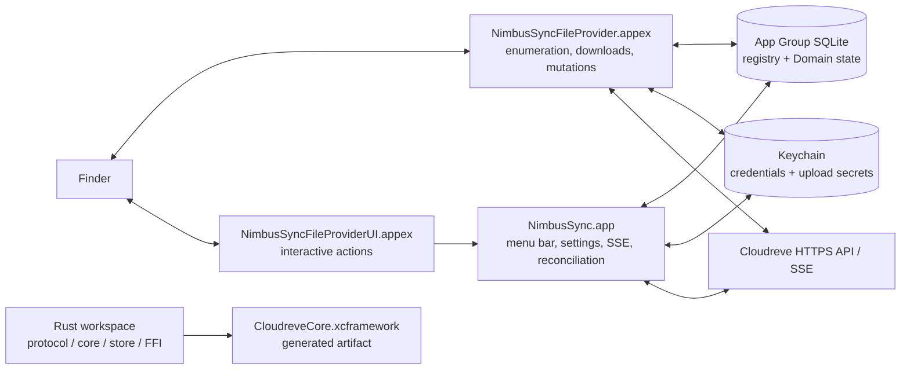

<div align="center">

# NimbusSync

**A native macOS File Provider client for self-hosted Cloudreve instances.**

[](#requirements)
[](#architecture)
[](#architecture)
[](LICENSE)

[English](README.md) | [简体中文](README_zh.md)

</div>

NimbusSync connects a macOS menu-bar application and Replicated File Provider
extensions to a self-hosted Cloudreve server. Each configured remote root is
represented as a File Provider Domain, so Finder can browse remote metadata and
download file contents on demand while the client keeps durable local state for
recovery, events, and user-facing diagnostics.

> [!IMPORTANT]
> This is a source-first Technical Preview/Beta engineering repository, not a
> 1.0 release or a published Swift/Rust package. The local Rust, Swift, Xcode,
> and static security/release gates are implemented, but real Cloudreve
> mutation semantics, signed Finder end-to-end behavior, provider upload
> matrices, notarization, and long-run evidence are still unverified. The
> current Phase 4 release decision is **No-Go for 1.0**.

> [!NOTE]
> The complete Chinese product and architecture material lives in `docs/`. The
> English and Chinese READMEs intentionally stay aligned, but the deeper design
> documents remain Chinese-first at the moment.

## Current Status

The following status is based on the repository's phase exit reports dated
2026-08-25. It distinguishes local engineering evidence from external platform
evidence:

| Area | Current status | Evidence or boundary |
| --- | --- | --- |
| Rust protocol/core/store/FFI primitives | Verified locally | Rust workspace tests and the phase reports |
| Swift Store/Auth/File Provider/Event/Product modules | Verified locally | Swift package tests and Xcode Debug builds |
| Menu-bar app and extension target structure | Implemented locally | `NimbusSync`, `NimbusSyncFileProvider`, `NimbusSyncFileProviderUI` |
| Real Cloudreve root/item identity and conditional writes | Unverified | Requires a controlled Cloudreve contract environment |
| Provider upload completion and resume matrix | Unverified | Capability-gated; no provider is promoted by code alone |
| Signed Finder callback replay and File Provider E2E | Unverified | Requires signed extensions and real Finder evidence |
| Developer ID, notarization, Gatekeeper, clean-machine upgrade | Unverified | Release credentials and test machines are still required |
| 1.0 release candidate | No-Go | See [`phase-4-release-readiness.md`](docs/reports/phase-4-release-readiness.md) |

The implementation uses a `verified` / `unsupported` / `unverified`
capability model. Write access is not enabled merely because a code path exists:
stable item identity, stable root identity, conditional content writes, and
idempotent creation must be verified first; the selected storage provider must
also have verified write, resumable, and zero-byte behavior.

## Why NimbusSync

Cloud files on macOS are a system integration problem, not only an HTTP client.
NimbusSync is organized around the failure modes that matter at the Finder
boundary:

- **Finder-native domains**: the app uses `NSFileProviderReplicatedExtension`
  instead of mirroring a remote tree into an ordinary watched directory.
- **Durable callback recovery**: operation replay keys, leases, source
  fingerprints, upload checkpoints, and conflict summaries live in persistent
  state rather than detached in-memory tasks.
- **Explicit consistency**: Cloudreve SSE is treated as a change hint; metadata
  enrichment, a local change journal, a signal outbox, and reconciliation provide
  the path toward eventual convergence.
- **Stable and opaque identities**: local Domain and item identifiers do not
  expose origins, accounts, remote paths, or file names, and remote identity is
  not inferred from a path alone.
- **Fail-closed behavior**: incomplete scans do not create tombstones, unknown
  write outcomes are not blindly retried, and unverified capabilities remain
  read-only or unsupported.

## What Exists Today

The current checkout contains the following working foundations and product
surfaces:

### Swift macOS product

- A SwiftUI menu-bar app with onboarding, Domain listing, settings, conflict
  center, notifications, deep-link routing, diagnostics, and launch-at-login
  plumbing.
- A Replicated File Provider extension for item mapping, paginated enumeration,
  change enumeration, content fetching, mutations, custom actions, and domain
  state projection.
- A File Provider UI extension that validates opaque item identifiers and routes
  supported actions back to the app without owning credentials or durable
  mutation state.
- Swift modules for Domain lifecycle, OAuth/PKCE and Keychain access, App Group
  SQLite state, event coordination, File Provider adapters, product projections,
  observability, and design tokens.

### Protocol, state, and recovery foundations

- Cloudreve origin normalization, API envelopes, file metadata DTOs, pagination,
  content/metadata version hashing, provider capability snapshots, and strict
  SSE framing.
- Registry and per-Domain SQLite state with WAL, foreign keys, schema fencing,
  migration hooks, quick checks, backups, repair isolation, directory snapshots,
  sync anchors, change journal, signal outbox, operations, conflicts,
  exclusion intents, and upload checkpoints.
- OAuth callback validation, PKCE state, Keychain credential storage, an App
  Group advisory refresh lock, bounded secret storage, and redirect policies that
  do not forward Bearer credentials across origins.
- Durable mutation/replay primitives for create, modify, trash, restore, delete,
  stale-version rejection, source fingerprint checks, cancellation, and
  conflict resolution services. Production write behavior remains capability
  gated and externally unverified.
- SSE supervisor/reconnect logic, event scope guards, metadata enrichment,
  local-write echo matching, working-set signaling, outbox draining, generation
  reconciliation, stable-root checks, health reduction, and scheduler models.

### Rust workspace

The Rust workspace is platform-neutral and currently contains:

| Crate | Responsibility |
| --- | --- |
| `cloudreve-protocol` | Cloudreve DTOs, URI/scope rules, capability snapshots, versions, page tokens, sync anchors, SSE parser, and backoff |
| `cloudreve-store` | SQLite schema, domains/items, journal, anchors, outbox, operation state, compaction, and backup helpers |
| `cloudreve-core` | HTTP client, remote mutation primitives, health reduction, reconciliation, upload recovery, and AES-CTR-at-offset helpers |
| `cloudreve-ffi` | Narrow C ABI for version and local identifier validation; static library output |
| `xtask` | Native artifact command wrapper |

`Scripts/xtask/build-xcframework.sh` packages the Rust static library as
`Artifacts/CloudreveCore.xcframework`. The generated artifact is ignored by
Git. The checked-in Xcode project currently links the Swift Package products
directly; it does not automatically embed a generated XCFramework during an
ordinary Debug build. Treat the Rust artifact pipeline and its Swift integration
boundary as active engineering work, not as proof of a shipped binary SDK.

## Architecture



The most important state path is:

```text
remote event or reconciliation
  -> metadata enrichment and scope validation
  -> SQLite item + journal + signal outbox transaction
  -> .workingSet signal
  -> File Provider change enumeration
```

For local mutations, the callback is associated with a durable operation and
replay key. The operation verifies the current item/version, runs only if the
capability snapshot permits it, persists its final outcome, and returns the
result to File Provider. A matching SSE echo is confirmation rather than a new
provider-visible change. The main app is not a required RPC proxy for extension
callbacks.

## Security and Data Boundaries

- OAuth access/refresh credentials and upload-related opaque secrets are stored
  in Keychain. SQLite stores references and recovery metadata, not secret
  values.
- App and File Provider processes share durable facts through the App Group and
  SQLite. Darwin notifications are wake-up hints, not a second state store.
- Release configuration permits HTTPS only. Debug may use loopback HTTP for
  controlled tests when explicitly enabled.
- Bearer credentials are not forwarded across origins or to signed storage URLs.
  SSE payloads, tokens, signed URLs, file contents, and sensitive paths are not
  part of normal diagnostics.
- File Provider callbacks do not rely on the main app, an old callback URL, an
  old file descriptor, or an unpersisted detached task after the callback ends.
- Domain removal preserves dirty data when state is uncertain and does not call
  a remote Cloudreve delete API. Exclusion cleanup uses a precise persisted
  intent and is kept separate from user deletion.
- Reconciliation can publish additions and updates incrementally, but only a
  complete and stable scan may commit destructive tombstones.

## Requirements

### Toolchain

- macOS 13 or later, matching [`Package.swift`](Package.swift) and the Xcode
  deployment settings.
- Xcode with Swift 6 support. This checkout was locally inspected with Xcode
  26.2 and Swift 6.2.3; the project declares Swift 6.0 and does not pin an
  Xcode distribution.
- Stable Rust/Cargo. The Rust workspace uses edition 2021 and Apache-2.0
  package metadata; this checkout was inspected with Rust 1.93.1.
- A controlled Cloudreve instance is optional for local unit tests, but required
  for the contract probe and any claim about real server or storage-provider
  support.
- A signed development environment and a real Finder test machine are required
  for File Provider E2E. Unsigned local builds are useful for compilation only.

### Clone

```sh
git clone git@github.com:tiylabs/nimbussync.git
cd nimbussync
```

Use the repository's normal access method if the GitHub remote is private.

## Build and Test

Run the focused checks first:

```sh
# Swift Package tests
swift test --disable-sandbox

# Rust workspace tests
(cd Rust && cargo test --workspace)

# Formatting and whitespace checks
(cd Rust && cargo fmt --all --check)
git diff --check
```

Build the unsigned Debug application and its extension targets:

```sh
xcodebuild \
  -project NimbusSync.xcodeproj \
  -scheme NimbusSync \
  -configuration Debug \
  CODE_SIGNING_ALLOWED=NO \
  build
```

A real File Provider Domain requires an Apple Development-signed build; the
unsigned build only verifies compilation. Sign in to the development team in
Xcode, make sure it owns the Bundle IDs and App Group, and run:

```sh
NIMBUSSYNC_DEVELOPMENT_TEAM=<TEAM_ID> \
  Scripts/development/build-signed.sh

# Optional: launch the app after signature verification
NIMBUSSYNC_DEVELOPMENT_TEAM=<TEAM_ID> NIMBUSSYNC_OPEN_APP=1 \
  Scripts/development/build-signed.sh
```

The script builds the `NimbusSync` scheme, permits Xcode provisioning updates,
and verifies the app, both extensions, Team ID, the
`group.ai.tiylabs.nimbussync` entitlement, and the File Provider document group.
The Team ID is not stored in the repository.

For repeatable phase checks, use a temporary build root. The scripts also run
secret and Release entitlement scans. Phase 0 additionally builds the default
arm64 Rust XCFramework:

```sh
export CLOUDREVE_BUILD_ROOT=/tmp/nimbussync-phase-gate
Scripts/phase-gates/phase-0.sh
```

Use `phase-1.sh` through `phase-4.sh` for the later gates. Their reports are
written below the ignored `Artifacts/PhaseGates/` directory. The gate scripts
intentionally keep real Cloudreve, signed Finder, notarization, and long-run
evidence separate from local compilation and unit tests.

### Build the Rust artifact

```sh
RUST_TARGETS=aarch64-apple-darwin \
  Scripts/xtask/build-xcframework.sh
```

The script accepts a space-separated `RUST_TARGETS` value and writes the
generated framework and checksum under `Artifacts/`. Do not commit generated
artifacts, credentials, response bodies, or test evidence containing secrets.

### Optional real-server contract probe

The probe is deliberately opt-in. It currently validates HTTPS handling and
authenticated account identity; mutation, upload-provider, refresh-rotation,
and signed Finder rows remain `unverified` until their environments exist. See
[`Tests/ContractTests/README.md`](Tests/ContractTests/README.md) for the exact
environment variables and command. Never commit credentials, response bodies,
or the generated report; the script stores only a redacted capability summary
under the ignored artifact directory.

## Release Packaging

Release packaging is an engineering exercise, not a public download path yet.
The scripts can assemble an app archive and checksum, but the current manifest
explicitly records `notarized: false` unless a future release pipeline supplies
the missing evidence.

```sh
VERSION=0.1.0 ARCHES=arm64 CODE_SIGNING_ALLOWED=NO \
  Scripts/release/build-release.sh

VERSION=0.1.0 Scripts/release/verify-release.sh
```

The Release configuration requests Developer ID signing. Hardened Runtime,
notarization, and Gatekeeper evidence still require a future release pipeline,
while the checked-in repository does not contain signing credentials. Do not
describe a locally assembled archive as notarized or Gatekeeper-approved.

## Repository Map

```text
Apps/NimbusSync/                   SwiftUI menu-bar app and lifecycle
Extensions/NimbusSyncFileProvider/ Replicated File Provider entry point
Extensions/NimbusSyncFileProviderUI/ Interactive File Provider actions
Packages/                           Shared Swift modules
  NimbusSyncDomainKit/              Domain identity, lifecycle, health, scope
  NimbusSyncAuthKit/                OAuth, PKCE, Keychain, refresh coordination
  NimbusSyncStoreBridge/            App Group SQLite and durable state
  NimbusSyncEventCoordinator/       SSE, journal delivery, reconciliation models
  NimbusSyncFileProviderKit/        Finder item, enumeration, content, mutations
  NimbusSyncProductKit/             Product projections, tasks, conflicts, UI state
  NimbusSyncDesignSystem/           Product design tokens
  NimbusSyncObservability/          Redacted diagnostics and metrics
Rust/crates/                        Platform-neutral protocol/core/store/FFI
Rust/xtask/                         Native artifact command wrapper
Config/                             Entitlements, Info.plists, Debug/Release settings
Scripts/                            Phase gates, contract probe, release, XCFramework
Tests/SwiftUnitTests/               Swift unit and invariant tests
Tests/ContractTests/                Opt-in real Cloudreve probe documentation
docs/                               Product, architecture, phase plans, exit reports
```

Some deeper phase plans describe future targets or crates that are not present
in this checkout. The map above is intentionally based on the current files,
not on the aspirational architecture diagrams.

## Documentation Map

Start with the document that matches your task:

| Topic | Document |
| --- | --- |
| Research and macOS platform mapping | [`docs/00-macos-port-research.md`](docs/00-macos-port-research.md) |
| Product requirements and acceptance scenarios | [`docs/01-macos-product-requirements.md`](docs/01-macos-product-requirements.md) |
| Technical architecture and invariants | [`docs/02-macos-technical-architecture.md`](docs/02-macos-technical-architecture.md) |
| Phase 0 protocol/File Provider spike | [`docs/03-phase-0-protocol-file-provider-spike.md`](docs/03-phase-0-protocol-file-provider-spike.md) |
| Phase 1 persistence and read path | [`docs/04-phase-1-persistence-read-path.md`](docs/04-phase-1-persistence-read-path.md) |
| Phase 2 write path and upload recovery | [`docs/05-phase-2-write-path-upload-recovery.md`](docs/05-phase-2-write-path-upload-recovery.md) |
| Phase 3 SSE and consistency | [`docs/06-phase-3-events-consistency.md`](docs/06-phase-3-events-consistency.md) |
| Phase 4 productization and release | [`docs/07-phase-4-product-release.md`](docs/07-phase-4-product-release.md) |
| Phase exit evidence | [`docs/reports/`](docs/reports/) |
| Real Cloudreve probe boundary | [`Tests/ContractTests/README.md`](Tests/ContractTests/README.md) |
| Repository conventions and security rules | [`AGENTS.md`](AGENTS.md) |

The phase reports are the source of truth for what was locally verified. The
phase plans describe intended scope and acceptance gates; they are not a
substitute for signed Finder or real-server evidence.

## Contributing

Before changing code:

1. Read [`AGENTS.md`](AGENTS.md) and the relevant phase plan/report.
2. Preserve existing local changes; do not reset, clean, or commit unrelated
   work.
3. Keep remote identity, operation state, and secrets behind the existing
   Store/Auth boundaries.
4. Add focused Swift or Rust tests for replay, stale versions, cancellation,
   pagination, anchor expiry, crash recovery, secret redaction, and fail-closed
   behavior as applicable.
5. Run the focused tests, formatting checks, and `git diff --check` before
   review.

Real Cloudreve credentials, signed URLs, response bodies, file contents, and
private paths must stay out of Git, logs, diagnostics, and gate artifacts.

## Visual Assets

No product screenshot or Finder recording is tracked yet. A useful future asset
would show the signed Technical Preview on macOS with the menu-bar status,
onboarding, and a Finder Domain in one short sequence. Until signed Finder
evidence exists, a screenshot would communicate more certainty than the project
has earned, so this README uses a source-backed Mermaid architecture diagram
instead.

## License

NimbusSync is distributed under the [Apache License 2.0](LICENSE). Cloudreve
server deployments, storage providers, third-party SDKs, and brand assets may
have their own terms; review them separately before distributing a product
build.
