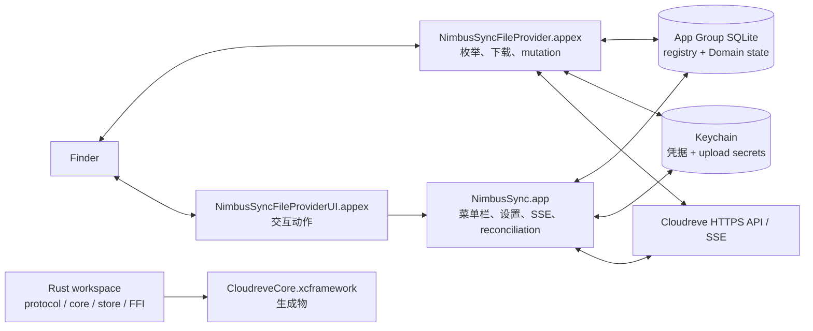

<div align="center">

# NimbusSync

**面向自托管 Cloudreve 实例的原生 macOS File Provider 客户端。**

[](#环境要求)
[](#架构)
[](#架构)
[](LICENSE)

[English](README.md) | 简体中文

</div>

NimbusSync 将 macOS 菜单栏应用、Replicated File Provider 扩展和自托管
Cloudreve 服务端连接起来。每个配置的远端根目录都会映射为一个 File
Provider Domain，Finder 可以浏览远端 metadata、按需下载文件内容；客户端
同时把恢复、事件一致性和诊断所需的状态持久化在本地。

> [!IMPORTANT]
> 这是一个以源码构建为主的 Technical Preview/Beta 工程仓库，不是 1.0
> 发布版，也不是已经发布到注册表的 Swift/Rust 包。本地 Rust、Swift、Xcode
> 以及静态安全/Release 门禁已经建立，但真实 Cloudreve mutation 语义、签名
> Finder 端到端行为、Provider 上传矩阵、公证和长稳证据仍未验证。当前 Phase 4
> 的 1.0 发布结论是 **No-Go**。

> [!NOTE]
> 完整的产品需求和架构材料位于 `docs/`，目前以中文为主。英文版和本中文版
> README 保持同一结构和事实口径，但不会把深层设计文档全部重复到首页。

## 当前状态

以下状态依据 2026-08-25 的阶段退出报告整理，并明确区分本地工程证据与真实
外部平台证据：

| 范围 | 当前状态 | 证据或边界 |
| --- | --- | --- |
| Rust protocol/core/store/FFI 基础 | 本地已验证 | Rust workspace 测试及阶段报告 |
| Swift Store/Auth/File Provider/Event/Product 模块 | 本地已验证 | Swift Package 测试及 Xcode Debug 构建 |
| 菜单栏 App 和扩展 Target 结构 | 本地已实现 | `CloudreveMac`、`CloudreveFileProvider`、`CloudreveFileProviderUI` |
| 真实 Cloudreve root/item identity 与条件写 | 未验证 | 需要受控的 Cloudreve contract 环境 |
| Provider 上传完成与断点恢复矩阵 | 未验证 | 由 capability gate 控制，代码本身不能升级支持级别 |
| 签名 Finder callback replay 与 File Provider E2E | 未验证 | 需要签名扩展和真实 Finder 证据 |
| Developer ID、公证、Gatekeeper、干净机器升级 | 未验证 | 需要发布凭据和测试机器 |
| 1.0 Release Candidate | No-Go | 见 [`phase-4-release-readiness.md`](docs/reports/phase-4-release-readiness.md) |

当前实现使用 `verified` / `unsupported` / `unverified` 三态 capability 模型。
代码路径存在并不代表写能力已经开放：stable item identity、stable root identity、
conditional content write、idempotent create 必须先验证；选中的存储 Provider
还必须验证 write、resumable 和 zero-byte 行为。

## 为什么做 NimbusSync

macOS 云文件是系统集成问题，而不只是一个 HTTP 客户端。NimbusSync 围绕
Finder 边界上最容易造成数据损坏的故障设计：

- **Finder 原生 Domain**：使用 `NSFileProviderReplicatedExtension`，不把远端
  文件树伪装成一个由普通 watcher 驱动的本地目录。
- **可恢复的 callback**：operation replay key、lease、source fingerprint、
  upload checkpoint 和 conflict summary 都进入持久状态，不依赖游离内存任务。
- **显式一致性链路**：Cloudreve SSE 只作为变化提示；metadata enrichment、本地
  change journal、signal outbox 和 reconciliation 共同构成最终收敛路径。
- **稳定且不透明的 identity**：本地 Domain/item identifier 不暴露 origin、账号、
  远端路径或文件名；远端对象身份也不会仅由路径推断。
- **Fail-closed**：不完整扫描不会生成 tombstone，结果未知的写入不会盲目重试，
  未验证能力保持只读或不支持。

## 当前已经具备的内容

当前 checkout 已包含以下基础能力和产品入口：

### Swift macOS 产品层

- SwiftUI 菜单栏应用：onboarding、Domain 列表、Settings、Conflict Center、
  通知、deep link、诊断和登录启动基础能力。
- Replicated File Provider 扩展：item 映射、分页枚举、change enumeration、
  内容获取、mutation、custom action 和 Domain state projection。
- File Provider UI 扩展：校验不透明 item identifier，并将支持的交互动作路由回
  主应用；不持有凭据，也不持有持久 mutation 状态。
- Swift 共享模块：Domain 生命周期、OAuth/PKCE/Keychain、App Group SQLite、
  事件协调、File Provider adapter、产品 projection、observability 和 design token。

### 协议、状态与恢复基础

- Cloudreve origin 规范化、API envelope、文件 metadata DTO、分页、
  content/metadata version hash、Provider capability snapshot 和严格 SSE framing。
- Registry 与每个 Domain 的 SQLite 状态：WAL、foreign key、schema fence、migration
  hook、quick check、backup、repair isolation、directory snapshot、sync anchor、
  change journal、signal outbox、operation、conflict、exclusion intent 和 upload checkpoint。
- OAuth callback 校验、PKCE state、Keychain 凭据存储、App Group advisory refresh
  lock、有界 secret 存储，以及不跨 origin 转发 Bearer 的 redirect policy。
- create、modify、trash、restore、delete 的持久 mutation/replay 基础，包含 stale
  version rejection、source fingerprint、取消和冲突解决 service。生产写入仍受
  capability gate 控制，真实服务端契约尚未验证。
- SSE supervisor/reconnect、事件 scope guard、metadata enrichment、本地写回声匹配、
  working-set signal、outbox drain、generation reconciliation、stable-root 检查、
  health reducer 和 scheduler 模型。

### Rust workspace

Rust workspace 当前包含：

| Crate | 职责 |
| --- | --- |
| `cloudreve-protocol` | Cloudreve DTO、URI/scope 规则、capability snapshot、版本、page token、sync anchor、SSE parser 和 backoff |
| `cloudreve-store` | SQLite schema、domain/item、journal、anchor、outbox、operation、compaction 和 backup helper |
| `cloudreve-core` | HTTP client、远端 mutation 原语、health reducer、reconciliation、upload recovery 和 AES-CTR-at-offset helper |
| `cloudreve-ffi` | 用于版本和本地 identifier 校验的窄 C ABI，输出 static library |
| `xtask` | native artifact 命令包装器 |

`Scripts/xtask/build-xcframework.sh` 会把 Rust static library 打包为
`Artifacts/CloudreveCore.xcframework`，生成物由 Git 忽略。当前检入的 Xcode
project 在普通 Debug 构建中直接链接 Swift Package products，不会自动嵌入生成的
XCFramework。应把 Rust artifact pipeline 与 Swift 集成边界视为仍在开发中的工程
内容，而不是已经交付的二进制 SDK。

## 架构



最重要的状态交付链路是：

```text
远端事件或 reconciliation
  -> metadata enrichment 与 scope 校验
  -> SQLite item + journal + signal outbox 事务
  -> .workingSet signal
  -> File Provider change enumeration
```

本地 mutation 会先关联持久 operation 和 replay key。执行前检查 item/version，
只有 capability snapshot 允许时才访问写路径；最终 outcome 持久化后再返回给
File Provider。匹配的 SSE echo 只负责确认，不再次生成 provider-visible change。
主应用不是 Extension callback 必须依赖的 RPC 代理。

## 安全与数据边界

- OAuth access/refresh credential 与上传相关不透明 secret 只进入 Keychain；SQLite
  只保存引用和恢复所需的非敏感 metadata。
- App 与 File Provider 进程通过 App Group 和 SQLite 共享持久事实。Darwin notification
  只是唤醒提示，不是第二个状态存储。
- Release 配置只允许 HTTPS；Debug 可在显式开启时为受控测试使用 loopback HTTP。
- Bearer 不跨 origin 转发，也不发送到 signed storage URL。SSE payload、token、signed
  URL、文件内容和敏感路径不进入普通诊断。
- File Provider callback 不依赖主应用、旧 callback URL、旧 FD 或 callback 结束后仍未
  持久化的 detached task。
- Domain 移除在状态不确定时保留 dirty data，且不调用远端 Cloudreve delete API。排除
  cleanup 使用精确持久 intent，与用户主动删除保持独立。
- reconciliation 可以增量发布新增和更新，但只有完整且稳定的扫描才能提交破坏性
  tombstone。

## 环境要求

### 工具链

- macOS 13 或更高版本，依据 [`Package.swift`](Package.swift) 和 Xcode deployment settings。
- 支持 Swift 6 的 Xcode。本 checkout 当前在 Xcode 26.2、Swift 6.2.3 环境检查过；项目
  声明 Swift 6.0，但没有在仓库中锁定 Xcode 发行版。
- Stable Rust/Cargo。Rust workspace 使用 edition 2021 和 Apache-2.0 package metadata；
  本 checkout 当前在 Rust 1.93.1 环境检查过。
- 本地单元测试不需要真实 Cloudreve；contract probe 和任何真实服务端/Provider 支持结论
  都需要受控 Cloudreve 实例。
- File Provider E2E 需要签名开发环境和真实 Finder 测试机；未签名构建只能证明编译路径。

### Clone

```sh
git clone git@github.com:tiylabs/nimbussync.git
cd nimbussync
```

如果 GitHub remote 需要权限，请使用仓库既有的认证方式。

## 构建与测试

先运行局部检查：

```sh
# Swift Package tests
swift test --disable-sandbox

# Rust workspace tests
(cd Rust && cargo test --workspace)

# 格式和空白检查
(cd Rust && cargo fmt --all --check)
git diff --check
```

构建未签名 Debug App 和扩展 Target：

```sh
xcodebuild \
  -project CloudreveMac.xcodeproj \
  -scheme CloudreveMac \
  -configuration Debug \
  CODE_SIGNING_ALLOWED=NO \
  build
```

需要可重复的阶段检查时，使用临时 build root。脚本还会执行 secret scan 和
Release entitlement scan；Phase 0 还会构建默认 arm64 Rust XCFramework：

```sh
export CLOUDREVE_BUILD_ROOT=/tmp/nimbussync-phase-gate
Scripts/phase-gates/phase-0.sh
```

后续阶段使用 `phase-1.sh` 到 `phase-4.sh`。报告写入被 Git 忽略的
`Artifacts/PhaseGates/`。这些 gate 有意把真实 Cloudreve、签名 Finder、公证和长稳
证据与本地编译/单元测试分开。

### 构建 Rust artifact

```sh
RUST_TARGETS=aarch64-apple-darwin \
  Scripts/xtask/build-xcframework.sh
```

脚本接受以空格分隔的 `RUST_TARGETS`，并将 framework 与 checksum 写入 `Artifacts/`。
不要提交生成物、凭据、响应 body 或包含 secret 的测试证据。

### 可选的真实服务端 contract probe

该 probe 默认不运行。目前它只验证 HTTPS 处理和 authenticated account identity；mutation、
upload-provider、refresh-rotation 和签名 Finder 项目在环境准备好前保持 `unverified`。
具体环境变量和命令见 [`Tests/ContractTests/README.md`](Tests/ContractTests/README.md)。
不要提交凭据、响应 body 或生成报告；脚本只会在被忽略的 artifact 目录写入脱敏
capability summary。

## Release 打包

Release 打包目前是工程流程，不是公开下载入口。脚本可以组装 App archive 和 checksum，
但当前 manifest 会明确写入 `notarized: false`，除非未来 Release pipeline 补齐证据。

```sh
VERSION=0.1.0 ARCHES=arm64 CODE_SIGNING_ALLOWED=NO \
  Scripts/release/build-release.sh

VERSION=0.1.0 Scripts/release/verify-release.sh
```

Release 配置明确要求 Developer ID signing；Hardened Runtime、公证和 Gatekeeper 证据
仍需要未来的 Release pipeline 补齐，仓库也不包含签名凭据。不要把本地组装的 archive
描述为已公证或已通过 Gatekeeper。

## 仓库结构

```text
Apps/CloudreveMac/                 SwiftUI 菜单栏 App 和生命周期
Extensions/CloudreveFileProvider/  Replicated File Provider 入口
Extensions/CloudreveFileProviderUI/交互式 File Provider action
Packages/                           共享 Swift 模块
  CloudreveDomainKit/               Domain identity、lifecycle、health、scope
  CloudreveAuthKit/                 OAuth、PKCE、Keychain、refresh 协调
  CloudreveStoreBridge/             App Group SQLite 和持久状态
  CloudreveEventCoordinator/        SSE、journal 交付、reconciliation 模型
  CloudreveFileProviderKit/         Finder item、枚举、内容、mutation
  CloudreveProductKit/              产品 projection、任务、冲突、UI state
  CloudreveDesignSystem/            产品 design token
  CloudreveObservability/           脱敏诊断和 metrics
Rust/crates/                        平台无关 protocol/core/store/FFI
Rust/xtask/                         native artifact 命令包装器
Config/                             Entitlement、Info.plist、Debug/Release 设置
Scripts/                            Phase gate、contract probe、release、XCFramework
Tests/SwiftUnitTests/               Swift unit/invariant tests
Tests/ContractTests/                可选真实 Cloudreve probe 文档
docs/                               产品、架构、阶段计划、退出报告
```

更深层的阶段计划中有一些尚未出现在当前 checkout 的未来 Target 或 crate。上面的
结构严格依据当前文件整理，而不是把规划中的架构图当成已存在的目录。

## 文档导航

按任务选择入口：

| 主题 | 文档 |
| --- | --- |
| 调研与 macOS 平台映射 | [`docs/00-macos-port-research.md`](docs/00-macos-port-research.md) |
| 产品需求与验收场景 | [`docs/01-macos-product-requirements.md`](docs/01-macos-product-requirements.md) |
| 技术架构与不变量 | [`docs/02-macos-technical-architecture.md`](docs/02-macos-technical-architecture.md) |
| Phase 0 协议/File Provider Spike | [`docs/03-phase-0-protocol-file-provider-spike.md`](docs/03-phase-0-protocol-file-provider-spike.md) |
| Phase 1 持久化与读路径 | [`docs/04-phase-1-persistence-read-path.md`](docs/04-phase-1-persistence-read-path.md) |
| Phase 2 写路径与上传恢复 | [`docs/05-phase-2-write-path-upload-recovery.md`](docs/05-phase-2-write-path-upload-recovery.md) |
| Phase 3 SSE 与一致性 | [`docs/06-phase-3-events-consistency.md`](docs/06-phase-3-events-consistency.md) |
| Phase 4 产品化与发布 | [`docs/07-phase-4-product-release.md`](docs/07-phase-4-product-release.md) |
| 阶段退出证据 | [`docs/reports/`](docs/reports/) |
| 真实 Cloudreve probe 边界 | [`Tests/ContractTests/README.md`](Tests/ContractTests/README.md) |
| 仓库约定与安全规则 | [`AGENTS.md`](AGENTS.md) |

阶段报告是“已经验证了什么”的事实来源。阶段计划描述目标范围和验收门槛，不能
替代签名 Finder 或真实服务端证据。

## 参与开发

修改代码前：

1. 阅读 [`AGENTS.md`](AGENTS.md) 以及对应的阶段计划/退出报告。
2. 保留工作区已有的本地改动；不要 reset、clean，也不要提交无关文件。
3. 让 remote identity、operation state 和 secret 继续通过现有 Store/Auth 边界管理。
4. 按改动范围补充 Swift 或 Rust 测试，重点覆盖 replay、stale version、取消、分页、
   anchor expiry、崩溃恢复、secret redaction 和 fail-closed 行为。
5. Review 前运行局部测试、格式检查和 `git diff --check`。

真实 Cloudreve credential、signed URL、响应 body、文件内容和私有路径不得进入 Git、
日志、诊断或 gate artifact。

## 视觉素材

当前仓库还没有产品截图或 Finder 录屏。未来最有价值的素材，是在签名 Technical
Preview 上用一个短流程展示菜单栏状态、onboarding 和 Finder Domain。签名 Finder
证据出现前，截图容易传递超过实际证据的确定性，因此本 README 使用源代码和报告支持
的 Mermaid 架构图作为视觉入口。

## 许可证

NimbusSync 使用 [Apache License 2.0](LICENSE)。Cloudreve 服务端部署、存储 Provider、
第三方 SDK 和品牌资产可能有各自的许可或使用条款；发布产品构建前需要单独审查。
