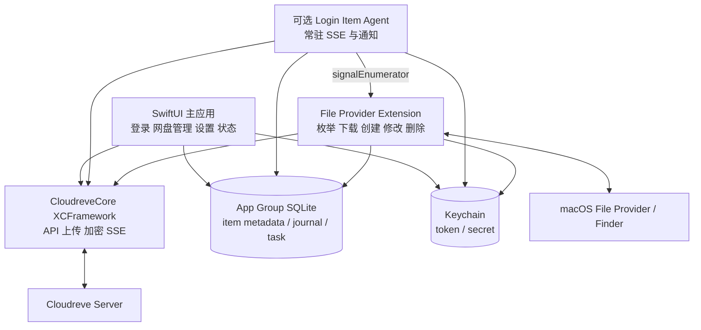

# Cloudreve Desktop macOS 复刻方案调研

> 状态：技术调研与架构建议  
> 调研日期：2026-08-25  
> 参考项目：[`cloudreve/desktop`](https://github.com/cloudreve/desktop)  
> 参考提交：[`71447408df6db38362703fbbb61dc534ea210470`](https://github.com/cloudreve/desktop/tree/71447408df6db38362703fbbb61dc534ea210470)

## 1. 摘要结论

要在 macOS 上复刻 Cloudreve Desktop 的核心体验，推荐采用：

- **Swift 6 + SwiftUI/AppKit** 实现主应用、菜单栏和系统集成；
- **`NSFileProviderReplicatedExtension`** 实现 Finder 云盘、占位文件、按需下载、双向修改和磁盘回收；
- **Rust** 复用 Cloudreve API、OAuth、SSE、上传提供商适配和加密逻辑；
- 通过小型 **UniFFI 或 C ABI** 将 Rust 编译为 XCFramework，供主应用和 File Provider Extension 调用；
- 使用 **Xcode 原生多 Target 工程** 完成 entitlements、App Group、签名和公证。

不建议把 Windows Cloud Files API（CFAPI）逐函数翻译成 macOS 文件监听代码，也不建议以 Tauri 作为 macOS 版本的架构中心。macOS 上只有 File Provider 才能提供系统级 dataless 文件、按需 materialization、Finder 状态和可靠的空间回收。

这里的“功能一致”应理解为用户能力一致，而不是内部 API 或同步根行为完全相同。macOS File Provider 的同步根由系统管理，无法无损复刻 Windows 版的“任意本地目录作为 Sync Root”。

## 2. 调研范围与依据

本调研覆盖：

- 参考项目的 UI、Cloudreve API、同步引擎、上传和 Windows Shell 集成；
- Windows CFAPI 与 macOS File Provider 的能力映射；
- Cloudreve SSE、同步锚点、冲突、恢复和凭据安全；
- macOS 进程/Target 划分、数据模型、发布和测试策略；
- 可复用代码、必须重构代码和必须重写代码的边界。

参考项目在 README 中声明的主要功能包括：实时双向同步、按需下载、Explorer 集成、多存储提供商和系统托盘。参见 [`README.md`](https://github.com/cloudreve/desktop/blob/71447408df6db38362703fbbb61dc534ea210470/README.md#features)。

## 3. 参考项目现状

### 3.1 总体结构

参考项目约由以下模块构成：

| 模块 | 作用 |
|---|---|
| Tauri 2 + React + MUI | 托盘、登录/添加网盘、设置、任务和状态 UI |
| `cloudreve-api` | Cloudreve REST、OAuth、令牌刷新、SSE 文件事件 |
| `cloudreve-sync` | 双向同步、inventory、任务队列、上传、冲突和文件事件处理 |
| `cfapi` | Windows Cloud Files API 封装、占位文件和按需取回 |
| `shellext` | Explorer COM 菜单、状态、缩略图等集成 |
| `win32_notif` | Windows Toast 通知 |
| MSIX Manifest | Cloud Files、COM、协议、Toast、启动任务注册 |

`cloudreve-sync` 直接启用了 `Win32_Storage_CloudFilters`、COM、Shell、Storage Provider 和 Notification 等 Windows 依赖，参见 [`crates/cloudreve-sync/Cargo.toml`](https://github.com/cloudreve/desktop/blob/71447408df6db38362703fbbb61dc534ea210470/crates/cloudreve-sync/Cargo.toml#L48-L80)。

### 3.2 当前同步数据流

Windows 版的核心数据流大致为：

```text
Cloudreve REST / SSE
        │
        ▼
cloudreve-api
        │
        ▼
Mount + Sync Planner + SQLite Inventory + Task Queue
        │
        ├── CFAPI placeholder enumeration
        ├── CFAPI range fetch / hydration
        ├── filesystem watcher
        └── Explorer callbacks
```

网盘启动时会注册 Storage Provider Sync Root、连接 CFAPI 回调，再启动普通文件系统 watcher，参见 [`mounts.rs`](https://github.com/cloudreve/desktop/blob/71447408df6db38362703fbbb61dc534ea210470/crates/cloudreve-sync/src/drive/mounts.rs#L373-L473)。

CFAPI 回调负责：

- `FETCH_DATA`：根据请求区间下载文件内容；
- `FETCH_PLACEHOLDERS`：枚举远端条目并创建占位文件；
- rename/delete：把本地操作转换成同步命令。

具体实现参见 [`callback.rs`](https://github.com/cloudreve/desktop/blob/71447408df6db38362703fbbb61dc534ea210470/crates/cloudreve-sync/src/drive/callback.rs#L43-L138)。

### 3.3 当前实现中需要一并修正的问题

macOS 版本不应机械复制以下实现边界：

1. **凭据与网盘配置混合序列化**

   `DriveConfig` 直接包含 access token、refresh token 和过期时间。macOS 版必须将令牌放入 Keychain，普通配置文件只保存 Keychain 引用。参见 [`mounts.rs`](https://github.com/cloudreve/desktop/blob/71447408df6db38362703fbbb61dc534ea210470/crates/cloudreve-sync/src/drive/mounts.rs#L33-L64)。

2. **inventory 以本地路径为主要身份**

   当前 `file_metadata.local_path` 是唯一键，并保存 ETag，但没有把 Cloudreve 稳定实体 ID 作为主身份。File Provider 中路径和名称都是可变元数据，必须改用远端稳定 ID。参见 [`inventory/README.md`](https://github.com/cloudreve/desktop/blob/71447408df6db38362703fbbb61dc534ea210470/crates/cloudreve-sync/src/inventory/README.md#L13-L29)。

3. **上传会话并非真正跨进程续传**

   上传器注释声明支持恢复，但发现旧 session 后会删除旧 session 并重新创建。macOS Extension 经常被系统终止，因此必须真正保留已完成分片和远端 session。参见 [`uploader/mod.rs`](https://github.com/cloudreve/desktop/blob/71447408df6db38362703fbbb61dc534ea210470/crates/cloudreve-sync/src/uploader/mod.rs#L116-L164)。

4. **部分公开状态接口仍是占位实现**

   `get_sync_status` 固定返回 `idle`；`start_sync`、`stop_sync` 也尚未实现。macOS 版不能以这些接口作为状态模型基础。参见 [`manager/mod.rs`](https://github.com/cloudreve/desktop/blob/71447408df6db38362703fbbb61dc534ea210470/crates/cloudreve-sync/src/drive/manager/mod.rs#L415-L438)。

5. **核心同步与平台实现耦合**

   `Mount` 同时承担远端协议、任务调度、CFAPI 注册和本地 watcher 生命周期，需先拆分成平台无关协议核心与平台适配器。

## 4. 技术选型

### 4.1 推荐栈

| 层次 | 推荐技术 | 说明 |
|---|---|---|
| 主语言 | Swift 6 | 原生支持 Apple Framework、Extension 生命周期和 Swift Concurrency |
| 主应用 UI | SwiftUI + 少量 AppKit | 网盘管理、设置、状态、菜单栏 |
| Finder 云盘 | FileProvider | 系统级占位文件、下载、上传和变更枚举 |
| Finder 交互 | FileProviderUI | 认证、错误处理和用户交互 |
| 登录 | 默认浏览器 + `CFBundleURLTypes` | 使用 `NSWorkspace` 打开 OAuth，并由 AppDelegate 接收 `cloudreve://mount` |
| 凭据 | Security / Keychain | App 与 Extension 通过 Keychain Access Group 共享 |
| 通知 | UserNotifications | 替代 Windows Toast |
| 自动启动 | ServiceManagement | 使用 `SMAppService` |
| 共享数据 | App Group + SQLite WAL | Domain、item metadata、journal、任务状态 |
| Cloudreve 核心 | Rust | 复用 API、上传、加密和 SSE |
| FFI | UniFFI 或窄 C ABI | 不向 Swift 暴露 Rust 内部类型和 Tokio 生命周期 |
| 构建发布 | Xcode | `.app + .appex`、签名、公证、更新 |

建议初始产品基线设为 macOS 13 或更高版本，并在 File Provider Spike 后，根据所需 partial fetch、Finder action 和部署覆盖范围确定最终 deployment target。

### 4.2 为什么不推荐全 Tauri

即使保留 Tauri，仍然必须建立 Xcode File Provider Extension，并处理：

- App Group 与 Keychain Access Group；
- Swift/Objective-C 与 Rust/Tauri 的跨进程边界；
- `.appex` 的 entitlements、签名和生命周期；
- 主应用、Extension、可选 Login Item Agent 的共享状态；
- Finder action、thumbnail 和 FileProviderUI。

Tauri 最多可以保留为设置 UI，但会引入额外 WebView、IPC 和打包复杂度。对于以系统文件集成为核心的 macOS 产品，SwiftUI 更合适。

### 4.3 为什么保留 Rust 核心

以下逻辑与平台无关，重写成 Swift 的收益有限：

- Cloudreve API DTO、OAuth 和令牌刷新；
- 上传会话、分片调度和存储提供商适配；
- AES-CTR 等加密；
- SSE 文件事件协议和退避策略；
- Cloudreve 错误码、ETag 和冲突识别。

建议把它们抽取成 `CloudreveCore`，API 设计为面向远端 ID、内容流和操作结果，而不是 `PathBuf`、CFAPI ticket 或 Windows handle。

## 5. 代码迁移边界

### 5.1 可复用

- `cloudreve-api` 的 HTTP、OAuth、令牌刷新和 SSE 协议；
- uploader 的存储提供商策略、分片和并发框架；
- 加密算法与 Cloudreve 元数据转换；
- Cloudreve 错误码和 StaleVersion/ObjectExisted 冲突识别；
- 远端事件重新订阅后执行全量 reconciliation 的策略。

SSE 代码已在新订阅时触发全量同步，在持续失败后也会重新进行全量同步，参见 [`remote_events.rs`](https://github.com/cloudreve/desktop/blob/71447408df6db38362703fbbb61dc534ea210470/crates/cloudreve-sync/src/drive/remote_events.rs#L58-L143)。

### 5.2 需要重构

- 将 `DriveConfig` 拆为非敏感 Domain 配置和 Keychain secret reference；
- 将 inventory 改为以 `domain_id + remote_item_id` 为主键；
- 把 uploader 输入从任意本地路径改为文件描述符、受控 URL 或流；
- 为上传 session 保存已完成分片、服务端 session 和恢复校验信息；
- 增加 change journal、sync anchor、tombstone 和 reconciliation 状态；
- 将任务结果映射成 File Provider 可恢复错误，而不是 Windows error code；
- 把同步计划从“扫描本地目录”改为“处理 File Provider item operation”。

### 5.3 必须重写

- CFAPI、Sync Root 和 placeholder 管理；
- 普通文件系统 watcher；
- Explorer COM context menu、custom state 和 thumbnail handler；
- Windows Toast、StartupTask 和协议注册；
- MSIX/AppxManifest 打包；
- Tauri 对 Windows Shell Service 的启动与托管。

## 6. Windows 与 macOS API 映射

| Windows 当前机制 | macOS 目标机制 | 迁移注意点 |
|---|---|---|
| `StorageProviderSyncRootManager` / `CfRegisterSyncRoot` | `NSFileProviderDomain` / `NSFileProviderManager` | 每个 Cloudreve 网盘映射为一个 Domain |
| CFAPI `FETCH_PLACEHOLDERS` | `NSFileProviderEnumerator.enumerateItems` | 返回远端 item，由系统维护本地表示 |
| CFAPI `FETCH_DATA` + `CfExecute` | `fetchContents` | 系统协调下载与 materialization |
| CFAPI range fetch | File Provider partial content fetching | 第一版可完整下载，后续为大文件增加范围下载 |
| `notify-debouncer` | `createItem` / `modifyItem` / `deleteItem` | 不监听 File Provider 根目录来推断用户操作 |
| CFAPI rename/delete callbacks | File Provider item mutation callbacks | 操作带 item ID、版本和字段变化 |
| `CfHydratePlaceholder` | File Provider materialization | 不自行用空文件模拟占位文件 |
| `CfDehydratePlaceholder` | File Provider eviction | 由系统释放本地内容并保留 item |
| CFAPI PinState | Finder 保留下载状态与系统策略 | 没有完全相同的底层语义，需实机验证 |
| COM `IExplorerCommand` | `NSFileProviderCustomAction` / FileProviderUI | 操作声明和 UI 模型不同 |
| Storage Provider custom state | item decorations | 从 item metadata 生成 Finder 装饰 |
| COM thumbnail provider | File Provider thumbnail API | 在 Extension 内按需生成或下载 |
| Windows Toast | UserNotifications | 主应用请求授权，避免 Extension 滥发通知 |
| `windows.startupTask` | `SMAppService` | 通过 Login Item 管理常驻 Agent |
| `windows.protocol` | `CFBundleURLTypes` | 用于 OAuth callback/deep link |
| MSIX/AppxManifest/COM | `.app + .appex + entitlements` | 需要 App Group、签名、公证 |
| 任意 Sync Root 路径 | 系统管理的 File Provider Domain 根 | 产品交互必须接受这一差异 |

如果必须同步任意本地目录，可以另做 FSEvents 模式，但它只能作为“普通文件夹同步”，不能与 File Provider 模式承诺完全相同的按需下载、dataless 文件和空间回收能力。

## 7. 推荐 Target 与运行时架构



### 7.1 主应用职责

- Cloudreve 登录、登出和账号管理；
- 创建、启用、停用和删除 `NSFileProviderDomain`；
- 把 refresh token 等敏感信息写入 Keychain；
- 展示同步状态、错误、流量和任务；
- 管理菜单栏、通知授权、登录项和更新；
- 发起重试、重新认证、全量校准等用户操作。

### 7.2 File Provider Extension 职责

- 枚举目录和 working set；
- 返回 item metadata、版本、能力和装饰；
- 下载文件内容；
- 执行创建、修改、移动、重命名和删除；
- 返回变更页和新的 sync anchor；
- 在主应用/Agent 不运行时仍能独立完成必要操作。

Extension 不能依赖主应用存活。即使 SSE Agent 不可用，它仍应能通过 REST 枚举、启动 reconciliation 并恢复正确状态。

### 7.3 Login Item Agent 职责

Agent 是可选的性能增强组件：

- 长期维护 Cloudreve SSE；
- 把事件转换为本地 change journal；
- 调用 `signalEnumerator` 通知系统拉取变化；
- 维护轻量网络/认证状态。

它不应成为下载、上传或恢复的唯一执行者。

### 7.4 Rust FFI 边界

FFI 应保持小而稳定，例如：

```text
authenticate / refresh
list_children / get_item
download / download_range
create_folder / upload / resume_upload
move / rename / delete
subscribe_events
map_cloudreve_error
```

不要直接暴露 Tokio runtime、Diesel connection、Rust trait object 或 Windows 路径结构。Swift 侧应只接收稳定 DTO、进度事件、文件描述符和结构化错误。

## 8. File Provider 数据模型

### 8.1 Domain 与 item identity

每个 Cloudreve drive 对应一个 File Provider Domain：

```text
domainIdentifier = stable Cloudreve account/drive UUID
itemIdentifier   = domainIdentifier + Cloudreve FileResponse.id
```

推荐字段映射：

| Cloudreve/本地字段 | File Provider 字段 |
|---|---|
| `FileResponse.id` | `itemIdentifier` |
| 父实体 ID | `parentItemIdentifier` |
| 文件名 | `filename` |
| 文件/目录类型 | `contentType` / item capabilities |
| size | `documentSize` |
| modified time | `contentModificationDate` |
| `primary_entity` / ETag | `contentVersion` |
| 名称、父目录、权限、共享状态哈希 | `metadataVersion` |

Cloudreve URI 和本地路径都不能作为永久 identity。实现前必须验证目标 Cloudreve 版本在重命名和移动后是否保持实体 ID 稳定；若不稳定，需要维护客户端 identity mapping。

### 8.2 建议数据库结构

至少需要：

- `domains`：Domain、实例地址、远端根、用户、Keychain reference；
- `items`：item ID、parent ID、名称、类型、ETag、metadata version、删除状态；
- `change_journal`：单调序号、item ID、change type、版本、来源；
- `upload_sessions`：远端 session、文件指纹、分片状态、重试信息；
- `operations`：本地操作、幂等键、状态、错误和下一次重试时间；
- `sync_state`：当前 anchor、最后完整校准时间和事件 client ID。

App、Agent 和 Extension 是不同进程。SQLite 应启用 WAL、`busy_timeout` 和短事务，并通过严格的 repository 层保证幂等写入。若实测多写者竞争仍明显，再引入轻量 XPC 写入 broker，但 Extension 不能因此失去离线独立能力。

## 9. 同步与恢复协议

### 9.1 远端变化

Cloudreve SSE 是变化通知和有限恢复机制，不能直接等同于 File Provider sync anchor。

推荐流程：

```text
SSE event
  → 验证 Domain/远端根范围
  → 事务写入 change_journal
  → 递增本地 sequence
  → signalEnumerator(container 或 workingSet)
  → enumerateChanges(oldAnchor)
  → 返回 journal changes + newAnchor
```

本地 journal sequence 编码为 File Provider `syncAnchor`。发生以下情况时执行全量 reconciliation：

- 首次收到 `subscribed`；
- SSE 返回 reconnect-required；
- 检测到事件缺口或 client ID 改变；
- journal 已裁剪，旧 anchor 无法继续；
- 服务端、Agent 或 Extension 异常退出后恢复；
- 定期安全校准发现摘要不一致。

当旧 anchor 已失效时，应返回 `syncAnchorExpired`，让系统重新枚举，不能返回空变化。

第一版可以把全部远端项目作为 working set，以正确性优先；完成大规模目录验证后，再优化为活跃/materialized 项目集合。

### 9.2 本地变化

本地文件创建、修改、移动和删除应直接来自 File Provider mutation callback：

```text
Finder operation
  → File Provider callback
  → 记录幂等 operation
  → Cloudreve API / uploader
  → 返回新的 item metadata 与版本
  → 写入 journal / inventory
  → 向系统完成回调
```

不要在 File Provider 根目录上再运行普通 watcher。系统可能创建临时文件、重放操作或调整 materialization 状态，监听这些低层事件会造成重复上传和误删除。

### 9.3 内容下载

第一阶段建议实现完整 `fetchContents`：

- 下载到 Extension 可访问的临时文件；
- 校验长度、ETag/哈希和取消状态；
- 成功后交给系统 materialize；
- 失败时返回可重试、认证、空间不足或版本错误。

参考 Windows 实现支持请求区间。大视频、镜像等场景需要在后续增加 partial content fetching，但应先通过完整下载实现验证整体正确性。

### 9.4 上传和断点续传

上传必须能够跨 Extension 进程生命周期恢复：

- 使用文件 identity、size、mtime 和可选快速哈希验证源内容未变化；
- 保存 Cloudreve session ID 和已经完成的分片；
- 每个分片上传和完成动作具有幂等键；
- 取消、网络失败和 Extension 被终止时不删除可恢复 session；
- 只有服务端明确判定 session 无效，或源文件变化后才创建新 session。

## 10. 冲突策略

当前 Rust 上传任务已经识别 Cloudreve `StaleVersion` 和 `ObjectExisted`，参见 [`tasks/upload.rs`](https://github.com/cloudreve/desktop/blob/71447408df6db38362703fbbb61dc534ea210470/crates/cloudreve-sync/src/tasks/upload.rs#L166-L204)。macOS 版应将其映射为 File Provider 的版本冲突或名称冲突错误。

建议提供三种用户动作：

- 保留远端版本；
- 覆盖远端版本；
- 另存为冲突副本。

冲突副本应使用本地化、可预测的名称，例如：

```text
报告（Jorben 的 Mac 冲突副本 2026-08-25）.docx
```

不要把内部 `__conflict__` 前缀直接暴露给用户。冲突动作必须使用远端实体 ID 和预期 ETag，避免用户决策期间文件再次变化而覆盖新版本。

## 11. macOS 特有差异与注意事项

### 11.1 文件路径和名称

- APFS 可能大小写敏感，也可能大小写不敏感；
- macOS 与服务端可能采用不同 Unicode 规范化形式；
- `/`、`:`、控制字符、尾随空格/点和超长名称的行为与 Windows 不同；
- 同一目录中仅大小写不同的两个远端文件可能无法落到大小写不敏感卷；
- 不应依靠字符串拼接路径识别对象。

需要建立统一的 filename validation 和 collision mapping 层，并始终以 item ID 维持身份。

### 11.2 Sandbox 与文件访问

File Provider Extension 不能任意遍历用户文件系统。上传器应接收：

- Extension 提供的临时内容 URL；
- 已验证的文件描述符；
- 或由 Swift 提供的顺序/随机读取接口。

不要把 sandbox 外部任意路径交给 Rust 后直接 `open()`。

### 11.3 Extension 生命周期

系统可以随时挂起或终止 Extension，因此：

- 每项操作必须幂等；
- 完成回调前写入必要状态；
- 不把关键状态只保存在内存 channel 中；
- 所有网络请求支持取消和明确超时；
- 重启后可以重放未完成 operation；
- 不运行无限循环或长期阻塞任务。

### 11.4 TLS 与私有部署

Cloudreve 常用于私有网络，可能采用自签名证书或私有 CA。若 Rust HTTP 使用 rustls，需要确认它正确读取 macOS 系统信任或显式导入受信 CA；若使用 URLSession，则能更自然地遵循系统信任链。

产品不应提供“无条件忽略 TLS 验证”的开关。若支持自签名证书，应使用证书导入、显式指纹确认或受控 trust-on-first-use 方案。

### 11.5 多进程认证

主应用、Agent 和 Extension 应通过 Keychain Access Group 共享凭据。刷新 token 时需要跨进程互斥，避免多个进程同时刷新并使旧 token 失效。推荐在数据库中保存刷新租约，或建立一个可回退的 refresh coordinator。

## 12. 打包与发布

Xcode 工程至少包含：

```text
NimbusSync.app
NimbusSyncFileProvider.appex
CloudreveLoginItem.app       # 可选
CloudreveCore.xcframework
```

需要配置：

- File Provider entitlement；
- App Sandbox 和网络访问；
- App Group；
- Keychain Access Group；
- URL Scheme；
- Developer ID Application 签名；
- hardened runtime；
- Apple notarization；
- Intel `x86_64` 和 Apple Silicon `arm64`，或明确仅支持 Apple Silicon。

Windows 版通过 MSIX 注册 Cloud Files、COM、Toast 和 StartupTask，参见 [`AppxManifest.xml`](https://github.com/cloudreve/desktop/blob/71447408df6db38362703fbbb61dc534ea210470/package/AppxManifest.xml#L66-L124)。这些声明不能复用，必须转换为 Xcode Targets、Info.plist 和 entitlements。

## 13. 分阶段实施路线

### 阶段 0：协议与身份验证，约 1 周

- 确认目标 Cloudreve 版本和 API；
- 验证实体 ID 在 rename/move 后是否稳定；
- 验证分页、ETag、SSE 恢复、上传 provider 和 OAuth callback；
- 确认最低 macOS 版本和分发渠道。

### 阶段 1：File Provider Spike，约 1–2 周

- 注册/移除 Domain；
- 枚举根目录和子目录；
- 完整文件按需下载；
- Finder 中展示基本 item、状态和错误；
- 验证 Extension 被终止后的恢复。

通过标准：能在 Finder 浏览远端目录，打开未下载文件，重启后 identity 不变化。

### 阶段 2：双向修改，约 3–4 周

- 创建文件夹和文件；
- 修改、上传、移动、重命名和删除；
- ETag 前置条件；
- provider-specific 上传完成流程；
- operation journal 和真正断点续传。

### 阶段 3：SSE 与 reconciliation，约 2–3 周

- 常驻 SSE Agent；
- change journal 与 sync anchor；
- `signalEnumerator`；
- 事件缺口、journal 裁剪和全量校准；
- 离线启动和服务端重启恢复。

### 阶段 4：产品功能，约 2–3 周

- SwiftUI 登录、网盘管理、设置和任务状态；
- Keychain 和 token refresh 协调；
- 菜单栏、通知、登录项；
- Finder decoration、thumbnail、custom action；
- 冲突解决 UI。

### 阶段 5：发布质量，约 2–4 周

- 大文件、大目录和长时间运行；
- Intel/Apple Silicon；
- macOS 支持版本矩阵；
- 低磁盘、网络抖动、进程终止和升级迁移；
- 签名、公证、安装、更新和卸载。

单名熟悉 Swift、Rust 和 File Provider 的工程师达到可发布质量，预计 **10–16 工程周**。如果要求完整覆盖全部 Cloudreve 存储提供商、复杂冲突、partial fetch 和多个 macOS 大版本，工期可能更长。

## 14. 测试矩阵

| 类别 | 必测场景 |
|---|---|
| 目录规模 | 空目录、深层目录、10 万级 item、分页边界 |
| 文件 | 0 字节、超大文件、稀疏文件、包目录、特殊字符 |
| 下载 | 首次打开、取消、范围下载、低磁盘、ETag 变化 |
| 上传 | 分片、取消、断网、重启续传、源文件再次变化 |
| 本地操作 | 创建、覆盖、移动、重命名链、删除、恢复 |
| 远端操作 | SSE 创建/修改/移动/删除、事件合并、事件丢失 |
| 冲突 | 两端同时修改、名称冲突、删除与修改竞争 |
| 生命周期 | Extension 强杀、Agent 强杀、重启、睡眠唤醒 |
| 认证 | token 过期、refresh 竞争、退出登录、Keychain 锁定 |
| 文件系统 | APFS 大小写敏感/不敏感、Unicode 规范化 |
| 网络 | 离线启动、超时、代理、私有 CA、服务端重启 |
| Provider | 本地存储、S3、OneDrive 等不同上传流程 |
| 发布 | 签名、公证、升级、卸载、Domain 残留清理 |

建议分三层测试：

1. Rust 单元/集成测试：API、上传、加密、事件解析、幂等操作；
2. Swift/Extension 测试：item mapping、anchor、错误映射、数据库并发；
3. 真实 Finder 端到端测试：多个 macOS 版本、真实 Cloudreve 和异常注入。

## 15. 主要风险

| 风险 | 等级 | 缓解措施 |
|---|---:|---|
| Cloudreve item ID 在移动后不稳定 | 高 | 阶段 0 验证，必要时增加 identity mapping |
| SSE 丢失或恢复窗口不足 | 高 | 本地 journal + 周期 reconciliation，不把 SSE 当唯一真相 |
| Extension 随时被终止 | 高 | 幂等 operation、持久 session、短事务、可取消网络请求 |
| App/Agent/Extension SQLite 竞争 | 高 | WAL、短事务、busy timeout、repository 层和压力测试 |
| 不同存储 provider 上传语义不同 | 高 | provider contract tests 和真实服务端测试 |
| APFS 名称碰撞 | 中高 | 统一名称映射、ID 身份、大小写/Unicode 测试 |
| Rust TLS 与系统信任不一致 | 中高 | 采用系统根证书，私有 CA 走显式信任流程 |
| Finder Pin/Evict 与 Windows 语义不完全一致 | 中 | Spike 实机验证并在产品文案中体现平台差异 |
| File Provider API 跨 macOS 版本行为变化 | 中 | 明确最低版本并维护 OS 测试矩阵 |
| 许可或官方品牌使用边界不清 | 中 | 按 Apache 2.0 和第三方许可要求维护 LICENSE、NOTICE 与 SBOM，独立核对 Community/Pro 和商标条款 |

## 16. 发布验收标准

在宣称“功能一致”前，至少满足：

- 多个 Cloudreve 网盘能作为独立 Finder Domain 使用；
- 未下载文件可以按需打开，释放空间后仍保留可见 item；
- 创建、修改、移动、重命名和删除能双向传播；
- SSE 丢失、断网和进程重启后能通过 reconciliation 恢复；
- 上传可跨 Extension 重启续传；
- 冲突不会静默覆盖任一版本；
- token 不写入明文配置或日志；
- 10 万级目录不会导致 Extension 持续超时或内存失控；
- App、Extension、Agent 均通过签名和公证验证；
- 卸载或删除 Domain 时明确区分“移除本地缓存”和“删除远端数据”。

## 17. 许可边界

参考桌面项目采用 MIT License，参见 [`LICENSE`](https://github.com/cloudreve/desktop/blob/71447408df6db38362703fbbb61dc534ea210470/LICENSE)。本项目自行开发内容的项目级默认许可为 Apache License 2.0，准据文本为仓库根目录的 [`LICENSE`](../LICENSE)；Rust workspace 的 package metadata 也声明为 `Apache-2.0`。

第三方代码、依赖和参考实现不会因为被本项目引用而自动转为 Apache 2.0。引入或分发这些内容时应：

- 保留上游 MIT copyright 和许可文本；
- 对 Apache 2.0 或其他第三方代码遵守其原始许可，并保留适用的 copyright、专利、商标、归属和 NOTICE 声明；
- 标记直接复制或修改的文件，并在发布前生成与 lockfile 和产物一致的 SBOM/许可证清单；
- 不把 Cloudreve 官方图标、名称或其他品牌资产自动视为 MIT、Apache 2.0 或其他开源许可的一部分；
- 单独核对 Cloudreve Community、Pro 功能和官方客户端商业条款；
- 商业发布前取得项目方或法律顾问对具体版本和分发模式的确认。

独立客户端通过 HTTP/SSE 调用 Community API，与修改和分发 Cloudreve 服务端不是同一技术行为；但这不自动授予 Pro 前端、Pro 二进制、官方客户端或商标的使用权。

## 18. Apple 官方参考资料

- [Replicated File Provider extension](https://developer.apple.com/documentation/fileprovider/replicated-file-provider-extension)
- [Synchronizing the File Provider Extension](https://developer.apple.com/documentation/fileprovider/synchronizing-the-file-provider-extension)
- [Synchronizing files using File Provider extensions](https://developer.apple.com/documentation/fileprovider/synchronizing-files-using-file-provider-extensions)
- [WWDC21: Sync files to the cloud with FileProvider on macOS](https://developer.apple.com/videos/play/wwdc2021/10182/)
- [Finder Sync Extension Programming Guide](https://developer.apple.com/library/archive/documentation/General/Conceptual/ExtensibilityPG/Finder.html)

## 19. 最终建议

正式实现前，应先完成一个只包含以下能力的原生 Spike：

1. 创建一个 File Provider Domain；
2. 从真实 Cloudreve 枚举目录；
3. 在 Finder 打开一个 dataless 文件并完成下载；
4. 修改文件并上传，返回新的 ETag；
5. 模拟 SSE 丢失，通过完整 reconciliation 恢复；
6. 强制终止 Extension 后重新执行未完成操作。

如果这六项在目标 Cloudreve 版本和最低 macOS 版本上通过，再进入完整 UI 和 Finder 增强功能开发。该顺序可以最早暴露远端 identity、Extension 生命周期和上传恢复这三个最高风险问题。
