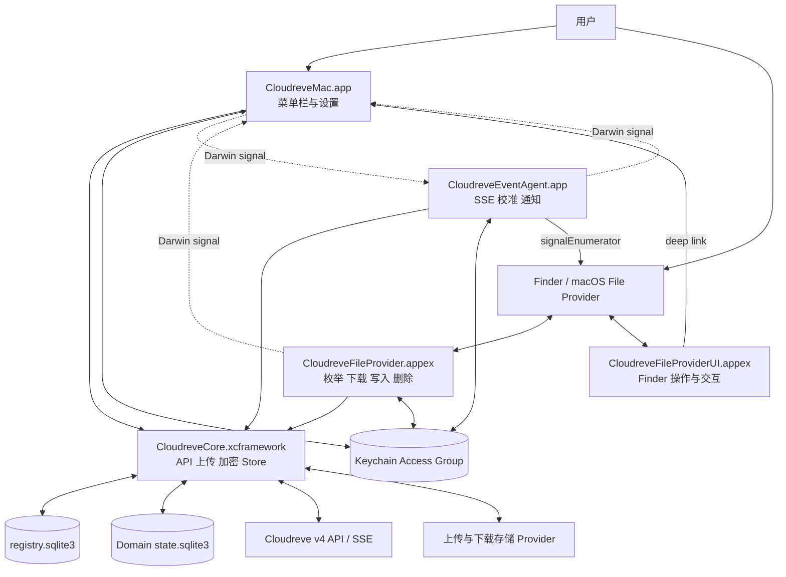
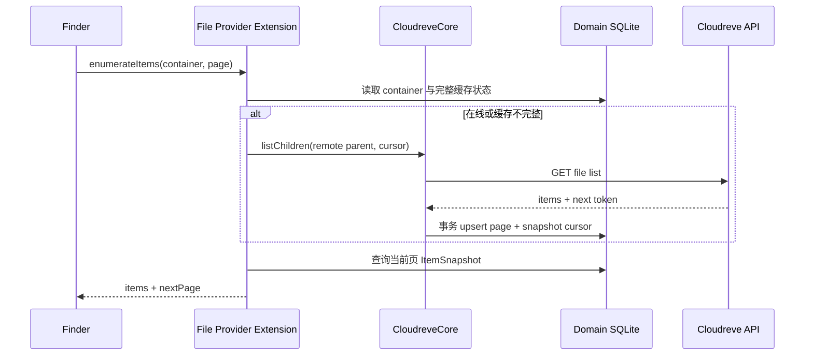
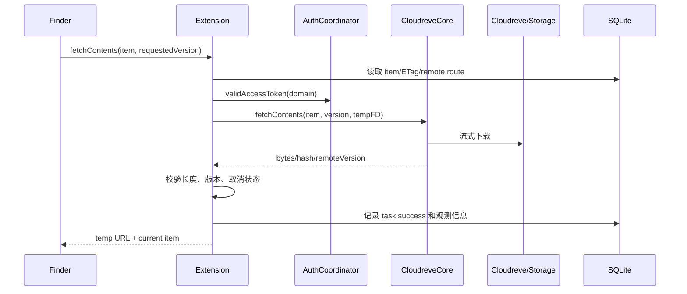
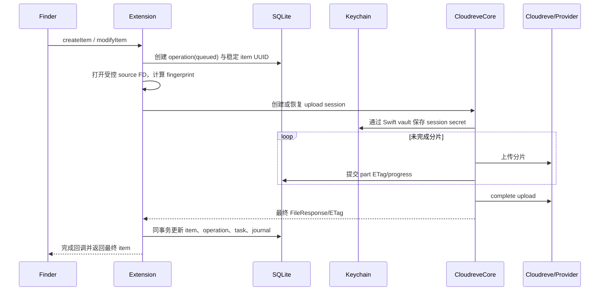
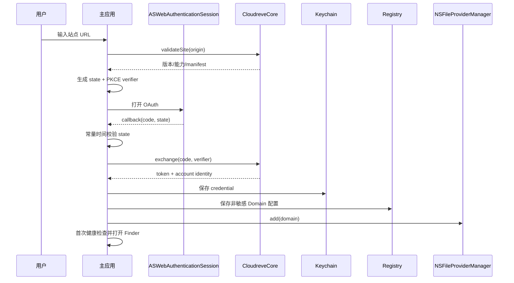

# Cloudreve for macOS 技术选型与架构设计

> 文档状态：Architecture Baseline 1.0  
> 日期：2026-08-25  
> 目标版本：Technical Preview、0.5 Beta、1.0  
> 输入文档：[macOS 复刻方案调研](./00-macos-port-research.md)、[macOS 客户端产品需求](./01-macos-product-requirements.md)  
> 参考实现：[`cloudreve/desktop@71447408`](https://github.com/cloudreve/desktop/tree/71447408df6db38362703fbbb61dc534ea210470)

## 1. 架构结论

Cloudreve for macOS 采用原生多进程架构：

- 使用 **Swift 6、SwiftUI 和少量 AppKit** 实现菜单栏、窗口、设置、通知和系统生命周期；
- 使用 **`NSFileProviderReplicatedExtension`** 提供 Finder Domain、占位文件、按需下载、双向修改和空间释放；
- 使用独立的 **File Provider UI Extension** 承接 Finder 自定义操作和需要打开主应用的交互；
- 使用独立的 **Login Item Agent** 维护 SSE、周期校准和后台通知，但不把它作为同步正确性的唯一前提；
- 将参考项目中可复用的 Cloudreve API、上传 Provider、分片上传和加密能力重构为 **Rust 静态 `CloudreveCore.xcframework`**；
- 使用 **UniFFI** 生成类型安全的 Swift 接口，不向 Swift 暴露 Tokio、数据库连接、Rust trait object 或内部路径类型；
- 使用 **App Group + 分 Domain SQLite WAL** 保存 metadata、change journal、operation、任务和恢复状态；
- 使用 **Keychain Access Group** 保存 OAuth 凭据以及上传会话中的签名 URL、回调密钥等临时秘密；
- 使用 **SQLite 作为跨进程事实源，Darwin Notification 作为无载荷唤醒信号**，不建立 App、Agent、Extension 之间的强 RPC 依赖；
- 使用 **Cloudreve SSE 作为变化提示，本地 journal 作为 File Provider sync anchor，reconciliation 作为最终一致性机制**；
- 1.0 采用 **macOS 13+、universal2、Developer ID 站外分发、Hardened Runtime 和 Apple 公证**；自动更新与 partial content fetching 延后到 1.x。

系统不移植 Windows CFAPI、普通目录 watcher、Explorer COM、Tauri UI 或 MSIX 打包逻辑。macOS 的本地文件树完全由 File Provider 管理。

### 1.1 技术选型总表

| 领域 | 结论性选型 | 约束 |
|---|---|---|
| 开发语言 | Swift 6 + Rust stable | Swift 负责 Apple Framework，Rust 负责协议和传输核心 |
| UI | SwiftUI，`NSStatusItem + NSPopover` 承载菜单栏界面 | AppKit 只用于 SwiftUI 尚不稳定或无法覆盖的系统行为 |
| Finder 集成 | `NSFileProviderReplicatedExtension` | 不使用普通目录 watcher 模拟云文件 |
| 后台进程 | `SMAppService` Login Item Agent | Agent 可退出，Extension 仍必须完成系统请求 |
| OAuth | `ASWebAuthenticationSession` + PKCE | Swift 校验 callback/state，Rust 完成协议交换 |
| FFI | UniFFI + 静态 XCFramework | 仅暴露稳定 DTO、异步命令、进度与结构化错误 |
| 网络 | Rust `reqwest` + macOS native TLS | 禁止关闭 TLS 校验；显式适配系统代理 |
| 并发 | Swift Concurrency + 受限 Tokio runtime | 不在 FFI 上传递 runtime 或裸线程句柄 |
| 持久化 | `rusqlite` + SQLite WAL | 一个 registry DB，每个 Domain 一个 state DB |
| 凭据 | Security.framework Keychain | token 和上传临时秘密不进入 SQLite、配置和日志 |
| 跨进程通知 | Darwin Notification | 只传“状态已变化”，接收方重新查询 SQLite |
| 日志 | `OSLog` + Rust `tracing` + 可选轮转文件 | 统一 correlation ID 和脱敏规则 |
| 构建 | Xcode 原生多 Target + Cargo `xtask` | 生成 universal XCFramework 并由 Xcode Targets 链接 |
| 服务端基线 | Cloudreve v4.12+ | 仍须通过协议兼容门禁，版本号本身不等于能力证明 |
| 发布 | Developer ID + notarized DMG | 首版不以 Mac App Store 为发布前提 |
| 自动更新 | 1.x 再引入 | 1.0 不内置第三方更新框架 |

## 2. 目标、范围与架构约束

### 2.1 目标

本架构覆盖 PRD 中 P0 和 P1 能力：

1. 多 Cloudreve 实例、账号和远端根映射为多个 Finder Domain；
2. 远端目录分页枚举、dataless item、完整按需下载和系统 eviction；
3. Finder 创建、修改、移动、重命名和删除传播到 Cloudreve；
4. Cloudreve 远端变化通过 SSE 和 reconciliation 收敛到 Finder；
5. Extension 强杀、离线、睡眠、系统重启和升级后可恢复；
6. 分片上传可跨 Extension 生命周期续传；
7. 冲突、认证过期、永久失败和事件降级可持久展示并恢复；
8. token、签名 URL、回调 secret 和文件内容不进入普通日志或明文数据库。

### 2.2 非目标

- 不提供任意本地目录双向同步；
- 不复用 Windows inventory 数据库；
- 不把 Tauri、WebView 或 React 作为 macOS UI 运行时；
- 不在 1.0 实现范围下载、选择性同步、暂停 Domain 和自动更新；
- 不实现 Cloudreve Web 管理后台、分享管理或服务端管理；
- 不提供跳过 TLS 校验的选项；
- 不以 SSE 事件历史替代全量校准。

### 2.3 不可破坏的不变量

1. **远端对象身份不依赖路径。** 路径、名称和父目录均为可变 metadata。
2. **Finder 中的本地表示由 File Provider 管理。** 不直接扫描或修改 Domain 根目录来推断同步操作。
3. **完成系统回调前先持久化。** File Provider mutation 只有在远端结果和本地最终状态写入成功后才返回成功。
4. **SSE 只触发同步，不证明同步完成。** “已是最新”必须建立在有效 anchor、无待处理写入和最近校准结果之上。
5. **不盲目重试结果未知的远端写入。** 必须先查询后置条件或进入 reconciliation。
6. **全量校准失败时不生成批量删除。** 只有完整分页成功并完成删除候选确认后才能写 tombstone。
7. **Extension 不依赖 App 或 Agent 存活。** 它可直接访问 Keychain、SQLite 和 CloudreveCore。
8. **秘密只持久化到 Keychain。** SQLite 只保存 Keychain 引用和非敏感恢复信息。
9. **移除 Domain 不调用远端删除 API。** 本地清理和远端文件删除是两条完全不同的调用链。

## 3. 系统上下文与运行时拓扑



图中的 CloudreveCore 是逻辑组件。App、Agent 和 File Provider Extension 各自在自己的进程中加载同一静态 XCFramework，并通过 Core repository 访问 SQLite；三个进程不共享 Rust 内存或 runtime。File Provider UI Extension 保持轻量，只负责验证 action context 并唤起主应用，不加载 Rust Core。

### 3.1 进程职责

| 进程 | 核心职责 | 明确不负责 |
|---|---|---|
| 主应用 | 登录、Domain 管理、菜单栏、设置、冲突中心、诊断、通知授权 | 不作为 File Provider 请求代理，不长期持有同步任务 |
| File Provider Extension | item 枚举、change 枚举、内容下载、创建、修改、移动、重命名、删除 | 不维护永久 SSE，不依赖主应用窗口或 Agent IPC |
| File Provider UI Extension | Finder 自定义操作、错误恢复入口、唤起主应用 | 不持有 token，不直接执行上传、删除或冲突覆盖 |
| Login Item Agent | 每 Domain SSE、周期 reconciliation、后台状态聚合、用户通知 | 不直接修改 Finder 文件，不成为上传完成的唯一执行者 |
| Rust Core | Cloudreve 协议、上传 Provider、加密、DTO 映射、SQLite repository | 不调用 SwiftUI，不持有 NSFileProvider 对象，不读取任意用户路径 |

### 3.2 故障独立性

- 主应用退出：Agent 和 File Provider 继续运行；用户再次打开时从 SQLite 恢复视图。
- Agent 退出：File Provider 仍可按系统请求枚举、下载和写入；远端实时性降级，后续枚举或 Agent 恢复时校准。
- Extension 被终止：未完成 operation 和 upload session 保留；系统下次回调时按幂等规则恢复。
- SQLite 暂时繁忙：调用方执行有上限的短退避，不在内存中假定写入成功。
- Keychain 锁定：读请求可使用已 materialized 内容；需要凭据的请求返回认证暂不可用，不删除队列。
- SSE 丢失：Domain 进入 `event_degraded` 或 `reconciling`，不能显示“已是最新”。

### 3.3 跨进程通信

1. SQLite 保存所有需要恢复的状态，是跨进程唯一事实源。
2. Darwin Notification 只使用固定事件名和 Domain UUID，不携带 token、路径、文件名或业务 payload。
3. 接收通知后重新查询 SQLite，因此通知丢失不会破坏正确性。
4. Agent 写入远端变化后调用 `NSFileProviderManager.signalEnumerator(for:)`，通知系统拉取 container 或 working set 的变化。
5. 1.0 不引入 App 与 Extension 的 NSXPC 强依赖。未来仅在 SQLite 写竞争经过压测确认不可接受时，才增加可回退的写入 broker。

## 4. 工程与 Target 结构

```text
cloudreve-macos/
├── CloudreveMac.xcodeproj
├── Apps/
│   └── CloudreveMac/
│       ├── AppLifecycle/
│       ├── MenuBar/
│       ├── Onboarding/
│       ├── Settings/
│       ├── ConflictCenter/
│       └── Diagnostics/
├── Extensions/
│   ├── CloudreveFileProvider/
│   │   ├── FileProviderExtension.swift
│   │   ├── FileProviderItem.swift
│   │   ├── Enumerator.swift
│   │   ├── MutationCoordinator.swift
│   │   └── ErrorMapping.swift
│   └── CloudreveFileProviderUI/
│       ├── ActionViewController.swift
│       └── ActionRouter.swift
├── Helpers/
│   └── CloudreveEventAgent/
│       ├── AgentLifecycle.swift
│       ├── EventSupervisor.swift
│       └── ReconciliationScheduler.swift
├── Packages/
│   ├── CloudreveDomainKit/
│   ├── CloudreveAuthKit/
│   ├── CloudreveStoreBridge/
│   ├── CloudreveObservability/
│   └── CloudreveDesignSystem/
├── Rust/
│   ├── Cargo.toml
│   └── crates/
│       ├── cloudreve-protocol/
│       ├── cloudreve-transfer/
│       ├── cloudreve-store/
│       ├── cloudreve-core/
│       └── cloudreve-ffi/
├── Config/
│   ├── Base.xcconfig
│   ├── Debug.xcconfig
│   ├── Release.xcconfig
│   └── Entitlements/
├── Scripts/
│   └── xtask/
├── Tests/
│   ├── SwiftUnitTests/
│   ├── RustTests/
│   ├── ContractTests/
│   ├── FileProviderTests/
│   └── EndToEndTests/
└── docs/
```

### 4.1 Xcode Targets

| Target | 类型 | 依赖 |
|---|---|---|
| `CloudreveMac` | macOS App | Swift Packages、CloudreveCore |
| `CloudreveFileProvider` | File Provider Extension | DomainKit、AuthKit、StoreBridge、CloudreveCore |
| `CloudreveFileProviderUI` | File Provider UI Extension | DomainKit、轻量 ActionRouter |
| `CloudreveEventAgent` | Login Item App | DomainKit、AuthKit、StoreBridge、CloudreveCore |
| `CloudreveMacTests` | Unit Test Bundle | Swift 业务模块 |
| `CloudreveFileProviderTests` | Unit/Integration Test Bundle | File Provider adapter 与测试服务器 |
| `BuildCloudreveCore` | Aggregate/Script Target | Cargo `xtask build-xcframework` |

App、File Provider 和 Agent 使用相同 App Group 与最小 Keychain Access Group。File Provider UI 不读取数据库或凭据，只通过 extension context 和 deep link 把 action 交给主应用。Debug 可启用 File Provider testing entitlement，Release 配置不得包含测试 entitlement。

### 4.2 Rust Crates

| Crate | 职责 | 迁移来源 |
|---|---|---|
| `cloudreve-protocol` | REST/SSE DTO、URI、OAuth、错误码、分页 | 重构 `cloudreve-api` |
| `cloudreve-transfer` | 下载流、上传 session、Provider、分片、AES-CTR | 重构 `uploader` 和相关 API |
| `cloudreve-store` | registry/domain schema、migration、repository、journal | 重写原 inventory |
| `cloudreve-core` | 用例编排、重试、reconciliation、能力协商 | 从原 `cloudreve-sync` 提取平台无关逻辑 |
| `cloudreve-ffi` | UniFFI DTO、handle、callback、错误映射 | 新增 |

`cfapi`、`shellext`、`win32_notif`、Windows watcher 和 Tauri command 不进入新 workspace。

## 5. Swift 模块设计

### 5.1 `CloudreveDomainKit`

- `DomainDescriptor`：Domain UUID、展示名、实例 origin、远端根、账号 ID、能力快照；
- `DomainLifecycleService`：创建、注册、重命名、移除 `NSFileProviderDomain`；
- `DomainHealthReducer`：从认证、网络、事件、校准、任务和冲突状态生成唯一用户状态；
- `DomainSignalBus`：发送和接收 Darwin Notification；
- `NameMapper`：远端名称、Finder 展示名称和碰撞键映射；
- `CapabilityMapper`：Cloudreve permission/capability 到 `NSFileProviderItemCapabilities`。

### 5.2 `CloudreveAuthKit`

- `OAuthCoordinator`：PKCE、state、`ASWebAuthenticationSession` 和 callback 校验；
- `CredentialVault`：Keychain 读写、删除和 access group 校验；
- `TokenRefreshCoordinator`：跨进程刷新租约、过期偏移和失败恢复；
- `SecretRedactor`：日志、诊断和错误对象的统一脱敏。

Keychain 使用 `kSecAttrAccessibleAfterFirstUnlockThisDeviceOnly`。每个 Domain 使用独立 credential item；重新授权覆盖原 item，不改变 Domain UUID。

### 5.3 `CloudreveStoreBridge`

- 负责 App Group URL、数据库 bootstrap 和 schema compatibility 检查；
- 封装 UniFFI repository，不让 UI 或 File Provider 拼接 SQL；
- 提供 `AsyncSequence` 风格的状态刷新接口；
- 对 Darwin signal 去抖，重新加载受影响 Domain 的最小查询集合。

### 5.4 File Provider Adapter

- `FileProviderExtension`：系统入口和 request 生命周期；
- `FileProviderItem`：从稳定 `ItemSnapshot` 映射系统属性；
- `Enumerator`：目录分页和 change journal 分页；
- `ContentCoordinator`：下载、临时文件、校验和取消；
- `MutationCoordinator`：create/modify/delete operation saga；
- `ThumbnailProvider`：P1 缩略图，失败时不影响主流程；
- `ErrorMapper`：CoreError 到 File Provider/POSIX error。

### 5.5 主应用界面

- 菜单栏使用 `NSStatusItem + NSPopover`，SwiftUI 作为内容视图；
- 主应用设置 `LSUIElement`，默认不显示 Dock 图标；打开设置或冲突中心时激活并显示独立窗口；
- 设置窗口使用 SwiftUI `Settings` 和 `NavigationSplitView`；
- 添加网盘使用单独 `WindowGroup` 和显式状态机；
- 冲突中心通过 `cloudreve-macos://conflict/<id>` deep link 定位；
- UI 只读取 projection/view model，不直接修改同步表。

## 6. Rust Core 与 FFI 契约

### 6.1 FFI 原则

1. 一个进程、一个 `CoreRuntime`，一个 Domain、一个轻量 `DomainSession`。
2. async 方法由 UniFFI 映射为 Swift async，不暴露 Tokio runtime。
3. 传输大文件时只传受控文件描述符或 Extension 临时 URL 对应的已打开 handle，不跨 FFI 复制完整内容。
4. DTO 使用显式版本和枚举，不以任意 JSON 作为公共接口。
5. 所有可取消调用返回 operation handle，并绑定 Swift `Progress`/task cancellation。
6. Rust panic 不跨 FFI，统一转成 `CoreError.internal` 并记录 correlation ID。
7. 上传会话秘密通过 UniFFI `SecretVault` callback 交给 Swift Keychain 封装，Rust Store 只保存 opaque reference。
8. Swift 保留原始文件描述符所有权；Rust 开始异步 IO 前先 `dup`，并只关闭自己的副本。

### 6.2 核心接口

```text
CoreRuntime.bootstrap(role, appGroupPath, secretVault, logSink, logConfig)
CoreRuntime.openDomain(domainID) -> DomainSession

SiteService.validateSite(origin)
AuthService.exchangeOAuthCode(code, verifier, redirectURI)
AuthService.refresh(refreshToken)

DomainSession.listChildren(parentItemID, pageToken, pageSize)
DomainSession.getItem(itemID)
DomainSession.updateAccessCredential(accessToken, expiresAt, generation)
DomainSession.fetchContents(itemID, expectedVersion, destinationFD)
DomainSession.createFolder(operation, parentID, name)
DomainSession.uploadFile(operation, parentID, name, sourceFD, fingerprint)
DomainSession.modifyContents(operation, itemID, expectedVersion, sourceFD, fingerprint)
DomainSession.moveOrRename(operation, itemID, destinationParentID, name)
DomainSession.deleteItem(operation, itemID, expectedVersion)
DomainSession.enumerateChanges(anchor, limit)
DomainSession.reconcile(scope, reason)
DomainSession.subscribeEvents(clientID, callback)
DomainSession.cancel(operationID)
```

### 6.3 结构化错误

```text
CoreError
├── category
│   ├── authentication
│   ├── network
│   ├── rateLimited
│   ├── permissionDenied
│   ├── notFound
│   ├── quotaExceeded
│   ├── versionConflict
│   ├── nameCollision
│   ├── invalidName
│   ├── integrityFailure
│   ├── cancelled
│   ├── unsupportedServer
│   ├── database
│   └── unknownOutcome
├── stableCode
├── retryClass
├── userAction
├── correlationID
└── redactedContext
```

Swift 只根据 `stableCode` 选择本地化文案，不把服务端原始 message 直接展示给用户。

### 6.4 网络栈

- `reqwest` 显式启用 native TLS，使用 macOS 系统信任链；
- Cloudreve API 默认连接超时 10 秒、普通请求超时 60 秒；下载和上传使用独立 inactivity timeout，不设不合理的整文件固定时限；
- API Bearer token 只发送到配置实例的标准化 origin；跨 origin 重定向不得携带 Authorization；
- 存储 Provider 的签名 URL 不附加 Cloudreve Bearer token；
- 默认只允许 `https`；用户明确配置局域网 `http` 时显示风险提示，并只对该 origin 生效；
- 禁止 `file`、自定义脚本协议和无上限重定向；
- 系统代理通过独立 macOS proxy resolver 注入 reqwest；代理和私有 CA 是发布前 contract test 项；
- 读取响应采用流式 backpressure，文件内容不整体载入内存。

Cloudreve 加密上传保持服务端协议定义的 AES-256-CTR 兼容性。分片加密必须从全文件绝对 offset 推导 counter，不能在每个分片重新从初始 IV 开始；key、IV 和回调 secret 只存在于进程内存与上传 Keychain item，并由真实加密 Provider contract test 验证。

## 7. 身份、版本与名称模型

### 7.1 Domain identity

首次添加网盘时生成永久 UUID：

```text
NSFileProviderDomainIdentifier = "crd:<domain_uuid>"
```

Domain UUID 不包含域名、账号、远端路径或用户可修改名称。重新授权和 Domain 改名不改变该 UUID。

### 7.2 Item identity

每个 item 使用客户端稳定 UUID：

```text
NSFileProviderItemIdentifier = "cri:<item_uuid>"
```

数据库另外保存 Cloudreve `FileResponse.id` 为 `remote_entity_id`。选择客户端 UUID 而不是直接暴露远端 ID 有三个原因：

1. 本地新建 item 在远端创建完成前也需要稳定身份；
2. 可以隔离 Cloudreve 版本差异和 identifier 编码；
3. 若服务端在受支持操作中返回替代 ID，可在明确关联关系存在时更新映射而不改变 Finder identity。

路径只作为 API 路由 metadata。无法确定旧、新远端对象对应关系时，不复用 item UUID，也不执行破坏性操作。

### 7.3 版本

| 版本 | 计算方式 | 用途 |
|---|---|---|
| `contentVersion` | `SHA-256(remote_entity_id, primary_entity/ETag, size, content timestamp)` | 下载缓存与并发内容修改检测 |
| `metadataVersion` | `SHA-256(parent UUID, display name, type, permission, shared, flags, metadata revision)` | rename、move、权限和 Finder 属性刷新 |
| `expectedRemoteVersion` | mutation 开始时保存的 ETag/primary entity | 条件写入与冲突判断 |

哈希输入使用带长度前缀的规范二进制编码，不使用字符串直接拼接。

### 7.4 名称映射

- `remote_name` 保存服务端原名；`display_name` 保存 Finder 中可用名称；
- `collision_key` 使用 Unicode 规范化、目标文件系统大小写规则和保留字符规则计算；
- 同目录碰撞时，第一个对象保留原展示名，其余对象使用稳定后缀 `（Cloudreve <remote-id-short>）`；
- 映射只影响本地展示，不自动重命名远端对象；
- 碰撞 item 添加装饰并进入“需要处理”；
- 本地创建会先检查 collision key，冲突时返回 filename collision；
- 远端符号链接或 `sys:shared_redirect` 在 1.0 不跟随目标，不进入普通可写树，并计入诊断中的 unsupported item 数。

## 8. 持久化架构

### 8.1 App Group 目录

```text
<AppGroup>/
├── Registry/registry.sqlite3
├── Domains/<domain_uuid>/state.sqlite3
├── Temporary/<domain_uuid>/
├── Logs/
└── Diagnostics/
```

File Provider materialized 内容由系统管理，不复制到 App Group。`Temporary` 仅用于系统回调允许范围内的下载临时文件和短期诊断产物，完成或失败后清理。

### 8.2 Registry 数据库

| 表 | 关键字段 | 用途 |
|---|---|---|
| `domains` | `domain_id`、origin、display_name、remote_root、account_id、status、secret_ref、capability_snapshot | 非敏感 Domain 配置 |
| `preferences` | key、typed value、updated_at | 全局设置 |
| `process_heartbeats` | role、instance_id、bundle_version、last_seen | 判断 Agent/迁移状态 |
| `schema_meta` | version、compat_min、compat_max | 滚动升级兼容性 |

`origin` 保存规范化 scheme、host、port 和 base path。显示值与网络请求值分离，避免字符串拼接 URL。

### 8.3 Domain 数据库

| 表 | 关键字段 | 用途 |
|---|---|---|
| `items` | item_uuid、remote_entity_id、parent_uuid、remote_name、display_name、kind、ETag、版本、size、timestamps、permissions、flags、tombstone、seen_generation | Finder metadata 镜像 |
| `directory_snapshots` | parent_uuid、snapshot_generation、complete、next_page_token、updated_at | 防止把不完整分页当作完整目录 |
| `change_journal` | sequence、epoch、item_uuid、change_kind、version、origin、created_at | File Provider change enumeration |
| `sync_state` | epoch、min_valid_sequence、last_event_at、event_client_id、last_reconcile_at、reconcile_status | anchor 与恢复状态 |
| `operations` | operation_id、kind、item_uuid、expected_version、state、step、attempt、next_retry_at、outcome、error_code | 持久化本地 mutation saga |
| `upload_sessions` | operation_id、secret_ref、fingerprint、provider、chunk_size、expires_at、state | 跨进程上传恢复索引 |
| `upload_parts` | operation_id、part_index、offset、length、source_hash、etag、state、attempt | 已完成分片及源内容校验 |
| `tasks` | task_id、operation_id、direction、state、bytes、speed、error、timestamps | 菜单栏与诊断视图 |
| `conflicts` | conflict_id、item_uuid、kind、base/remote/local metadata、state、resolution | 持久冲突中心 |
| `reconcile_runs` | run_id、scope、generation、phase、cursor、started_at、completed_at、summary | 校准恢复 |
| `auth_lease` | singleton、owner_instance_id、expires_at、credential_generation | 跨进程 token refresh 互斥 |

主要约束和索引：

- `items(item_uuid)` 为主键；
- 活跃对象的 `remote_entity_id` 在 Domain 内唯一；
- `items(parent_uuid, collision_key)` 对活跃对象唯一；
- `change_journal(sequence)` 单调递增；
- 同一 item 同时最多一个 active mutation；
- `upload_parts(operation_id, part_index)` 唯一；
- 所有外键启用并通过延迟约束支持批量 reconcile。

### 8.4 SQLite 配置和事务

每个连接设置：

```sql
PRAGMA journal_mode = WAL;
PRAGMA foreign_keys = ON;
PRAGMA synchronous = FULL;
PRAGMA busy_timeout = 3000;
```

- 写事务保持短小，不在事务中执行网络、哈希、文件 IO 或通知；
- 需要竞争写锁时使用 `BEGIN IMMEDIATE`；
- busy 采用 50、100、200、400 ms 有上限退避，超过调用 deadline 后返回可重试错误；
- progress 最多每秒或每增加 1 MiB 持久化一次，避免写放大；
- operation 最终状态、item 最终版本和 change journal 在同一事务提交；
- checkpoint 由 Agent 在空闲时执行，Extension 不进行长时间 checkpoint。

### 8.5 秘密存储

Keychain item 分为：

1. `credential/<domain_uuid>`：access token、refresh token、过期时间；
2. `upload/<domain_uuid>/<operation_uuid>`：session ID、签名 URL、Provider credential、callback secret、加密 key/IV；
3. `diagnostic-install-id`：仅本地关联，不用于遥测。

SQLite 的 `secret_ref` 是随机引用，不包含 secret。上传成功、明确取消或会话过期后删除对应 Keychain item。

### 8.6 Schema 升级

- schema 声明 `compat_min` 和 `compat_max`，支持新旧相邻一个应用版本短暂并存；
- migration 先新增表/列和回填，再在后续版本删除旧结构；
- 破坏性迁移使用 shadow table，不在 Extension 请求中执行长事务；
- 启动迁移前主应用请求 Agent 退出，迁移完成后重新注册；
- 旧进程发现 schema 超出兼容范围时拒绝写入并退出，不猜测字段含义；
- migration 失败保留原库和诊断信息，Domain 进入 `error`，不得以空库覆盖。

## 9. File Provider 协议

### 9.1 目录枚举



规则：

- page size 初始为 `min(server max_page_size, 500)`；
- page token 是带版本、Domain、parent 和远端 cursor 的不透明编码，并校验调用上下文；
- 只有最后一页成功写入后，`directory_snapshots.complete` 才为 true；
- 离线时仅可返回已完成的缓存快照；不完整缓存不得伪装成完整目录；
- 每页对象先完成身份映射、名称碰撞检查和数据库事务，再交给 observer；
- 枚举只处理当前 container，不递归加载整个 Domain；
- 根容器使用 `.rootContainer`，working set 使用 `.workingSet`。

### 9.2 Change enumeration 与 sync anchor

anchor 使用版本化二进制结构：

```text
AnchorV1 { domain_uuid, epoch_uuid, sequence }
```

处理流程：

1. 解码并校验 Domain；
2. 若 epoch 不一致，或 sequence 小于 `min_valid_sequence`，返回 `syncAnchorExpired`；
3. 按 sequence 返回最多 500 条 update/delete；
4. 同一批内可按 item 合并为最终净变化，但不能跨越 delete 后 recreate 的 identity 边界；
5. 返回本批最后 sequence；仍有记录时设置 `moreComing`；
6. observer 完成前不裁剪本批 journal。

journal 至少保留最近 7 天和最近 100,000 条记录，取覆盖范围更大的条件。达到 1,000,000 条或 256 MiB 后执行压缩，并更新 `min_valid_sequence`；旧 anchor 随后明确过期。

若 Agent heartbeat 已过期或 SSE 处于 degraded，Extension 先返回当前已持久化 journal，并异步登记 reconciliation。校准完成后再次 `signalEnumerator`。`enumerateChanges` 不等待一次可能持续数分钟的全量扫描，也不因暂时没有 journal 记录而把 Domain 标记为 healthy。

### 9.3 按需下载



- 1.0 总是完整下载，P2 再实现 partial fetch；
- 临时文件必须位于 Extension 可访问位置，使用随机文件名和排他创建；
- 下载过程中持续检查系统 cancellation；
- 远端版本与请求版本不一致时丢弃临时内容并返回 version out of date；
- 长度、解密结果或服务端校验失败时不得 materialize；
- 失败时立即清理临时文件；成功时只在系统已经接管或复制内容后清理，不能在 completion 前删除；
- 0 字节文件走同一完成协议，不创建伪内容。

### 9.4 本地创建与内容修改



源文件快速 fingerprint 包含 size、mtime、File Provider 本地版本以及首尾分段哈希。文件系统 inode 可能因系统重新提供临时副本而改变，因此只作为诊断字段，不作为恢复 identity。

上传恢复规则：

- 已完成分片的 ETag 持久化在 `upload_parts`；
- 每个完成分片同时保存 plaintext SHA-256；恢复时重新读取并校验已完成分片，防止相同 size/mtime 下混用新旧内容；
- Extension 被终止、网络断开或系统取消时保留仍有效 session；
- 只上传 pending/failed part，不重传已确认 part；
- Provider completion 必须可重试或可查询；结果未知时进入 `verifying`，不得创建第二个文件；
- 只有服务端明确 session 无效、过期，或源 fingerprint 改变时才放弃 session；
- 最终 FileResponse 入库前，File Provider callback 不返回成功。

### 9.5 移动、重命名和删除

每个 mutation 形成持久 saga：

```text
queued
  -> preflight
  -> remote_submitted
  -> verifying
  -> committed
  -> callback_completed
```

- `preflight` 用 `remote_entity_id` 获取当前对象，验证父级、路径和预期版本；
- 远端 API 支持条件参数时，必须携带 entity ID/expected version；
- rename 和 move 合并为一个逻辑 operation；Cloudreve 只能分步执行时，持久化当前 step，并在失败后校准，不把半完成状态标记成功；
- 删除只针对 preflight 确认的远端对象；根目录、只读对象和 identity 不明确对象拒绝删除；
- 请求超时但可能已到达服务端时进入 `unknownOutcome`，随后按远端 ID 查询后置条件；
- 确认已完成则提交本地状态，确认未完成才重试，无法确认则产生需处理事项；
- 本地 operation 产生的 SSE 回声通过 operation ID、remote ID 和版本合并，不重复生成 Finder 变化。

### 9.6 File Provider 错误映射

| CoreError | File Provider/POSIX 映射 | 后续动作 |
|---|---|---|
| authentication | `notAuthenticated` | 保留 operation，提示重新授权 |
| network/server unavailable | `serverUnreachable` | 有限退避，状态为 offline/degraded |
| versionConflict | `versionOutOfDate` | 创建持久 conflict，不自动重试 |
| nameCollision | `filenameCollision` | 用户改名或进入冲突中心 |
| notFound | `noSuchItem` | 触发父目录校准 |
| permissionDenied | `cannotSynchronize` 或 Cocoa permission error | 刷新 capabilities，停止重试 |
| quotaExceeded | `insufficientQuota` | 展示容量问题 |
| local disk full | POSIX `ENOSPC` | 保留可重试状态 |
| cancelled | Cocoa user cancelled | 不显示永久失败 |
| unknownOutcome | `cannotSynchronize` | 先 verification/reconciliation，不盲重试 |

实际系统错误码以 File Provider Spike 在 macOS 13 至发布时最新稳定版的行为测试为准，业务分类不随系统码变化。

### 9.7 Finder P1 能力与排除规则

- “在 Cloudreve 中查看”根据 item UUID 查询当前 remote ID/URI，再构造受信 Web URL，不把缓存路径直接拼入 URL；
- “立即检查更新”登记目标 item 或 container reconciliation，不重新提交本地上传；
- “解决冲突”仅在存在 pending conflict 时可用，动作打开主应用对应详情；
- thumbnail 使用独立缓存键 `remote_entity_id + contentVersion + sizeClass`，超时或失败直接回退系统图标；
- decoration 只从持久状态派生，不把进度更新编码进 item identifier；
- 排除规则使用 Rust gitignore 兼容 parser 编译，规则与 revision 按 Domain 保存；
- 远端命中规则的 item 不进入枚举，本地创建命中规则时返回明确错误；
- 规则更新会递增 anchor epoch 并触发完整重新枚举；移除已 materialized item 前必须由主应用确认；
- 排除操作只改变本地视图，任何路径都不得调用远端 delete。

### 9.8 Domain 安全移除

1. 在 registry 中把 Domain 标记为 `removing`，拒绝新 mutation；
2. 通知 Agent 停止该 Domain 的 SSE 和 reconciliation；
3. 调用 `NSFileProviderManager.remove` 并等待系统完成；
4. 删除 credential 和 upload session Keychain items；
5. 删除该 Domain 的 state DB、临时文件和局部日志；
6. 从 registry 删除配置并发送状态信号。

任一步失败都保留 `removing` 恢复记录并允许重试。整个调用链没有 Cloudreve delete API，清理其他 Domain 的共享目录或 Keychain item 也被禁止。

## 10. 远端事件与一致性协议

### 10.1 SSE Agent

每个启用 Domain 维护一个 SSE subscription：

```text
connect
  -> resumed: 继续消费
  -> subscribed: 触发全量 reconciliation
  -> file events: 事务写 journal，再 signalEnumerator
  -> reconnect-required: 立即重连并校准
  -> stream/error: 指数退避，进入 event_degraded
```

- `client_id` 对 Domain 稳定，保存在 `sync_state`；
- 重连退避使用 full jitter，基础 1 秒，最大 60 秒；连续失败后保持每 5 分钟尝试；
- 事件按远端根范围过滤，越界事件只记录计数，不写入 item；
- SSE payload 只作为变化线索；create、modify 和 rename 事件必须通过 info 或父目录列表获取完整当前 metadata 后再写 journal；
- 同一批事件在一个短事务内映射、去重并递增 journal sequence；
- commit 成功后再 signal 对应 parent 和 `.workingSet`，信号按 250 ms 合并；
- Agent 每 30 秒写 heartbeat。超过 90 秒未更新时，UI 显示事件降级，Extension 可在系统请求触发时执行目标目录校准。

### 10.2 Reconciliation

reconciliation 使用可恢复的 generation scan：

1. 创建 `reconcile_runs`，记录 run UUID、范围和起始 journal sequence；
2. 从远端根按目录广度优先分页，逐页 upsert item 并标记 `seen_generation`；
3. 每页 cursor 和完成状态持久化，进程终止后可继续；
4. 新增和版本变化可逐页写 journal；
5. 只有整个范围完整遍历成功，才计算未见对象；
6. 有 pending 本地 operation 的未见对象不删除，转为冲突或单项验证；
7. 删除候选使用稳定 remote ID 或完整父目录快照确认；身份不明确时不执行破坏性映射；
8. 回放扫描期间收到的 SSE 变化，并对受影响目录做稳定化复查；
9. 在最终事务中写 tombstone、journal 和成功时间；
10. 失败时保留旧有效 anchor，Domain 保持 reconciling/error，不宣称已同步。

触发条件：

- 首次 `subscribed`；
- reconnect-required、event client ID 改变或事件缺口；
- anchor 过期；
- 数据库恢复或进程异常终止；
- 用户“立即检查更新”；
- 在线状态下每 6 小时一次，加入 Domain 级随机抖动；
- 本地摘要与远端枚举摘要不一致。

### 10.3 重试和幂等语义

| 请求类型 | 自动重试策略 |
|---|---|
| GET/list/info | 网络错误和 5xx 可指数退避重试 |
| download range/stream | 支持校验后的范围恢复时重试，否则重建临时文件 |
| create/upload complete | 仅有服务端幂等键或后置条件可确认时自动重试 |
| rename/move/delete | 结果未知时先查询 remote ID 和目标状态 |
| token refresh | 使用跨进程租约，只允许一个 owner 请求 |
| conflict/permission/name error | 不重试，等待用户或 metadata 更新 |

系统提供的是“可恢复的至少一次执行 + 幂等收敛”，不宣称在无服务端幂等支持时具备网络级 exactly-once。

## 11. 认证与授权

### 11.1 首次授权



callback 中的账号、远端根和显示名均视为不可信输入，必须通过 token 对应的服务端 API 再确认。

### 11.2 跨进程 token refresh

1. 请求前以 60 秒偏移检查 access token；
2. access token 有效时直接加载到当前进程内存中的 `DomainSession`；
3. 需要刷新时，通过 `BEGIN IMMEDIATE` 竞争 `auth_lease`；
4. 获得租约的进程重新读取 Keychain，避免重复刷新；
5. 调用 Rust refresh API，成功后先原子更新 Keychain，再递增 `credential_generation` 并释放租约；
6. 其他进程监听 generation 或短暂等待，然后重新读取 Keychain；
7. owner 崩溃后租约最多 30 秒过期；
8. refresh token 无效时 Domain 进入 `auth_expired`，所有写 operation 保留，不消耗普通重试次数。

Rust Core 不再像参考实现一样在每个进程内部独立自动刷新 token。刷新编排统一由 Swift `TokenRefreshCoordinator` 完成。

### 11.3 权限映射

Cloudreve `permission`、item capability 和 navigator capability 映射为 File Provider item capabilities。无法确认写权限时按只读处理。权限拒绝后立即刷新 metadata，不继续展示可执行但必然失败的操作。

## 12. 冲突设计

### 12.1 冲突类型

- `contentVersionConflict`：本地内容基于旧 ETag；
- `nameCollision`：目标父目录已有同 collision key 对象；
- `deleteVsModify`：一端删除、另一端修改；
- `moveVsMove`：本地与远端目标父级不同；
- `identityAmbiguous`：无法证明路径上的对象仍是原 remote ID；
- `unsupportedName`：远端名称无法无歧义映射；
- `partialMutation`：复合远端操作只完成部分步骤。

### 12.2 冲突记录

冲突保存 base、local、remote 三方版本摘要以及内容引用，不把完整文件内容复制到数据库。未解决冲突不因通知关闭、App 重启或任务清理而删除。

### 12.3 解决动作

| 动作 | 实现 |
|---|---|
| 保留远端 | 再次读取远端版本，确认后放弃本地 operation，并让系统获取当前远端内容 |
| 覆盖远端 | 以用户确认时读取的最新 ETag 条件写入；远端再次变化则保持冲突 |
| 保留两个版本 | 生成唯一冲突副本名，上传本地内容为新 item，原 remote item 不变 |

冲突副本默认格式为 `文件名（设备名 冲突副本 YYYY-MM-DD）.ext`，重名时追加序号。所有不可逆动作在主应用中确认，通知只负责导航。

## 13. 状态、任务与后台调度

### 13.1 Domain 状态归并

组件状态分别持久化，最终状态由 reducer 计算，不允许最后写入者覆盖高优先级异常：

```text
auth_expired
  > conflict / permanent_error
  > offline
  > reconciling
  > syncing
  > event_degraded
  > healthy
```

`healthy` 需要同时满足：

- credential 有效；
- 无待处理 conflict/permanent error；
- 无 active mutation；
- anchor 有效；
- 最近 reconciliation 未失败；
- 事件通道未 degraded，或显式处于无 Agent 的受控降级状态；
- 网络离线状态未生效。

### 13.2 Operation 与 Task

- `operation` 表示必须正确完成的持久业务动作；
- `task` 表示供 UI 展示的执行实例和进度；
- 一个 operation 可以经历多个 task attempt；
- 清理 task history 不删除 operation、item、conflict 或 upload session；
- `succeeded` 只在服务端提交、最终 metadata 和 journal 同事务落盘后产生。

### 13.3 并发预算

初始默认值：

| 工作 | 每 Domain | 全进程 |
|---|---:|---:|
| metadata 请求 | 4 | 8 |
| 文件下载 | 2 | 4 |
| 活跃文件上传 | 2 | 3 |
| 单文件分片 | `min(provider setting, 4)` | 8 |
| reconciliation | 1 | 2 Domains |
| SSE | 1 | 每 Domain 1 条 |

同一 item 的 mutation 严格串行。后台 reconciliation 优先级低于用户打开文件和 Finder mutation。网络昂贵或低电量策略在 1.x 再产品化，1.0 只做系统 cancellation 和资源上限。

## 14. 安全与隐私架构

### 14.1 信任边界

不可信输入包括：

- 用户输入的实例 URL；
- OAuth callback 参数；
- Cloudreve 返回的名称、路径、metadata、URL 和错误文本；
- 存储 Provider 的签名 URL 与响应；
- Finder 提交的名称、内容 URL 和字段集合；
- 导入的排除规则。

### 14.2 控制措施

- URL 使用结构化 parser 和 origin allowlist，不通过字符串拼接；
- API Authorization 不跨 origin；
- 上传签名 URL 只允许 HTTP(S)，限制重定向和响应大小；
- 文件描述符由 Swift 在 Sandbox 权限范围内打开，Rust 不接受任意绝对路径；
- 所有名称先做长度、保留字符、Unicode 和 collision 检查；
- SQL 全部使用参数绑定；
- OAuth 使用随机 state、PKCE S256 和一次性 callback 消费；
- token、code、Authorization、cookie、签名查询参数、加密 key/IV 统一脱敏；
- 默认不采集遥测，不上传实例域名、账号、文件名、路径或内容摘要；
- 诊断导出必须由用户主动触发，并允许隐藏文件名和路径；
- Release 启用 App Sandbox、Hardened Runtime 和最小 entitlements。

### 14.3 日志字段

允许记录：时间、process role、Domain 短 ID、operation/task/item 本地 UUID、阶段、耗时、字节数、稳定错误码和 correlation ID。

禁止记录：token、OAuth code、完整 signed URL、Authorization header、cookie、上传 callback secret、加密材料、文件内容。默认日志也不记录完整实例 URL和文件路径。

## 15. 可观测性与诊断

### 15.1 本地指标

- 每 Domain item、materialized、tombstone 和 conflict 数；
- operation 各状态数量和最老等待时间；
- 上传/下载吞吐与失败率；
- SSE 最近事件、重连次数和 heartbeat；
- reconciliation 最近结果、耗时、扫描 item 数和差异数；
- journal 最小/最大 sequence、行数和大小；
- SQLite busy 次数、事务耗时和 WAL 大小；
- App、Agent、Extension、Rust Core、schema 和服务端版本。

### 15.2 Correlation ID

每次 File Provider request 生成 correlation ID，并贯穿 Swift、UniFFI、Rust、operation、task 和日志。远端请求可使用不含隐私的 request ID header；服务端不支持时仍保留本地链路。

### 15.3 诊断包

诊断包包含：

- `manifest.json`：版本、OS、架构、Domain 状态摘要；
- 脱敏日志；
- schema 和 migration 状态；
- operation/task/conflict 计数，不包含 secret；
- 可选文件名/路径映射，默认关闭；
- SQLite integrity check 结果，不直接复制包含用户 metadata 的数据库。

## 16. 性能设计

- UI 只读取本地 projection，popover 打开不等待网络；
- 文件列表和 change journal 始终分页；
- Rust 下载、上传和加密使用固定大小 buffer，默认 1 MiB，峰值不随文件大小增长；
- 单目录不构造完整 Swift 对象数组后再分页；
- thumbnail 使用独立低优先级队列和有上限缓存；
- reconciliation 逐页提交并释放 DTO；
- SQLite 查询必须覆盖 `parent_uuid`、`remote_entity_id`、`operation state` 和 `journal sequence` 索引；
- SwiftUI 状态刷新按 Domain 和视图增量加载，不每秒重建全部 100,000 item；
- Agent 在睡眠唤醒后加入随机延迟，避免所有 Domain 同时重连和校准。

性能基线沿用 PRD：popover p95 不高于 300 ms，普通目录首屏枚举 p95 不高于 2 秒，SSE 正常时远端变化 p95 不高于 5 秒，单 Domain 至少支持 100,000 item。

## 17. 构建、签名与发布

### 17.1 Rust 构建

`cargo xtask build-xcframework` 完成：

1. 锁定 `rust-toolchain.toml`；
2. 编译 `aarch64-apple-darwin` 和 `x86_64-apple-darwin`；
3. 生成 UniFFI Swift bindings 和 module map；
4. 生成 universal macOS library；
5. 使用 `xcodebuild -create-xcframework` 生成 `CloudreveCore.xcframework`；
6. 输出 artifact checksum 和 Rust 依赖许可清单。

CI 必须验证生成 bindings 与 UDL/API 定义一致。Release 不在 Xcode Build Phase 中访问网络。

### 17.2 Entitlements

| Target | 必需能力 |
|---|---|
| App | App Sandbox、outgoing network、App Group、Keychain Group、URL Scheme、Login Item 管理 |
| File Provider | File Provider、App Sandbox、outgoing network、App Group、Keychain Group |
| File Provider UI | File Provider UI、App Sandbox；不授予网络和 Keychain 能力 |
| Agent | App Sandbox、outgoing network、App Group、Keychain Group、User Notifications |

正式 identifier、App Group 和 Keychain Group 由签名配置注入，不硬编码在业务模块。

### 17.3 发布物

```text
CloudreveMac.app
├── Contents/PlugIns/CloudreveFileProvider.appex
├── Contents/PlugIns/CloudreveFileProviderUI.appex
└── Contents/Library/LoginItems/CloudreveEventAgent.app
```

发布流程：Release 构建、单元与集成测试、codesign 深度校验、notary submit、staple、Gatekeeper 实机验证、生成 DMG、升级与卸载检查。

## 18. 测试架构

### 18.1 测试分层

| 层 | 内容 | 运行环境 |
|---|---|---|
| Rust unit | URI、DTO、错误、哈希、名称、retry、journal、upload part | macOS CI |
| Swift unit | 状态 reducer、OAuth state、Keychain wrapper、File Provider mapping | XCTest |
| Store integration | 多进程 WAL、busy、migration、anchor、crash recovery | 临时 App Group |
| API contract | Community/Pro、分页、ETag、SSE、Provider upload | 真实版本矩阵 |
| File Provider integration | Domain、枚举、download、mutation、eviction | 签名测试 App |
| End-to-end | PRD AC-001 至 AC-010 | 真实 Finder + Cloudreve |
| Fault injection | kill、断网、超时、磁盘满、重复事件、响应丢失 | 自动化与人工组合 |
| Release | universal2、签名、公证、升级、卸载 | 支持的 macOS 版本 |

### 18.2 必须注入的故障点

- operation 写入后、远端请求前终止；
- 远端请求成功后、本地 commit 前终止；
- upload part 成功后、part ETag 入库前终止；
- 最后一页枚举前网络中断；
- reconciliation 遍历完成前中断；
- Keychain refresh 成功后、lease 释放前终止；
- journal commit 后、`signalEnumerator` 前终止；
- SQLite busy、损坏、磁盘满；
- SSE 重复、乱序、缺口和 reconnect-required；
- rename/move/delete 请求返回超时但服务端实际已执行。

### 18.3 PRD 可追踪性

| 架构能力 | 覆盖需求 |
|---|---|
| Domain + Auth | FR-AUTH、FR-DOM、AC-001、AC-007、AC-008 |
| File Provider read path | FR-FP、AC-002、AC-009 |
| Operation saga + uploader | FR-UP、AC-003、AC-005、AC-010 |
| Journal + SSE + reconcile | FR-EVT、AC-004、AC-010 |
| Conflict store | FR-CNF、AC-006 |
| State/task projection | FR-TSK、FR-LIFE |
| Keychain + redaction | FR-DIA、NFR Security |
| Finder enhancements | FR-FND、FR-IGN、P1 验收 |

## 19. 协议兼容门禁

以下事项必须由阶段 0 的真实 Cloudreve 环境验证，并固化为自动 contract test。它们是发布门禁，不是可在实现中猜测的细节。

| 门禁 | 通过条件 | 不通过时的产品行为 |
|---|---|---|
| 稳定实体 ID | rename/move 后 `FileResponse.id` 保持稳定，或事件提供可靠旧新关联 | Domain 降为只读预览，禁止不安全写入 |
| 完整分页 | page/next token 能无重无漏遍历 10,000 item | 不发布该服务端版本支持 |
| 条件内容写 | `previous` 能可靠拒绝 stale version | 禁止覆盖修改，只允许新建/下载 |
| 条件 metadata mutation | rename/move/delete 可绑定 entity/version，或服务端提供等价幂等契约 | 对缺失契约的操作返回“不受支持”，不得用路径盲写 |
| 上传恢复 | session、part ETag 和 completion 可跨进程恢复或查询 | 对应 Provider 不列入 1.0 支持矩阵 |
| SSE 恢复 | subscribed/resumed/reconnect-required 语义可复现 | 始终显示 event degraded，并提高 reconciliation 频率 |
| 账号身份 | token 可查询稳定 user/account ID | 禁止原 Domain 原地重新授权 |
| TLS/代理 | 系统根、私有 CA 和系统代理行为符合预期 | 阻断相关网络环境的发布声明 |

参考 API 中 rename、move 和 delete 请求仍以 URI 为主，未体现 expected entity/version 参数。为了满足 PRD 的“不静默覆盖、不删除错误对象”，1.0 不以 preflight 查询替代服务端原子条件检查。目标服务端若没有该能力，必须补充服务端契约或明确降级对应写操作。

### 19.1 能力快照

站点校验后保存非敏感 `capability_snapshot`：

```text
serverVersion
stableEntityIdentity
cursorPagination
conditionalContentWrite
conditionalMetadataMutation
resumableUploadProviders[]
sseResume
thumbnail
```

能力由探测和版本矩阵得出，不根据 Community/Pro 名称猜测。服务端升级后重新探测；能力降低时先停止相关写入并提示用户。

## 20. 分阶段实施

### 阶段 0：协议与 File Provider Spike

- 完成第 19 节全部 P0 门禁探测；
- 建立 Xcode 四个产品 Target 和最小 XCFramework；
- 注册单 Domain，完成分页枚举、完整下载、内容修改；
- 强杀 Extension 并验证 operation 恢复；
- 冻结最低 macOS 版本和受支持 Cloudreve/Provider 矩阵。

退出标准：真实 Finder 中稳定展示并打开文件；修改具备条件写；进程终止后不重复创建或假成功。

### 阶段 1：持久化与读路径

- registry/domain schema、migration、Keychain；
- item identity、名称映射、目录分页和缓存；
- change journal、anchor 和完整 fetchContents；
- 基础菜单栏状态与添加 Domain。

退出标准：单 Domain 100,000 item、单目录 10,000 item 分页通过；离线缓存不误报完整性。

### 阶段 2：写路径与上传恢复

- create/modify/move/rename/delete operation saga；
- 全 Provider uploader 重构；
- Keychain upload secret、part checkpoint、source fingerprint；
- 冲突持久化和三种 P0 解决动作。

退出标准：AC-003、AC-005、AC-006、AC-010 通过故障注入。

### 阶段 3：SSE 与最终一致性

- Login Item Agent、SSE supervisor、heartbeat；
- generation reconciliation、稳定化复查、journal compaction；
- event degraded、offline 和 auth refresh 协调；
- 多 Domain 公平调度。

退出标准：事件缺失、服务端重启、睡眠唤醒和 Agent 强杀后自动收敛。

### 阶段 4：1.0 产品能力

- 完整设置、任务、冲突中心、通知和诊断；
- Finder decoration、custom action、thumbnail；
- 排除规则、11 种语言和可访问性；
- universal2、签名、公证、升级和卸载。

退出标准：PRD P0 + P1 和 AC-001 至 AC-010 全部通过，无发布阻断项。

## 21. 发布验收

1. 支持矩阵内的 Cloudreve 版本和 Provider 全部通过自动 contract test；
2. 多 Domain 在 Finder 中独立工作，身份不会因改名、移动或重新授权改变；
3. 完整下载、eviction、创建、修改、移动、重命名和删除均有真实 Finder E2E；
4. SSE 丢失和 anchor 过期均能触发 reconciliation 并最终收敛；
5. Extension、Agent、App 任意终止后无静默丢任务、重复创建和假成功；
6. 上传能从已完成分片恢复，session secret 不进入 SQLite 或日志；
7. 所有冲突保留至少一个可恢复版本，未解决项重启后仍存在；
8. Domain 移除只清理本地状态，不调用远端 delete；
9. 日志和诊断通过 secret 扫描；
10. macOS 13 至发布时最新稳定版（当前包含 13、14、15、26）的 Apple Silicon 与 Intel 目标完成签名、公证、升级、卸载和 100,000 item 压测。

## 22. 最终架构基线

1. Finder 同步层固定为 Replicated File Provider，不再保留普通目录同步兼容层。
2. Apple 平台能力固定由 Swift 实现，Cloudreve 协议与传输固定由 Rust Core 实现。
3. UniFFI 是唯一业务 FFI；大文件通过受控 FD 流式传输。
4. SQLite WAL 是恢复与跨进程状态事实源，Keychain 是唯一秘密持久化位置。
5. Agent 提供实时性，Extension 保证系统请求可独立完成，reconciliation 保证最终正确。
6. 所有 mutation 通过持久 operation saga、条件版本和后置验证执行。
7. 任何无法满足稳定 identity、条件 mutation 或上传恢复的服务端/Provider，不进入 1.0 可写支持矩阵。

该基线可直接用于建立工程、拆分模块和编写阶段计划。后续若 File Provider Spike 或 Cloudreve contract test 证明某项平台契约不成立，应先同步修改 PRD、本文档和验收矩阵，再调整实现。
