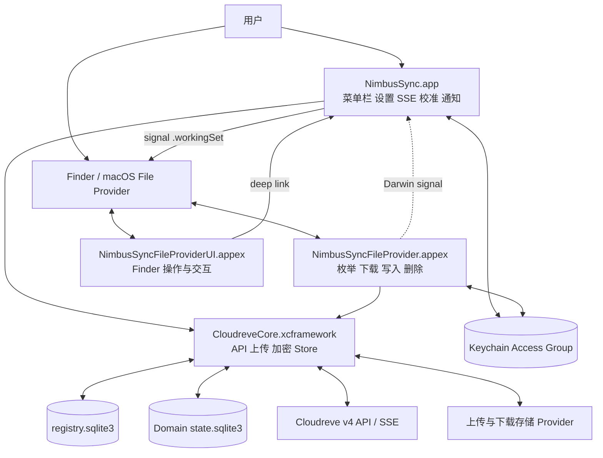
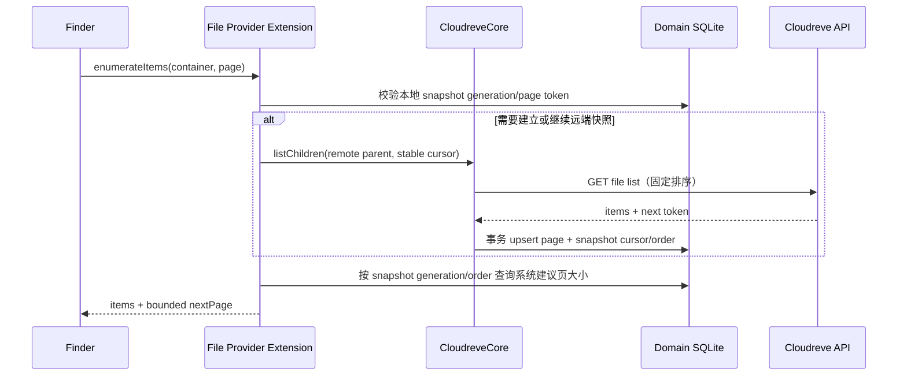
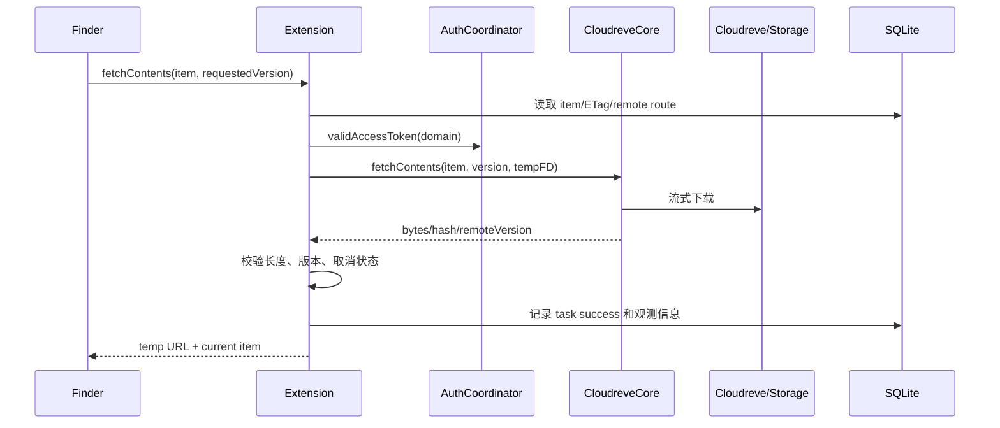
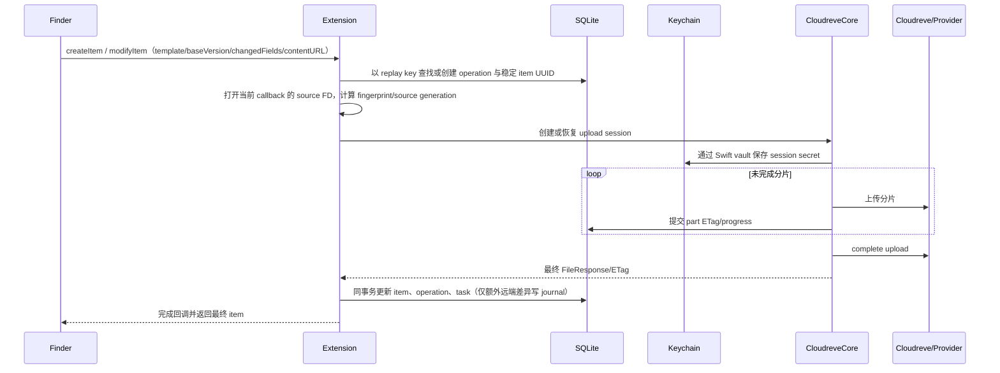
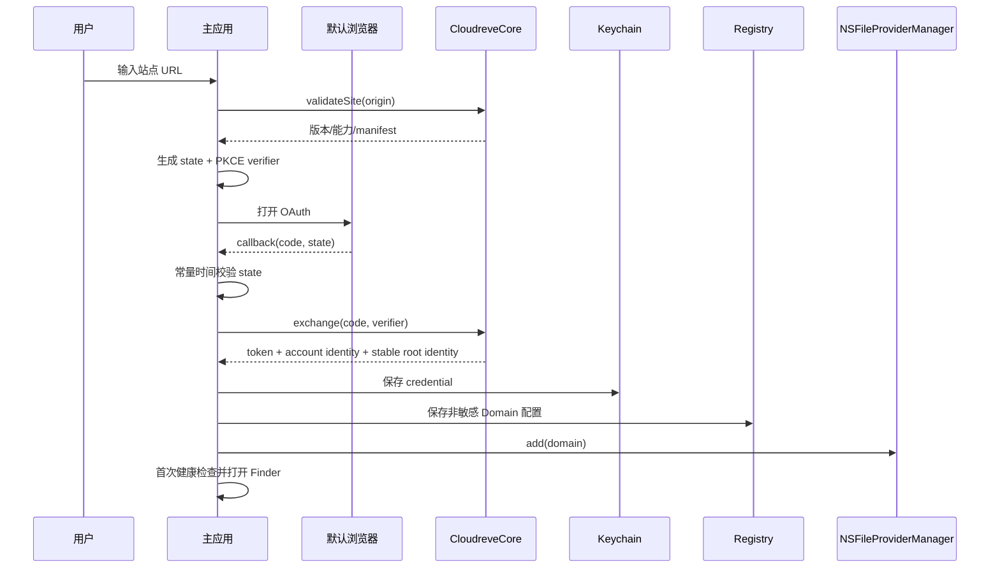

# NimbusSync 技术选型与架构设计

> 文档状态：Architecture Baseline 1.3
> 日期：2026-08-25  
> 目标版本：Technical Preview、0.5 Beta、1.0  
> 输入文档：[macOS 复刻方案调研](./00-macos-port-research.md)、[macOS 客户端产品需求](./01-macos-product-requirements.md)  
> 参考实现：[`cloudreve/desktop@71447408`](https://github.com/cloudreve/desktop/tree/71447408df6db38362703fbbb61dc534ea210470)

## 1. 架构结论

NimbusSync 采用原生多进程架构，连接自托管 Cloudreve 服务端：

- 使用 **Swift 6、SwiftUI 和少量 AppKit** 实现菜单栏、窗口、设置、通知和系统生命周期；
- 使用 **`NSFileProviderReplicatedExtension`** 提供 Finder Domain、占位文件、按需下载、双向修改和空间释放；
- 使用 **File Provider 非 UI action** 执行“立即检查更新”等无交互动作，使用独立的 **File Provider UI Extension** 承接认证恢复、冲突导航等必须呈现界面的动作；
- 由常驻菜单栏主应用维护 SSE、周期校准和通知，并通过 **`SMAppService.mainApp`** 选择性登录启动；1.0 不再增加职责重复的 Login Item helper 进程；
- 将参考项目中可复用的 Cloudreve API、上传 Provider、分片上传和加密能力重构为 **Rust 静态 `CloudreveCore.xcframework`**；
- 使用 **UniFFI** 生成类型安全的 Swift 接口，不向 Swift 暴露 Tokio、数据库连接、Rust trait object 或内部路径类型；
- 使用 **App Group + 分 Domain SQLite WAL** 保存 metadata、目录快照、materialized set、change journal、operation、任务和恢复状态；
- 使用 **Keychain Access Group** 保存 OAuth 凭据以及上传会话中的签名 URL、回调密钥等临时秘密；
- 使用 **SQLite 作为跨进程事实源，Darwin Notification 作为无载荷唤醒信号**，不建立 App 与 Extension 之间的强 RPC 依赖；
- 使用 **Cloudreve SSE 作为变化提示，本地 journal 作为 File Provider sync anchor，reconciliation 作为最终一致性机制**；
- 使用持久 **working-set signal outbox** 衔接 journal 提交与 `signalEnumerator`，保证进程在两者之间终止后仍能补发；
- Replicated File Provider 的远端变化统一通过 **`.workingSet` change enumeration** 发布，不 signal 任意目录 enumerator；
- 实现 **`NSFileProviderDomainState`**，用持久、单调的 Domain version 将系统观察到的本地变更与 provider 状态关联；
- 1.0 采用 **macOS 13+、universal2、Developer ID 站外分发、Hardened Runtime 和 Apple 公证**；自动更新与 partial content fetching 延后到 1.x。

系统不移植 Windows CFAPI、普通目录 watcher、Explorer COM、Tauri UI 或 MSIX 打包逻辑。macOS 的本地文件树完全由 File Provider 管理。

### 1.1 技术选型总表

| 领域 | 结论性选型 | 约束 |
|---|---|---|
| 开发语言 | Swift 6 + Rust stable | Swift 负责 Apple Framework，Rust 负责协议和传输核心 |
| UI | SwiftUI，`NSStatusItem + NSPopover` 承载菜单栏界面 | AppKit 只用于 SwiftUI 尚不稳定或无法覆盖的系统行为 |
| Finder 集成 | `NSFileProviderReplicatedExtension` | 不使用普通目录 watcher 模拟云文件 |
| 后台运行 | 菜单栏主应用 + `SMAppService.mainApp` | 主应用可退出；Extension 仍必须完成系统请求，并将实时性标为降级 |
| OAuth | 默认浏览器 + AppDelegate deep link + PKCE | Swift 校验 callback/state，并完成协议交换 |
| FFI | UniFFI + 静态 XCFramework | 仅暴露稳定 DTO、异步命令、进度与结构化错误 |
| 网络 | Rust `reqwest` + macOS native TLS | 禁止关闭 TLS 校验；显式适配系统代理 |
| 并发 | Swift Concurrency + 受限 Tokio runtime | 不在 FFI 上传递 runtime 或裸线程句柄 |
| 持久化 | `rusqlite` + SQLite WAL | 一个 registry DB，每个 Domain 一个 state DB |
| 凭据 | Security.framework Keychain | token 和上传临时秘密不进入 SQLite、配置和日志 |
| 跨进程通知 | Darwin Notification | 只传固定事件名；Domain UUID 作为数据库查询条件而非通知 payload |
| 日志 | `OSLog` + Rust `tracing` + 可选轮转文件 | 统一 correlation ID 和脱敏规则 |
| 构建 | Xcode 原生多 Target + `Scripts/build.sh` | 构建前检查、App 打包；XCFramework 暂缓 |
| 服务端基线 | Cloudreve v4.12+ | 仍须通过协议兼容门禁，版本号本身不等于能力证明 |
| 发布 | Developer ID + notarized DMG | 首版不以 Mac App Store 为发布前提 |
| 自动更新 | 1.x 再引入 | 1.0 不内置第三方更新框架 |

## 2. 目标、范围与架构约束

### 2.1 目标

本架构覆盖 PRD 中 P0 和 P1 能力：

1. 多 Cloudreve 实例、账号和远端根映射为多个 Finder Domain；
2. 远端目录分页枚举、dataless item、完整按需下载和系统 eviction；
3. Finder 创建、修改、移动、重命名和删除传播到 Cloudreve；
4. Cloudreve 远端变化通过 SSE 和 reconciliation 收敛到 Finder；
5. Extension 强杀、离线、睡眠、系统重启和升级后可恢复；
6. 分片上传可跨 Extension 生命周期续传；
7. 冲突、认证过期、永久失败和事件降级可持久展示并恢复；
8. token、签名 URL、回调 secret 和文件内容不进入普通日志或明文数据库。

### 2.2 非目标

- 不提供任意本地目录双向同步；
- 不复用 Windows inventory 数据库；
- 不把 Tauri、WebView 或 React 作为 macOS UI 运行时；
- 不在 1.0 实现范围下载、选择性同步、暂停 Domain 和自动更新；
- 不实现 Cloudreve Web 管理后台、分享管理或服务端管理；
- 不提供跳过 TLS 校验的选项；
- 不以 SSE 事件历史替代全量校准。
- 不在 1.0 支持 external-volume Domain、Desktop/Documents known-folder replication 或远程安全擦除。

### 2.3 不可破坏的不变量

1. **远端对象身份不依赖路径。** 路径、名称和父目录均为可变 metadata。
2. **Finder 中的本地表示由 File Provider 管理。** 不直接扫描或修改 Domain 根目录来推断同步操作。
3. **完成系统回调前先持久化。** File Provider mutation 只有在远端结果和本地最终状态写入成功后才返回成功。
4. **SSE 只触发同步，不证明同步完成。** “已是最新”必须建立在有效 anchor、无待处理写入和最近校准结果之上。
5. **不盲目重试结果未知的远端写入。** 必须先查询后置条件或进入 reconciliation。
6. **全量校准失败时不生成批量删除。** 只有完整分页成功并完成删除候选确认后才能写 tombstone。
7. **Extension 不依赖 App 存活。** 它可直接访问 Keychain、SQLite 和 CloudreveCore。
8. **秘密只持久化到 Keychain。** SQLite 只保存 Keychain 引用和非敏感恢复信息。
9. **移除 Domain 不调用远端删除 API。** 本地清理和远端文件删除是两条完全不同的调用链。
10. **系统提供的内容 URL 只在当前 callback 生命周期内有效。** Extension 被终止后必须等待 callback 重放和新的 URL，不能凭持久化路径自行打开旧临时文件。
11. **移除或排除不得丢弃 dirty user data。** 未确认上传的内容必须先完成、显式保留到系统返回位置，或阻断操作。
12. **同一账号的远端范围不得重叠。** 规范化后的相同、祖先或子孙 remote root 不能由两个可写 Domain 同时管理。
13. **Replicated Extension 只 signal `.workingSet`。** 对其他 container 调用 `signalEnumerator` 会被系统忽略；真实 old/new parent 必须写入 journal，由 working-set change 传播。
14. **callback 返回后不依赖游离任务。** 关键网络、文件和状态转换必须受当前系统 callback/`Progress` 约束，或先持久化并等待下一次系统调用；detached task 只能做可丢失优化。
15. **排除清理不等于远端删除。** 返回 `excludedFromSync` 前必须持久化 exclusion intent；由此产生的后续 `deleteItem` 只能消费该 intent，绝不进入 Cloudreve trash/delete 调用链。
16. **Domain 根身份不依赖路径。** 根目录以稳定远端实体 ID 绑定，URI 只是当前路由；同路径出现的新对象不得继承原 Domain。
17. **只有 provider-side change 才投递到 working set。** 本地 callback 的提交结果由 completion 返回给系统；对应 SSE 回声只做确认，不能再次发布成远端变化，除非最终服务端状态确有差异。
18. **journal 提交与系统唤醒之间必须可恢复。** 任何需要系统消费的变化都在同一事务写入 signal outbox；通知丢失或进程终止不影响下次补发。
19. **系统标识合法且无敏感信息。** Domain identifier 不包含 `/`、`:`、origin、账号或路径，item identifier 也不暴露远端 ID、路径和文件名。

## 3. 系统上下文与运行时拓扑



图中的 CloudreveCore 是逻辑组件。App 和 File Provider Extension 各自在自己的进程中加载同一静态 XCFramework，并通过 Core repository 访问 SQLite；两个进程不共享 Rust 内存或 runtime。File Provider UI Extension 保持轻量，只负责验证 action context、呈现必要反馈并唤起主应用，不加载 Rust Core。

### 3.1 进程职责

| 进程 | 核心职责 | 明确不负责 |
|---|---|---|
| 主应用 | 登录、Domain 管理、菜单栏、设置、冲突中心、诊断、SSE、周期校准、通知 | 不作为 File Provider 请求代理，不成为 Finder 写入完成的唯一执行者 |
| File Provider Extension | item 枚举、change 枚举、内容下载、创建、修改、移动、重命名、删除、无交互 Finder action | 不维护永久 SSE，不依赖主应用窗口或强 IPC |
| File Provider UI Extension | Finder 交互式 action、认证错误恢复入口、唤起主应用 | 不持有 token，不直接执行上传、删除或冲突覆盖；无交互 action 留在 File Provider Extension |
| Rust Core | Cloudreve 协议、上传 Provider、加密、DTO 映射、SQLite repository | 不调用 SwiftUI，不持有 NSFileProvider 对象，不读取任意用户路径 |

### 3.2 故障独立性

- 主应用退出：File Provider 仍可处理系统实际发起的枚举、下载和写入；SSE、周期校准与通知暂停。已 materialized 目录的普通遍历不会再次调用 Extension，可能保持旧远端视图，Domain 不得显示全局 healthy。
- 主应用恢复：先重订阅 SSE 并 reconciliation，再恢复实时状态；UI 从 SQLite projection 恢复，不依赖旧进程内存。
- Extension 被终止：未完成 operation 和 upload session 保留；系统下次回调时按幂等规则恢复。
- SQLite 暂时繁忙：调用方执行有上限的短退避，不在内存中假定写入成功。
- Keychain 锁定：读请求可使用已 materialized 内容；需要凭据的请求返回认证暂不可用，不删除队列。
- SSE 丢失或主应用未运行：Domain 进入 `event_degraded`、`app_not_running` 或 `reconciling`，不能显示“已是最新”；Extension 只能在系统 callback 的 deadline 内做有界目标校准，不能自行保证周期唤醒。

### 3.3 跨进程通信

1. SQLite 保存所有需要恢复的状态，是跨进程唯一事实源。
2. Darwin Notification 使用固定事件名且不携带 payload；接收方查询 registry 中的全局 revision 和受影响 Domain 集合，不把 Domain UUID、token、路径或文件名编码进通知名。
3. 接收通知后重新查询 SQLite，因此通知丢失不会破坏正确性。
4. 主应用写入远端变化后只调用 `NSFileProviderManager.signalEnumerator(for: .workingSet)`。Replicated Extension 对其他 container 的 signal 会被系统忽略；journal 记录 old/new parent，系统据 working-set changes 更新当前 Finder 视图。
5. 1.0 不引入 App 与 Extension 的 NSXPC 强依赖。未来仅在 SQLite 写竞争经过压测确认不可接受时，才增加可回退的写入 broker。

## 4. 工程与 Target 结构

```text
cloudreve-macos/
├── NimbusSync.xcodeproj
├── Apps/
│   └── NimbusSync/
│       ├── AppLifecycle/
│       ├── MenuBar/
│       ├── Onboarding/
│       ├── Settings/
│       ├── ConflictCenter/
│       └── Diagnostics/
├── Extensions/
│   ├── NimbusSyncFileProvider/
│   │   ├── FileProviderExtension.swift
│   │   ├── FileProviderItem.swift
│   │   ├── Enumerator.swift
│   │   ├── MutationCoordinator.swift
│   │   └── ErrorMapping.swift
│   └── NimbusSyncFileProviderUI/
│       ├── ActionViewController.swift
│       └── ActionRouter.swift
├── Packages/
│   ├── CloudreveDomainKit/
│   ├── CloudreveAuthKit/
│   ├── CloudreveStoreBridge/
│   ├── CloudreveObservability/
│   ├── CloudreveEventCoordinator/
│   └── CloudreveDesignSystem/
├── Rust/
│   ├── Cargo.toml
│   └── crates/
│       ├── cloudreve-protocol/
│       ├── cloudreve-transfer/
│       ├── cloudreve-store/
│       ├── cloudreve-core/
│       └── cloudreve-ffi/
├── Config/
│   ├── Base.xcconfig
│   ├── Debug.xcconfig
│   ├── Release.xcconfig
│   └── Entitlements/
├── Scripts/
│   └── build.sh
├── Tests/
│   ├── SwiftUnitTests/
│   ├── RustTests/
│   ├── FileProviderTests/
│   └── EndToEndTests/
└── docs/
```

### 4.1 Xcode Targets

| Target | 类型 | 依赖 |
|---|---|---|
| `NimbusSync` | macOS App | Swift Packages、CloudreveCore |
| `NimbusSyncFileProvider` | File Provider Extension | DomainKit、AuthKit、StoreBridge、CloudreveCore；Replicated File Provider 与非 UI actions |
| `NimbusSyncFileProviderUI` | File Provider UI Extension | DomainKit、轻量 ActionRouter |
| `NimbusSyncTests` | Unit Test Bundle | Swift 业务模块 |
| `CloudreveFileProviderTests` | Unit/Integration Test Bundle | File Provider adapter 与测试服务器 |

App 和 File Provider 使用相同 App Group 与最小 Keychain Access Group。File Provider Target 的 `NSExtensionFileProviderDocumentGroup` 必须指向同一 App Group；缺少或不一致时 `NSFileProviderManager` 的存储与跨进程访问契约不成立。File Provider UI 不读取数据库或凭据，只通过 extension context 和 deep link 把 action 交给主应用。主应用以 `SMAppService.mainApp` 管理登录启动，不嵌入第二个常驻 helper。Debug 可启用 File Provider testing entitlement，Release 配置不得包含测试 entitlement。

### 4.2 Rust Crates

| Crate | 职责 | 迁移来源 |
|---|---|---|
| `cloudreve-protocol` | REST/SSE DTO、URI、OAuth、错误码、分页 | 重构 `cloudreve-api` |
| `cloudreve-transfer` | 下载流、上传 session、Provider、分片、AES-CTR | 重构 `uploader` 和相关 API |
| `cloudreve-store` | registry/domain schema、migration、repository、journal | 重写原 inventory |
| `cloudreve-core` | 用例编排、重试、reconciliation、能力协商 | 从原 `cloudreve-sync` 提取平台无关逻辑 |
| `cloudreve-ffi` | UniFFI DTO、handle、callback、错误映射 | 新增 |

`cfapi`、`shellext`、`win32_notif`、Windows watcher 和 Tauri command 不进入新 workspace。

## 5. Swift 模块设计

### 5.1 `CloudreveDomainKit`

- `DomainDescriptor`：Domain UUID、展示名、实例 origin、远端根实体 ID/当前 URI、账号 ID、能力快照；
- `DomainLifecycleService`：创建、注册、重命名、移除 `NSFileProviderDomain`；
- `DomainProvisioningSaga`：协调 Keychain、registry、Domain DB 与系统 `addDomain`，启动时收敛 `provisioning/registered/rollback_required` 半完成状态；
- `DomainHealthReducer`：从认证、网络、事件、校准、任务和冲突状态生成唯一用户状态；
- `DomainSignalBus`：发送和接收 Darwin Notification；
- `DomainStateProjection`：实现持久 `NSFileProviderDomainVersion` 与最小非敏感 `userInfo`，供系统 request、action predicate 和 pending set 对齐状态；
- `NameMapper`：远端名称、File Provider 可表示名称和碰撞诊断映射；
- `CapabilityMapper`：Cloudreve permission/capability 到 `NSFileProviderItemCapabilities`。
- `RemoteScopeGuard`：规范化 origin/account/current remote root URI，拒绝同账号重复或祖先/子孙范围，并在根移动后重算。

### 5.2 `CloudreveAuthKit`

- `OAuthCoordinator`：PKCE、state、默认浏览器授权和 `cloudreve://mount` 校验，并兼容旧 `cloudreve://callback/desktop` 路由；
- `CredentialVault`：Keychain 读写、删除和 access group 校验；
- `TokenRefreshCoordinator`：跨进程刷新租约、过期偏移和失败恢复；
- `SecretRedactor`：日志、诊断和错误对象的统一脱敏。

Keychain 使用 `kSecAttrAccessibleAfterFirstUnlockThisDeviceOnly`。每个 Domain 使用独立 credential item；重新授权覆盖原 item，不改变 Domain UUID。

### 5.3 `CloudreveStoreBridge`

- 负责 App Group URL、数据库 bootstrap 和 schema compatibility 检查；
- 封装 UniFFI repository，不让 UI 或 File Provider 拼接 SQL；
- 提供 `AsyncSequence` 风格的状态刷新接口；
- 对 Darwin signal 去抖，重新加载受影响 Domain 的最小查询集合。
- 维护 working-set signal outbox、materialized set 与 pending set 镜像；系统集合只用于调度和 UI，不替代 operation 事实源。

### 5.4 File Provider Adapter

- `FileProviderExtension`：系统入口和 request 生命周期；
- `FileProviderItem`：从稳定 `ItemSnapshot` 映射系统属性；
- `Enumerator`：目录分页和 change journal 分页；
- `ContentCoordinator`：下载、临时文件、校验和取消；
- `MutationCoordinator`：create/modify/delete operation saga；
- `ExclusionCoordinator`：持久化本机排除 intent，区分系统排除清理与用户永久删除；
- `ReplayMatcher`：使用系统临时 item ID、稳定 item ID、base version、changed fields 和 source fingerprint 关联 callback 重放；
- `FieldPolicy`：显式处理 content、filename、parent、时间、flags、tag、favorite、xattr 和 type/creator，不支持字段按 File Provider 协议返回；
- `ThumbnailProvider`：P1 缩略图，失败时不影响主流程；
- `ErrorMapper`：CoreError 到 File Provider/POSIX error。

### 5.5 主应用界面

- 菜单栏使用 `NSStatusItem + NSPopover`，SwiftUI 作为内容视图；
- 主应用设置 `LSUIElement`，默认不显示 Dock 图标；打开设置或冲突中心时激活并显示独立窗口；
- 设置窗口使用 SwiftUI `Settings` 和 `NavigationSplitView`；
- 添加网盘使用单独 `WindowGroup` 和显式状态机；
- 冲突中心通过 `nimbussync://conflict/<id>` deep link 定位；
- 主应用内 `EventCoordinator` 管理 SSE、周期 reconciliation、`signalEnumerator` 与通知；退出应用后这些增强能力暂停；
- 任务取消通过 SQLite `cancel_requested` + Darwin signal 跨进程传播；它只取消当前 attempt，不把仍由系统持有的 dirty change 标记为已放弃；
- 登录启动使用 `SMAppService.mainApp`，开关读取系统真实注册状态；
- UI 只读取 projection/view model，不直接修改同步表；
- 启动时先调用 `getDomains` 建立系统 Domain 事实，并注册 materialized/pending set 通知；任务视图合并系统集合与本地 operation projection；
- 通知由主应用统一发送，category action 只携带本地不透明 ID；File Provider UI 负责系统要求的交互反馈和唤起主应用，不直接执行远端写入；
- 11 种语言、日期/字节格式、VoiceOver、键盘导航、Reduce Motion 与非颜色状态由共享 DesignSystem/Strings Catalog 覆盖，并进入 UI snapshot 与辅助功能测试。

## 6. Rust Core 与 FFI 契约

### 6.1 FFI 原则

1. 一个进程、一个 `CoreRuntime`，一个 Domain、一个轻量 `DomainSession`。
2. async 方法由 UniFFI 映射为 Swift async，不暴露 Tokio runtime。
3. 传输大文件时只传受控文件描述符或 Extension 临时 URL 对应的已打开 handle，不跨 FFI 复制完整内容。
4. DTO 使用显式版本和枚举，不以任意 JSON 作为公共接口。
5. 所有可取消调用返回 operation handle，并绑定 Swift `Progress`/task cancellation。
6. Rust panic 不跨 FFI，统一转成 `CoreError.internal` 并记录 correlation ID。
7. 上传会话秘密通过 UniFFI `SecretVault` callback 交给 Swift Keychain 封装，Rust Store 只保存 opaque reference。
8. Swift 保留原始文件描述符所有权；Rust 开始异步 IO 前先 `dup`，并只关闭自己的副本。
9. `sourceFD` 只属于当前 File Provider callback；operation 持久化 `source_generation/fingerprint` 而不持久化 FD 或临时路径，重放时必须绑定新 FD。
10. UniFFI 回调不得同步回入持有 Swift actor/SQLite 写锁的调用栈，进度通过有界异步通道汇聚，避免跨语言死锁和无界积压。
11. App 发起的跨进程取消先持久化 `cancel_requested`；执行进程在网络 buffer、分片和 completion 前检查 generation，并以 `NSUserCancelledError` 结束当前 callback。进程内 `CoreRuntime.cancel` 只是加速路径。

### 6.2 核心接口

```text
CoreRuntime.bootstrap(role, appGroupPath, secretVault, logSink, logConfig)
CoreRuntime.openDomain(domainID) -> DomainSession

SiteService.validateSite(origin)
AuthService.exchangeOAuthCode(code, verifier, redirectURI)
AuthService.refresh(refreshToken)

DomainSession.listChildren(parentItemID, pageToken, pageSize)
DomainSession.getItem(itemID)
DomainSession.resolveRoot(remoteRootEntityID)
DomainSession.updateAccessCredential(accessToken, expiresAt, generation)
DomainSession.fetchContents(itemID, expectedVersion, destinationFD)
DomainSession.createFolder(operation, replayKey, parentID, name)
DomainSession.uploadFile(operation, replayKey, parentID, name, sourceFD, fingerprint)
DomainSession.modifyItem(operation, replayKey, itemID, expectedVersion, changedFields, sourceFD?, fingerprint?)
DomainSession.deleteItem(operation, replayKey, itemID, expectedVersion, recursive)
DomainSession.enumerateChanges(anchor, limit)
DomainSession.reconcile(scope, reason)
DomainSession.subscribeEvents(clientID, callback)
DomainSession.cancel(operationID)
```

### 6.3 结构化错误

```text
CoreError
├── category
│   ├── authentication
│   ├── network
│   ├── rateLimited
│   ├── permissionDenied
│   ├── notFound
│   ├── quotaExceeded
│   ├── versionConflict
│   ├── nameCollision
│   ├── invalidName
│   ├── integrityFailure
│   ├── cancelled
│   ├── unsupportedServer
│   ├── database
│   ├── unsupportedMetadata
│   ├── rootUnavailable
│   └── unknownOutcome
├── stableCode
├── retryClass
├── userAction
├── correlationID
└── redactedContext
```

Swift 只根据 `stableCode` 选择本地化文案，不把服务端原始 message 直接展示给用户。

### 6.4 网络栈

- `reqwest` 显式启用 native TLS，使用 macOS 系统信任链；
- Cloudreve API 默认连接超时 10 秒、普通请求超时 60 秒；下载和上传使用独立 inactivity timeout，不设不合理的整文件固定时限；
- API Bearer token 只发送到配置实例的标准化 origin；跨 origin 重定向不得携带 Authorization；
- 存储 Provider 的签名 URL 不附加 Cloudreve Bearer token；
- Release 只允许 `https`，不以风险提示代替传输保护；仅 Debug/自动化测试可对 loopback host 开启 `http`；私有部署通过系统信任或安装私有 CA 解决证书问题；
- 禁止 `file`、自定义脚本协议和无上限重定向；
- 系统代理通过独立 macOS proxy resolver 注入 reqwest；代理和私有 CA 是发布前 contract test 项；
- 读取响应采用流式 backpressure，文件内容不整体载入内存。

Cloudreve 加密上传保持服务端协议定义的 AES-256-CTR 兼容性。分片加密必须从全文件绝对 offset 推导 counter，不能在每个分片重新从初始 IV 开始；key、IV 和回调 secret 只存在于进程内存与上传 Keychain item，并由真实加密 Provider contract test 验证。Provider 类型必须穷举匹配：Local/Remote、OSS、COS、S3、KS3、OBS、OneDrive、Qiniu、Upyun 分别验证；Load Balance 必须使用服务端实际选中的子策略，未知枚举值不得回退为 Local。

## 7. 身份、版本与名称模型

### 7.1 Domain identity

首次添加网盘时生成永久 UUID，并通过授权 API 解析、保存 `remote_root_entity_id` 与当时的 `canonical_remote_root_uri`。写入 registry 前计算 `scope_key = SHA-256(canonical_origin, account_id, canonical_remote_root_uri)`，并检查同账号远端范围是否相同或互为祖先；命中时拒绝第二个可写 Domain：

```text
NSFileProviderDomainIdentifier = "crd-<lowercase_uuid_without_braces>"
```

`NSFileProviderDomainIdentifier` 明确禁止 `/` 和 `:`，因此不能使用 `crd:<uuid>`。Domain UUID 不包含域名、账号、远端路径或用户可修改名称；重新授权和 Domain 改名不改变该 UUID。

Domain 根通过 `remote_root_entity_id` 跟随同一对象的安全改名或移动，并更新当前 URI、scope 索引及失效的 path route cache。若根 ID 消失、同路径被其他对象替换、根移动到授权范围外，或移动后与现有可写 Domain 重叠，则把所有受影响 Domain 置为 `root_unavailable/scope_conflict` 并冻结 mutation；不得按旧路径自动认领新对象。所有 path-based Cloudreve mutation 在提交前都要由 item/root ID 重新解析当前 URI，并在响应后核验目标身份。

### 7.2 Item identity

普通远端 item 使用客户端稳定 UUID：

```text
NSFileProviderItemIdentifier = "cri-<lowercase_uuid_without_braces>"
```

Domain 远端根固定映射为系统 `.rootContainer`，数据库通过 Domain 的 `remote_root_entity_id` 解析其远端对象；trash 使用系统 `.trashContainer`，working set 只是变更传播用的合成 container。这三个系统 identifier 不分配 `cri-` ID，也不作为普通远端 item 创建或删除。

数据库另外保存 Cloudreve `FileResponse.id` 为 `remote_entity_id`。选择客户端 UUID 而不是直接暴露远端 ID 有三个原因：

1. 本地新建 item 在远端创建完成前也需要稳定身份；
2. 可以隔离 Cloudreve 版本差异和 identifier 编码；
3. 若服务端在受支持操作中返回替代 ID，可在明确关联关系存在时更新映射而不改变 Finder identity。

路径只作为 API 路由 metadata。无法确定旧、新远端对象对应关系时，不复用 item UUID，也不执行破坏性操作。

本地创建时，File Provider 提供的临时 item identifier 在崩溃重放中保持稳定。`pending_creations` 必须先持久化该 identifier 到客户端 item UUID/operation ID 的映射；远端创建成功后再绑定 `remote_entity_id`。不得为每次 callback 随机创建一个新 operation。

### 7.3 版本

| 版本 | 计算方式 | 用途 |
|---|---|---|
| `contentVersion` | `SHA-256(primary_entity/ETag)`；无可靠内容版本时使用经门禁验证的 content revision，不混入一般 `updated_at` | 下载缓存与并发内容修改检测 |
| `metadataVersion` | `SHA-256(parent UUID, provider name, type, permission, shared, flags, metadata revision)` | rename、move、权限和 Finder 属性刷新 |
| `expectedRemoteVersion` | mutation 开始时保存的 ETag/primary entity | 条件写入与冲突判断 |
| `domainVersion` | 持久归档的 `NSFileProviderDomainVersion`，每次 provider-visible 状态或 action `userInfo` 变化时调用 `next()` | 把系统观察到的本地事件关联到 provider 状态、驱动 pending/action predicate |

哈希输入使用带长度前缀的规范二进制编码，不使用字符串直接拼接。本地尚未提交的内容使用持久化的 `source_generation` 生成临时 content version；远端提交后才切换为服务端 content version，避免旧上传完成覆盖后继本地编辑。

Extension 实现 `NSFileProviderDomainState`。`domainVersion` 的 secure archive 与当前 revision 一起持久化，进程重启后继续 `next()`，不能重新从初始值开始；`userInfo` 只包含 action predicate 所需的非敏感布尔值/小整数，例如 `authenticated`、`hasConflict`，不放文件名、路径或服务端错误文本。更新两者后写入 signal outbox，确保 working set 被唤醒。

每次 create/modify/delete callback 都记录 `NSFileProviderRequest.domainVersion`。若它早于当前持久 Domain version，不直接拒绝，也不能沿用旧路径或权限；必须重新解析 parent/root 身份、capabilities 和 base item version。Domain version 只能作为竞态证据，不能替代 item 的条件版本。

### 7.4 名称映射

- `remote_name` 保存服务端原名；可表示时直接作为 `NSFileProviderItem.filename`，不自行模拟 Finder 的大小写/Unicode collision bounce；
- `remote_collision_key` 对远端原名做 Unicode/大小写归一化，用于预警和本地 create preflight，但不建立会阻止两个稳定 item ID 共存的唯一约束；
- 同目录仅大小写或规范化形式不同的远端对象仍以不同 item ID 枚举，让 File Provider 决定实际 user-visible bounced name。`getUserVisibleURL` 的结果只用于定位和 UI，不反写远端名称；
- 仅当名称本身不能被 File Provider 表示时使用持久、可逆的安全替代名，并记录 `name_mapping_kind`。替代名不得因分页顺序变化，也不得在用户未显式改名时传播回远端；
- 碰撞或替代名 item 添加装饰并进入“需要处理”；本地创建命中远端 collision key 时使用带 existing item 的 `filenameCollision`，由系统和用户完成改名；
- 远端符号链接或 `sys:shared_redirect` 在 1.0 不跟随目标，不进入普通可写树，并计入诊断中的 unsupported item 数；macOS package 按目录逐子项同步而不承诺包级原子性，Finder alias 按普通文件处理，跨 item hard link 与 sparse allocation 不承诺保留；
- 1.0 传输 data fork。服务端时间用于展示，Cloudreve permission 只映射为 capabilities；本地创建时间、POSIX mode、Finder tag/comment、favorite、type/creator、任意 xattr、resource fork 和 POSIX ACL 不写入 Cloudreve，也不参与 identity/version；UI 与兼容矩阵不得暗示这些 metadata 会跨设备同步。
- macOS 上每个 item 必须提供 `contentType`；root item 也必须返回非空、面向用户的 filename。类型变化不得把同一 item 在 file/folder/symlink 之间转换，遇到这种远端变化时创建新 identity 并安全移除旧 identity。

## 8. 持久化架构

### 8.1 App Group 目录

```text
<AppGroup>/
├── Registry/registry.sqlite3
├── Domains/<domain_uuid>/state.sqlite3
├── Locks/auth-<domain_uuid>.lock
├── Logs/
└── Diagnostics/

<NSFileProviderManager.temporaryDirectoryURL>/
└── Transfers/<operation_uuid>/
```

File Provider materialized 内容由系统管理，不复制到 App Group。与系统交换的下载文件和 callback 内容短期克隆必须使用该 Domain 的 `NSFileProviderManager.temporaryDirectoryURL`，以保证同卷 clone/move 语义；该目录不是持久用户数据保险箱。App Group 只保存状态、日志和短期诊断产物。`Transfers` 失败时立即清理；成功交给 completion 后不再修改或删除，因为系统会接管并 unlink，若进程在交接窗口崩溃，则下次启动仅按本客户端随机前缀、operation 终态和最小保留时间清理残留。冲突内容默认由系统 pending item 保管；若实机证明某流程无法重放，必须让用户导出到可见位置或阻断该流程，不能依赖 temporary directory 长期保存唯一副本。

### 8.2 Registry 数据库

| 表 | 关键字段 | 用途 |
|---|---|---|
| `domains` | `domain_id`、origin、display_name、remote_root_entity_id、current_remote_root_uri、account_id、scope_key、status、secret_ref、capability_snapshot/revision | 非敏感 Domain 配置、稳定根身份与重复范围防护 |
| `domain_actions` | action_id、domain_id、kind、step、system_domain_seen、state、error、timestamps | `addDomain`/移除/回滚的跨 Keychain、SQLite 与系统注册恢复 saga |
| `preferences` | key、typed value、updated_at | 全局设置 |
| `process_heartbeats` | role、instance_id、bundle_version、schema_generation、last_seen | 判断 App/Extension 与迁移状态 |
| `schema_meta` | version、generation、compat_min、compat_max、migration_state | 滚动升级兼容性与写入 fencing |

`origin` 保存规范化 scheme、host、port 和 base path。显示值与网络请求值分离，避免字符串拼接 URL。

### 8.3 Domain 数据库

| 表 | 关键字段 | 用途 |
|---|---|---|
| `items` | item_uuid、remote_entity_id、parent_uuid、trash_original_parent_uuid、remote_name、provider_name、name_mapping_kind、collision_key、visibility_state、kind、ETag、版本、size、timestamps、permissions、flags、trashed、tombstone、seen_generation | Finder metadata 镜像；被本机过滤的远端 identity 仍保留 |
| `directory_snapshots` | parent_uuid、snapshot_generation、order_key、complete、server_cursor、updated_at | 防止把不完整或跨版本分页当作完整目录 |
| `materialized_containers` | item_uuid、is_materialized、updated_at | 跟踪系统已落盘目录并限定 working set 通知范围 |
| `system_set_state` | set_kind、system_anchor、refresh_required、refresh_cursor、last_completed_at | materialized/pending set 的可恢复增量刷新状态 |
| `pending_items` | item_uuid/template_id、upload/download error、updated_at | 系统 pending set 的有上限镜像，仅用于 UI 和移除 preflight |
| `change_journal` | sequence、epoch、item_uuid、old_parent_uuid、new_parent_uuid、change_kind、version、origin、delivery_audience、created_at | provider-side container/working-set change enumeration；本地 callback 审计不进入系统投递流 |
| `signal_outbox` | signal_id、working_set_revision、state、attempt、next_retry_at、created_at | journal/domain state 提交后可靠补发 `.workingSet` signal |
| `sync_state` | epoch、min_valid_sequence、domain_version_blob/revision、last_event_at、event_client_id、last_reconcile_at、reconcile_status | anchor、Domain state 与恢复状态 |
| `pending_creations` | system_template_id、item_uuid、operation_id、created_at | 将系统 crash replay 映射回同一创建 operation |
| `operations` | operation_id、replay_key、kind、item_uuid、expected_version、changed_fields、source_generation、state、step、cancel_requested、lease_owner/expires_at、attempt、next_retry_at、outcome、error_code | 持久化本地 mutation saga；取消仅终止 attempt |
| `exclusion_intents` | item_uuid、system_item_identifier、rule_revision、kind、state、created_at、consumed_at | 以稳定 item ID 或 create template ID 区分 `excludedFromSync` 后的系统本地清理与用户永久删除 |
| `upload_sessions` | operation_id、remote_session_ref、secret_ref、fingerprint、provider、chunk_size、expires_at、state | 跨 callback 上传恢复索引 |
| `upload_parts` | operation_id、part_index、offset、length、source_hash、etag、state、attempt | 已完成分片及源内容校验 |
| `tasks` | task_id、operation_id、direction、state、bytes、speed、error、timestamps | 菜单栏与诊断视图 |
| `conflicts` | conflict_id、item_uuid、kind、base/remote/local metadata、state、resolution | 持久冲突中心 |
| `reconcile_runs` | run_id、scope、generation、phase、cursor、lease_owner/expires_at、started_at、completed_at、summary | 校准恢复 |
| `auth_lease` | singleton、owner_instance_id、lease_epoch、expires_at、credential_generation、last_refresh_outcome | refresh 诊断、代次和恢复状态；实际互斥由 App Group lock file 保证 |

主要约束和索引：

- `items(item_uuid)` 为主键；
- 活跃对象的 `remote_entity_id` 在 Domain 内唯一；
- `items(parent_uuid, collision_key)` 建普通索引用于碰撞分组，不设唯一约束；File Provider 可以用稳定 item ID 保存并 bounce 名称冲突对象；
- `pending_creations(system_template_id)` 和 `operations(replay_key)` 唯一；
- 每个 item/template 同时最多一个 active `exclusion_intent`；会返回 `excludedFromSync` 的 intent 必须先提交，并能通过 provider item UUID/create template ID、kind、rule revision 和 source generation 精确命中后续 `deleteItem`，再原子消费；`remote_view_filter` intent 不得拦截用户永久删除；
- `change_journal(sequence)` 单调递增；
- 每个未被成功提交给 `signalEnumerator` 的 provider-visible revision 至少有一个 pending `signal_outbox` 记录；重复 signal 合并但不能提前丢弃；
- 同一 item 同时最多一个 active mutation；
- operation 和 reconcile worker 通过事务 compare-and-swap 获取有期限 lease；崩溃后可接管，但同一 generation 只有一个 owner 提交最终结果；
- `upload_parts(operation_id, part_index)` 唯一；
- 所有外键启用并通过延迟约束支持批量 reconcile。

### 8.4 SQLite 配置和事务

每个连接设置：

```sql
PRAGMA journal_mode = WAL;
PRAGMA foreign_keys = ON;
PRAGMA synchronous = FULL;
PRAGMA busy_timeout = 3000;
```

- 写事务保持短小，不在事务中执行网络、哈希、文件 IO 或通知；
- 需要竞争写锁时使用 `BEGIN IMMEDIATE`；
- busy 采用 50、100、200、400 ms 有上限退避，超过调用 deadline 后返回可重试错误；
- progress 最多每秒或每增加 1 MiB 持久化一次，避免写放大；
- operation 最终状态、item 最终版本和 task 终态在同一事务提交；若该 operation 还产生系统尚未通过 callback 观察到的其他 provider-visible change，则相关 journal 也加入同一事务；
- 远端/SSE/reconciliation 产生的 provider-visible change 与 `signal_outbox` 在同一事务提交；signal API completion 成功后才能清除 outbox，启动时和网络/系统恢复后必须 drain；
- 本地 create/modify/delete callback 的最终 item 与 operation 同事务提交，但不写入面向系统的 change journal；只有 completion 之外确实改变了其他 item，或服务端最终状态不同于 callback 返回值时，才为差异对象写 provider-visible change；
- 网络请求前领取 lease，网络返回后重新校验 lease owner、operation generation 和 source generation；失去所有权的 worker 不提交旧结果；
- checkpoint 由主应用在空闲时执行；主应用未运行时只允许短小被动 checkpoint，Extension 不进行长时间 checkpoint。

### 8.5 秘密存储

Keychain item 分为：

1. `credential/<domain_uuid>`：access token、refresh token、过期时间、credential generation 和 token-family metadata；
2. `upload/<domain_uuid>/<operation_uuid>`：小型 Provider credential、callback secret、加密 key/IV 等必须跨 callback 保留的秘密；
3. `diagnostic-install-id`：仅本地关联，不用于遥测。

SQLite 的 `secret_ref` 是随机引用，不包含 secret。上传成功、明确取消或会话过期后删除对应 Keychain item。

Keychain 不保存无上限的分片 signed URL 数组。Provider 必须允许根据非敏感 session ID 重新获取/刷新 URL，或只持久化有上限的小型恢复凭据；否则该 Provider 不进入“跨进程续传”支持矩阵。访问令牌和 signed URL 只按各自 origin 使用，禁止在重定向时转发。

### 8.6 Schema 升级

- schema 声明 `compat_min` 和 `compat_max`，支持新旧相邻一个应用版本短暂并存；
- migration 先新增表/列和回填，再在后续版本删除旧结构；
- 破坏性迁移使用 shadow table，不在 Extension 请求中执行长事务；
- 主应用将 `migration_state` 置为 preparing，等待已登记写事务结束并递增 schema generation；无法强制终止的旧 Extension 在下一次写入前因 generation/compatibility fencing 拒绝写入；
- 旧进程发现 schema generation 改变或超出兼容范围时关闭连接、返回可重试升级中错误并退出当前请求，不猜测字段含义；
- 只有新版本完成 migration、integrity check 和 generation 发布后才恢复 mutation；主应用不能仅凭进程 heartbeat 假定旧 Extension 已退出；
- migration 失败保留原库和诊断信息，Domain 进入 `error`，不得以空库覆盖。

### 8.7 损坏检测与恢复

- 启动和异常退出后执行有上限的 `quick_check`；检测到损坏时立即把 Domain 置为 `repair_required`，关闭写入并隔离原 DB/WAL，不直接创建同名空库；
- 主应用在干净 checkpoint 后使用 SQLite online backup 保留最近两个本地状态快照；备份不包含 Keychain secret，轮转遵循诊断存储上限；
- `items`/目录快照属于可重建缓存，但 `operations`、`pending_creations`、`upload_sessions`、`exclusion_intents`、`conflicts` 和 `domain_version_blob` 属于关键恢复记录。恢复时优先从最新完整备份读取，再通过 File Provider pending/materialized enumerator、callback/reimport 重放和远端后置条件校准；
- `domainVersion` 无法从备份解码时不得重新创建一个可能小于系统已知值的版本。若 item identity 仍可靠，由主应用发起 root reimport 并等待 `importDidFinish` 重建系统状态；identity 也不可靠时只能安全保留 dirty user data 后重建 Domain；
- 在所有 unknown outcome 得到确认前，不删除 upload Keychain item、不发布 tombstone、不把任务标记成功；无法证明状态时保留需处理事项并导出诊断；
- 只有确认不存在 dirty/pending 数据，或系统已经把 dirty user data 保留到 Domain 外后，才允许丢弃损坏库并从远端全量重建 metadata。

## 9. File Provider 协议

### 9.1 目录枚举



规则：

- 优先采用 `observer.suggestedPageSize`，并限制为 `min(system suggestion, server max_page_size, 500)`；不以固定 500 覆盖系统建议；
- `NSFileProviderPage` 不超过 500 bytes。page token 仅编码版本、Domain、parent、snapshot generation 和本地 offset/短游标；大型或敏感远端 cursor 保存在 SQLite；
- 枚举排序必须显式固定并跨页稳定。阶段 0 需验证服务端 cursor 在并发 create/rename/delete 下无重无漏；
- 若服务端没有稳定 snapshot/cursor 语义，则 Core 先完成一个本地 `directory_snapshot` generation，再从该 generation 向系统分页；不能把变化中的 page-number 列表直接暴露为一次 File Provider 枚举；
- 构造本地 snapshot 不得阻塞单次 File Provider page callback 数分钟：有旧完整 snapshot 时先返回旧 snapshot，并在 callback 返回前持久化 refresh intent，由主应用或后续系统 callback 接管；不得依赖 callback 返回后的 detached task。首次无快照时执行有 deadline 的分段构建，超时返回可重试错误；无法在有界稳定化轮次内收敛则该服务端版本不通过门禁；
- 只有最后一页成功写入后，`directory_snapshots.complete` 才为 true；
- 离线时仅可返回已完成的缓存快照；不完整缓存不得伪装成完整目录；
- 每页对象先完成身份映射、名称碰撞检查和数据库事务，再交给 observer；
- 同一 snapshot 内 provider-safe name mapping 和 sort key 固定；中途远端变化写入 journal，在当前枚举完成后的 change enumeration 交付；
- 枚举只处理当前 container，不递归加载整个 Domain；
- 根容器使用 `.rootContainer`，working set 使用 `.workingSet`。

### 9.2 Change enumeration 与 sync anchor

anchor 使用版本化二进制结构：

```text
AnchorV1 { domain_uuid, scope_kind, container_uuid?, epoch_uuid, sequence }
```

处理流程：

1. 解码并校验 Domain；
2. 若 Domain/scope 不匹配、epoch 不一致，或 sequence 小于 `min_valid_sequence`，返回 `syncAnchorExpired`；
3. 从 anchor sequence 后按全局顺序扫描有上限的一段 journal，再按 enumerator scope 过滤 update/delete；目录 enumerator 同时检查 old/new parent，working set 只返回其成员相关变化；
4. 同一批内可按 item 合并为最终净变化，但不能跨越 delete 后 recreate 的 identity 边界；
5. 返回“最后已扫描”的 sequence，即使该段均被 scope 过滤也要推进 anchor；该 Domain journal 仍有未扫描记录时设置 `moreComing`，避免被无关目录变化卡住；
6. observer 完成前不裁剪本批 journal。

`change_journal` 是 File Provider 的 provider-side delivery log，不是所有内部状态变化的审计日志。来自 create/modify/delete callback 的本地提交通过 completion 已经被系统观察，不再次进入 working-set change；SSE 回声若与 operation 的 remote ID、目标 parent/name 和最终 version 相符，只确认 operation/event watermark。只有回声暴露了 callback 未返回的额外服务端变化时，才生成新的 provider-visible journal row。

每次写入 provider-visible journal、递增 `domainVersion` 或修改 action `userInfo` 时，同一事务 upsert `signal_outbox`。提交后 App 或 Extension 调用 `signalEnumerator(for: .workingSet)`，仅在 completion 成功后确认该 outbox revision；进程启动、唤醒和 Darwin signal 后均 drain。这样即使进程在数据库 commit 后、系统 signal 前终止，也不需要等待下一条 SSE 才能恢复交付。

journal 软保留目标为最近 7 天和最近 100,000 条记录中覆盖范围更大者。达到 1,000,000 条或 256 MiB 的硬上限时允许压缩并更新 `min_valid_sequence`，即使未满 7 天；旧 anchor 随后必须明确过期并触发重新枚举，不能返回空变化。

若主应用 heartbeat 已过期或 SSE 处于 degraded，Extension 先交付当前已持久化 journal。仅当当前 callback deadline 足够时执行有界目标 scope freshness check；较大的校准写入 `reconcile_runs`，等待主应用恢复或后续系统 callback 接管，不能把 callback 返回后的 detached task 当作调度器。校准提交后只 signal `.workingSet`。`enumerateChanges` 不等待一次可能持续数分钟的全量扫描，也不因暂时没有 journal 记录而把 Domain 标记为 healthy。尤其是 materialized 目录的普通遍历不会触发 Extension 枚举，主应用退出期间不能保证主动发现其远端变化。

#### Working set 与 materialized containers

- 实现 `materializedItemsDidChange`：先持久化 `materialized.refresh_required`，再在数秒预算内通过 `enumeratorForMaterializedItems` 增量推进 system anchor 并更新 `materialized_containers`，完成或保存 continuation 后才调用 completion。主应用也订阅 materialized-set notification 并接管未完成 intent；Extension 初始化和后续 callback 会再次 drain，正确性不依赖 callback 返回后的游离任务；
- working set 至少包含已 materialized 目录的直接子项、最近访问 item、active operation/conflict 和系统已知的 pending item；不默认把 100,000 item 全量常驻 working set；
- trashed 顶层 item、shared item，以及未来明确支持的 favorite/tagged item也属于 working set；trashed 目录的后代按系统契约移出 working set；
- 远端 create/modify/delete 只有在 old/new parent 属于 materialized set 或 item 已在 working set 时才进入 working-set change；目录自身的 change journal 仍完整保留，所有刷新信号统一发给 `.workingSet`；
- 远端 move 同时记录 old/new parent，任一侧 materialized 时通知 working set；未知 parent 不伪造删除，系统会结合 item identity 处理；
- materialized set 丢失或损坏时可保守退化为扩大 working set，但要记录 degraded 状态并后台重建，不能漏发已落盘目录的远端变化。

### 9.3 按需下载



- 1.0 总是完整下载，P2 再实现 partial fetch。当前 SDK 对完整 `fetchContents` 明确说明 `requestedVersion` 总为 nil，因此请求开始前读取最新 item/ETag，并通过实体版本约束获取内容；若下载中版本变化则丢弃结果并做有界重试，不返回自造的 `versionOutOfDate` 错误；实现仍需防御未来系统传入非 nil 版本；
- 临时文件必须位于该 Domain 的 `NSFileProviderManager.temporaryDirectoryURL`，使用随机文件名和排他创建；获取目录失败时返回可重试初始化错误，不能回退到跨卷任意临时目录；
- 下载过程中持续检查系统 cancellation；
- 非 nil `requestedVersion` 已无法提供时丢弃临时内容并重新发布当前 item；`versionNoLongerAvailable` 虽自 macOS 12.3 可用，但 Apple 将其定义为 strict partial-content fetch 的语义，完整 fetch 不借用该错误。具体全量下载错误映射由 Spike 固化，nil 请求按上一条规则重读最新版本；
- 长度、解密结果或服务端校验失败时不得 materialize；
- 失败时立即清理临时文件；成功调用 completion 后文件所有权交给系统，Extension 不再修改或主动删除。崩溃遗留只在下次启动按本客户端随机前缀、终态与最小保留时间清理；
- 0 字节文件走同一完成协议，不创建伪内容。

### 9.4 本地创建与内容修改



源文件快速 fingerprint 包含 size、File Provider base version 以及首尾分段哈希；mtime 和 inode 可能因系统重新提供临时副本而改变，只作为诊断字段，不参与同一内容的硬判定。完整内容哈希与逐分片 plaintext 哈希在流式上传时计算，并在提交前与 operation 的 source generation 绑定。

callback 与源内容生命周期规则：

- create 的 replay key 首选系统在 item template 中提供、且 crash replay 时稳定的临时 item identifier；远端成功后映射到客户端 item UUID；
- modify 的 replay key 由 `item_uuid + baseVersion + normalized changedFields + source fingerprint/generation` 构成；delete 由 `item_uuid + baseVersion + recursive` 构成；
- File Provider 提供的 content URL 由系统所有，completion 后可能被 unlink；只能在 callback 内打开并 `dup` FD，禁止把 URL/FD 持久化后跨进程使用；
- Extension 被终止时 operation/session 保留为 `awaiting_source_replay`。只有系统重放 callback、提供新 content URL 且 fingerprint 匹配后才继续上传；
- 若重放内容已变化，旧 session 进入 superseded/abandoned，已上传分片不得与新内容混合；同一 item 的后继修改排在当前 generation 之后；
- `mayAlreadyExist`、deletion-conflicted 和 reimport 必须先尝试匹配现有 remote/item/operation；无法证明对应关系时返回可恢复冲突，不创建第二个远端对象。
- `reimportItems(below:)` 的 completion 只表示系统已接受请求，不表示扫描结束；恢复状态保持 `reimporting`，直到收到 `importDidFinish`。root reimport 可能在 completion 前终止 Extension，因此触发动作和恢复标记必须由主应用预先持久化。
- Finder 从普通目录复制/移动入 Domain、同 Domain 复制和跨 Domain 复制都以系统 create template 为事实源；即使 Cloudreve 有 copy API，也只有在能把源 item 无歧义关联到当前 callback 且不改变系统幂等语义时才可优化。复制出 Domain 只触发读取；跨边界移动必须等目标 create 成功后才允许源侧 delete，任一侧失败都不得提前删源。
- 建立字段支持矩阵：1.0 支持 `contents`、`filename`、`parentItemIdentifier`；服务端 `creationDate/contentModificationDate` 是只读最终值，Cloudreve permission 只映射 capabilities。对 `lastUsedDate`、`tagData`、`favoriteRank`、`fileSystemFlags`、`extendedAttributes`、`typeAndCreator` 等不支持字段，只返回对应 `stillPendingFields`；若本次 `changedFields` 全部不支持，则原样返回整组，让 macOS 12+ 将其视为不支持，不能假成功后丢值或写回默认值。
- resource fork 被 File Provider 视为 contents。1.0 若检测到非空 resource fork 或仅 resource fork 发生变化，必须返回稳定的 unsupported/cannot-synchronize 错误并保留本地 pending 内容；不能只上传 data fork 后宣称整个 contents 已同步。
- 本地 symbolic link 不跟随 target，也不把 target 内容作为普通文件上传；package、alias 和 symbolic link 的 create/modify template 必须按明确类型分支处理。服务端没有经门禁验证的同类语义时，symbolic link、socket、device、FIFO 等使用 `unsupported_local_type` exclusion intent 后返回 `excludedFromSync`，让系统保留本地对象；后续 `deleteItem` 只消费该 intent，不触发远端删除。

上传恢复规则：

- 已完成分片的 ETag 持久化在 `upload_parts`；
- 每个完成分片同时保存 plaintext SHA-256；恢复时重新读取并校验已完成分片，防止相同 size/mtime 下混用新旧内容；
- Extension 被终止、网络断开或系统取消时保留仍有效 session，但没有新的 callback source FD 时不主动续跑；
- 只上传 pending/failed part，不重传已确认 part；
- Provider completion 必须可重试或可查询；结果未知时进入 `verifying`，不得创建第二个文件；
- 只有服务端明确 session 无效、过期，或源 fingerprint 改变时才放弃 session；
- 最终 FileResponse 入库前，File Provider callback 不返回成功。
- 0 字节文件优先使用经门禁验证的 create/update API，不创建不接受空内容的 Provider upload session；服务端缺少可靠空文件契约时禁用该 Provider 的空文件写入。
- App 的取消请求只终止当前 attempt：执行进程检查 `cancel_requested` 后取消网络与 `Progress`、保留 dirty/pending item 和可恢复 session，并以 `NSUserCancelledError` 完成本次 callback；系统后续仍可重放。

当一次 `modifyItem` 同时包含 filename、parent 和 contents 时，整个 changed-fields 集合进入同一 saga。远端 API 只能分步时，可通过 `stillPendingFields` 让系统稍后重放尚未提交的字段；不得先返回所有字段成功，再以后台任务补做内容或改名。只有经过 Spike 证明远端对该组合具备原子可见性时，才设置 `NSExtensionFileProviderAppliesChangesAtomically=YES`。

### 9.5 移动、重命名、废纸篓和永久删除

每个 mutation 形成持久 saga：

```text
queued
  -> preflight
  -> remote_submitted
  -> verifying
  -> committed
```

`committed` 已包含可重放的最终 item/error 结果。completion handler 本身无法做可靠的“调用后持久化”，因此不设置 `callback_completed` 为正确性条件；系统若因回调丢失而重放，Extension 直接返回已提交结果。

- `preflight` 用 `remote_entity_id` 获取当前对象，验证父级、路径和预期版本；
- move/reparent 提交前按最新远端父链检查目标不在当前目录子树中；File Provider 对纯本地操作的无环保证不能覆盖与远端并发 move 形成的环，身份或父链不完整时返回冲突并触发校准；
- 远端 API 支持条件参数时，必须携带 entity ID/expected version；
- rename、move 与同次内容修改合并为一个逻辑 operation；Cloudreve 只能分步执行时，持久化当前 step，准确返回 `stillPendingFields`，并在失败后校准，不把半完成状态标记成功；
- `NSFileProviderDomain.supportsSyncingTrash` 在 macOS 13+ 的系统默认值是 `true`，因此 Domain 构造时必须先显式设为 `false`；只有 `trashRestore` 门禁通过后才设为 `true`。启用后，普通 Finder 删除表现为把 `parentItemIdentifier` 改为 `.trashContainer`，通过 `modifyItem` 映射到 Cloudreve 软删除并保存原父级；恢复是从 `.trashContainer` reparent 到指定或原父级，映射 Cloudreve restore；
- Extension 必须能枚举 `.trashContainer`；trashed item 留在 working set，trashed 目录的子项从 working set 移除，恢复目录后重新发布子项变化；
- `deleteItem` 表示从废纸篓永久删除。永久删除只针对 preflight 确认的远端对象；根目录、只读对象和 identity 不明确对象拒绝删除；
- `deleteItem` 入口首先按 stable item ID 或 create template ID、intent kind、rule revision 和 source generation 查询 active `exclusion_intent`。只有由先前 `excludedFromSync` 返回创建的 `local_create/unsupported_local_type` intent 才能拦截这次系统清理；`remote_view_filter` 不会产生该类 delete callback，不能吞掉并发的真实用户删除。匹配时只转为 `local_only_excluded` 并返回成功，不获取远端删除 lease、不调用 Cloudreve API；没有精确匹配时才进入永久删除 saga；
- 未带 recursive option 的非空目录返回 `directoryNotEmpty`；递归删除逐项记录结果，部分失败不得把整棵子树标记成功；
- 若目标服务端只能直接永久删除或无法可靠恢复，则不声明 trash 支持，并隐藏 `.allowsTrashing/.allowsDeleting`，不能把 Finder 普通删除悄悄降级为不可恢复操作；
- 请求超时但可能已到达服务端时进入 `unknownOutcome`，随后按远端 ID 查询后置条件；
- 目标在普通树和 trash 中均经可信查询确认不存在时，`deleteItem` 按幂等删除返回成功；不能因本地 metadata 丢失就再次按旧 URI 发起删除；
- 确认已完成则提交本地状态，确认未完成才重试，无法确认则产生需处理事项；
- SSE 本身不携带客户端 operation ID。本地写回声通过 active operation 记录、remote ID、目标父级/名称和最终版本后置条件合并；服务端未来若支持幂等键回传，再作为额外证据，不能假定当前协议已有该字段。

### 9.6 File Provider 错误映射

| CoreError | File Provider/POSIX 映射 | 后续动作 |
|---|---|---|
| authentication | `notAuthenticated` | 保留 operation，提示重新授权 |
| network/server unavailable | `serverUnreachable` | 有限退避，状态为 offline/degraded |
| versionConflict | macOS 13-15 使用带 item/underlying context 的 `cannotSynchronize`；macOS 26+ 可用时使用 `localVersionConflictingWithServer` | 创建持久 conflict，等待用户/系统合并；不得使用只适用于严格内容获取的 `versionNoLongerAvailable` |
| nameCollision | `filenameCollision` | 用户改名或进入冲突中心 |
| notFound | `noSuchItem` | 触发父目录校准 |
| permissionDenied | 读写分别映射 Cocoa `NSFileReadNoPermissionError` / `NSFileWriteNoPermissionError`；无对应语义时用 `cannotSynchronize` | 刷新 capabilities，停止重试 |
| quotaExceeded | `insufficientQuota` | 展示容量问题 |
| local disk full | POSIX `ENOSPC` | 保留可重试状态 |
| excludedByRule | `excludedFromSync` | 本地内容保留并标记“仅此 Mac”，规则变化后可重新触发 |
| cancelled | Cocoa user cancelled | 不显示永久失败 |
| unknownOutcome | `cannotSynchronize` | 先 verification/reconciliation，不盲重试 |
| deletionRejected/versionConflict on delete | `deletionRejected` 并携带最新 item | 让系统恢复磁盘 item，持久化冲突或权限状态 |
| nonRecursiveDirectoryNotEmpty | `directoryNotEmpty` | 不执行部分递归删除 |

实际系统错误码以 File Provider Spike 在 macOS 13 至发布时最新稳定版的行为测试为准，业务分类不随系统码变化。所有返回给 File Provider 的错误最终必须属于 `NSFileProviderErrorDomain` 或 `NSCocoaErrorDomain`；其他底层错误放入 `NSUnderlyingErrorKey`，不能直接穿透 Rust/HTTP 错误域。

### 9.7 Finder P1 能力与排除规则

- “立即检查更新”是 `NSFileProviderCustomAction` 非 UI action：在 File Provider Extension 内登记目标 item/container reconciliation，不重新提交本地上传；
- “在 Cloudreve 中查看”和“解决冲突”通过 File Provider UI action 提供必要反馈后 deep link 到主应用；前者根据 item identifier 在主应用查询当前 remote ID/URI，再构造受信 Web URL，不把缓存路径直接拼入 URL；
- “解决冲突”只通过 action predicate 对 pending conflict 可用；UI Extension 不读取数据库或 token，也不直接执行覆盖；
- thumbnail 使用独立缓存键 `remote_entity_id + contentVersion + sizeClass`，超时或失败直接回退系统图标；
- decoration 只从持久状态派生，不把进度更新编码进 item identifier；
- 1.0 不声明 `.allowsExcludingFromSync`，因为 Finder 原生排除动作的系统清理协议不等价于“仅隐藏但保留 Cloudreve 远端对象”；用户只能从设置页配置本机排除规则；
- 排除规则使用 Rust gitignore 兼容 parser 编译，规则与 revision 按 Domain 保存；名称匹配基于规范化的 Domain 相对路径，不能使用 user-visible bounced path 反推远端 identity；
- 从未枚举的远端匹配 item 可直接过滤；已经进入 Finder 的远端 item 先写 `remote_view_filter` intent，再标记为 `remote_excluded`、保留 identity/remote metadata，并向 working set 报告该 provider item identifier 被删除。这里的删除只表示从本机 provider view 移除，不写远端 tombstone、不调用 Cloudreve delete；若系统因本地编辑产生 deletion-conflicted create，则由同一 intent 转入“保留到本机/冲突”流程；
- 本地 create/modify 命中规则时，先事务写入带 provider item UUID 或 create template ID 的 `exclusion_intent`，再返回 `excludedFromSync`。系统会保留本地内容并随后调用 `deleteItem`；该 callback 必须命中 intent 并走本地清理分支。排除后的 item 已脱离 provider 管理，产品不承诺继续提供自定义 decoration；
- 已展示远端 item 的 view-removal 与该 item mutation 严格串行；若系统因并发本地编辑发出 deletion-conflicted create，使用同一 exclusion intent 进入“保留到本机/冲突”流程，不把本地内容重新上传到被排除路径；
- 规则更新会递增 anchor epoch 并触发完整重新枚举；移除已 materialized item 前必须由主应用确认，存在 dirty/pending 内容时必须先同步或保留到 Domain 外，禁止直接隐藏；移除规则时，远端 item 写 `viewAdded`，本地排除项通过 `signalErrorResolved(excludedFromSync)` 请求系统重新评估；
- 排除操作只改变本地视图，任何路径都不得调用远端 delete。

### 9.8 Domain 安全移除

1. 在 registry 中创建 `domain_actions(kind=remove)` 并把 Domain 标记为 `removal_preflight`，停止主应用中该 Domain 的 SSE/reconciliation；该本地标志不能假定已经阻止 Finder 产生新修改；
2. 调用 `waitForChanges(below: .rootContainer)` 获取当前磁盘变更 barrier，再查询本地 operations、upload sessions、conflicts、unknown outcome 和系统 pending set。pending set 有容量上限且不包含尚未被 provider 认识的初始传输，只能作为补充证据；`maximumSizeReached` 或 barrier 失败时必须按“可能有 dirty 数据”处理；
3. 存在已知未确认写入时，用户可选择继续同步后重试移除，或继续安全保留。正常产品路径一律使用 `NSFileProviderDomainRemovalModePreserveDirtyUserData`，覆盖检查与 remove 之间的新竞态；系统返回的 preserved location 必须在 UI 中展示并可从 Finder 打开；
4. `RemoveAll` 只允许无用户数据的自动化测试或明确的内部恢复流程使用，不以一次空 pending 查询作为安全证明。调用 `NSFileProviderManager.remove` 后等待系统完成，不能先删数据库/Keychain；
5. 关闭该 Domain 的 Core session 和数据库连接，保留移除审计摘要，再删除 credential、upload session Keychain items、state DB、临时文件和局部日志；
6. 从 registry 删除配置、完成 `domain_actions` 并发送状态信号。用于重新启用的 P2“禁用”流程另存 descriptor，不复用完整删除流程。

任一步失败都保留 `removal_preflight/removing` 恢复记录并允许重试。整个调用链没有 Cloudreve delete API，清理其他 Domain 的共享目录或 Keychain item 也被禁止。“准备卸载”按相同步骤遍历所有 Domain，并在最后注销 `SMAppService.mainApp`。

## 10. 远端事件与一致性协议

### 10.1 主应用 SSE Coordinator

菜单栏主应用运行时为每个启用 Domain 维护一个 SSE subscription：

```text
connect
  -> resumed: 继续消费
  -> subscribed: 触发全量 reconciliation
  -> file events: 事务写 journal + signal outbox，再 signal .workingSet
  -> reconnect-required: 立即重连并校准
  -> stream/error: 指数退避，进入 event_degraded
```

- `client_id` 对 Domain 稳定，保存在 `sync_state`；
- SSE parser 遵循事件流 framing，支持 CRLF、多行 `data`、comment/keep-alive，并限制单事件与累计 buffer 大小；解析失败、未知状态事件或超限都进入 degraded 并触发校准，不能静默跳过；
- 重连退避使用 full jitter，基础 1 秒，最大 60 秒；连续失败后保持每 5 分钟尝试；
- 事件按远端根范围过滤，越界事件只记录计数，不写入 item；
- SSE payload 只作为变化线索；create、modify 和 rename 事件必须通过 info 或父目录列表获取完整当前 metadata 后再写 journal；
- 同一批事件在一个短事务内映射、去重并递增 journal sequence；
- 当前 Cloudreve 事件仅提供 `type/file_id/from/to`，没有可依赖的单调 event sequence。客户端只能以 `resumed/subscribed/reconnect-required` 作为恢复提示；异常断流或恢复语义不明时必须 reconciliation，不能宣称精确检测所有事件缺口；
- delete 事件先按 `file_id` 查询普通树与 trash：软删除映射为 `.trashContainer` 变化，只有确认永久不存在后才写 tombstone；
- SSE 事件若命中已提交本地 operation 的 remote ID、目标状态和最终版本，则只确认回声，不生成第二条 provider-visible change；版本、父级、名称或权限不一致时仅发布实际差异；
- commit 成功后只 signal `.workingSet`，信号按 250 ms 合并；old/new parent 保存在 change journal 中供系统传播，不能依赖对具体 parent 的 signal；合并器消费持久 outbox，不能只依赖内存 debounce timer；
- 主应用每 30 秒写 heartbeat。超过 90 秒未更新时，Domain 视为事件降级，Extension 可在系统请求触发时执行目标目录校准；心跳恢复后必须先 reconciliation，不能仅因进程重新出现就标记 healthy。

### 10.2 Reconciliation

reconciliation 使用可恢复的 generation scan：

1. 创建 `reconcile_runs`，记录 run UUID、范围、起始 journal sequence 和服务端能力快照 revision；
2. 从远端根按目录广度优先分页，逐页 upsert item 并标记 `seen_generation`；启用 trash 时另行完整扫描 `cloudreve://trash` 并关联原父级；
3. 每页 cursor 和完成状态持久化，进程终止后可继续；
4. 新增和版本变化可逐页写 journal；
5. 只有整个范围完整遍历成功，才计算未见对象；
6. 有 pending 本地 operation 的未见对象不删除，转为冲突或单项验证；
7. 普通树未见对象先按 remote ID 查询 trash；确认软删除则更新为 `.trashContainer`，只有 normal/trash 两侧完整快照都未见时才成为 tombstone 候选；
8. 删除候选使用稳定 remote ID 或同一 generation 的完整父目录快照确认；任何目录分页不稳定、不完整或能力 revision 改变时均不执行破坏性映射；
9. 回放扫描期间收到的 SSE 变化，并对受影响目录做稳定化复查；
10. 在最终事务中写 trash/tombstone、journal 和成功时间；
11. 失败时保留旧有效 anchor，Domain 保持 reconciling/error，不宣称已同步。

每次扫描开始和结束都验证 `remote_root_entity_id`。根 ID 对应对象安全改名或移动时，事务更新当前 URI 和 scope key，并使受影响的 path route cache 失效；若身份消失、权限不足、同路径换成新 ID、授权范围越界或与其他 Domain 形成重叠，终止扫描并进入 `root_unavailable/scope_conflict`。在该状态解除前只允许读取已 materialized 内容和诊断，不提交远端 mutation。

触发条件：

- 首次 `subscribed`；
- reconnect-required、event client ID 改变或事件缺口；
- anchor 过期；
- 数据库恢复或进程异常终止；
- 用户“立即检查更新”；
- 主应用在线时每 6 小时校准 working/materialized scope、每 24 小时在空闲和非低电量条件下做全 Domain 扫描，并加入 Domain 级随机抖动；主应用退出期间由 Extension 的目标 scope 校准兜底，不承诺周期全量扫描；
- 本地摘要与远端枚举摘要不一致。

### 10.3 重试和幂等语义

| 请求类型 | 自动重试策略 |
|---|---|
| GET/list/info | 网络错误和 5xx 可指数退避重试 |
| download range/stream | 支持校验后的范围恢复时重试，否则重建临时文件 |
| create/upload complete | 仅有服务端幂等键或能以稳定 parent/name/client operation metadata 证明唯一后置条件时自动重试 |
| rename/move/trash/restore/delete | 结果未知时先查询 remote ID、trash 状态和目标状态 |
| token refresh | 使用 App Group advisory lock 串行；响应结果未知时按服务端轮换契约恢复或转重新授权 |
| conflict/permission/name error | 不重试，等待用户或 metadata 更新 |

系统提供的是“可恢复的至少一次执行 + 幂等收敛”，不宣称在无服务端幂等支持时具备网络级 exactly-once。

## 11. 认证与授权

### 11.1 首次授权



callback 中的账号、远端根和显示名均视为不可信输入，必须通过 token 对应的服务端 API 再确认。Domain 创建前必须把 remote root URI 解析为稳定实体 ID，并验证该对象是可枚举目录；仅有 callback path 不得建立 Domain。

在 registry commit 与 `add(domain)` 前执行重复范围检查：相同 canonical origin + account ID 下，若新旧 remote root 相同或互为祖先，则中止创建并定位现有 Domain。该检查在数据库唯一 `scope_key` 之外还需事务内执行祖先关系校验，避免并发添加绕过。

Domain 创建跨越 Keychain、两个 SQLite 文件和系统 Domain registry，不能伪装成单一事务，必须执行可恢复 saga：

1. 事务创建 `domain_actions(kind=provision, step=prepared)` 与 `domains(status=provisioning)`，预留稳定 Domain UUID/scope；
2. 写入 credential Keychain item，初始化并校验 Domain DB，再将 action step 逐项提交；
3. 调用 `NSFileProviderManager.add` 后，使用 `getDomains` 按稳定 identifier 核对系统事实；同 identifier 已存在视为幂等恢复，不创建第二个 Domain；
4. 首次 item/根枚举健康检查通过后才标记 `registered` 并向用户显示完成；
5. App 启动时扫描未完成 action：系统 Domain 已存在则继续初始化，尚未存在则重试或按反向顺序清理 DB/Keychain；任何回滚都不得删除远端数据；
6. 同 identifier 的展示名更新复用 `addDomain` 的更新语义，但不得借此覆盖 scope/account 配置。

### 11.2 跨进程 token refresh

1. 请求前以 60 秒偏移检查 access token；
2. access token 有效时直接加载到当前进程内存中的 `DomainSession`；
3. 需要刷新时，在 App Group 的 `Locks/auth-<domain_uuid>.lock` 上获取带 deadline 的 POSIX advisory lock；该锁跨进程互斥并在进程崩溃时由内核释放，SQLite `auth_lease` 只记录 owner/epoch 供观测与恢复，不单独承担 fencing；
4. 获得锁后重新读取 Keychain 和 `credential_generation`；若其他进程已经刷新则直接使用新凭据；
5. 调用 Rust refresh API。成功后把 access token、refresh token、到期时间、token-family metadata 和递增后的 `credential_generation` 作为一个 Keychain item 更新，再同步 SQLite generation 并发送状态通知；若进程在 Keychain 更新后、SQLite commit 前终止，下一个 lock owner 以 Keychain generation 为准修复 SQLite；
6. 其他进程只做有上限等待，然后重新读取 Keychain；等待超过当前 File Provider deadline 时返回可重试认证错误，不并发发起第二次刷新；
7. 进程在 refresh 响应后、Keychain commit 前崩溃时，只有服务端支持旧 refresh token 重放、旋转 grace period 或结果查询，才能无交互恢复。否则把结果视为未知，停止循环刷新并进入 `auth_expired`，保留所有 operation，要求原账号重新授权；
8. refresh token 无效时同样进入 `auth_expired`，所有写 operation 保留，不消耗普通重试次数。

Rust Core 不再像参考实现一样在每个进程内部独立自动刷新 token。刷新编排统一由 Swift `TokenRefreshCoordinator` 完成。

### 11.3 权限映射

Cloudreve `permission`、item capability 和 navigator capability 映射为 File Provider item capabilities。Domain 创建时显式设置 `supportsSyncingTrash = false`，门禁通过后才开启；`.allowsTrashing` 只在软删除和 restore 均通过门禁时开放，`.allowsDeleting` 只对 trash 中允许永久删除的 item 开放。无法确认写权限时按只读处理。权限拒绝后立即刷新 metadata，不继续展示可执行但必然失败的操作；读取权限撤销后拒绝新的 `fetchContents`，但不承诺擦除系统缓存、用户已复制到 Domain 外或备份中的历史内容。

## 12. 冲突设计

### 12.1 冲突类型

- `contentVersionConflict`：本地内容基于旧 ETag；
- `nameCollision`：目标父目录已有同 collision key 对象；
- `deleteVsModify`：一端删除、另一端修改；
- `moveVsMove`：本地与远端目标父级不同；
- `identityAmbiguous`：无法证明路径上的对象仍是原 remote ID；
- `unsupportedName`：远端名称无法无歧义映射；
- `partialMutation`：复合远端操作只完成部分步骤。

### 12.2 冲突记录

冲突保存 base、local、remote 三方版本摘要、系统 pending item identifier 和 `source_generation`，不把完整文件内容或 callback URL 写进数据库。默认由 File Provider 保留 dirty 内容。temporary directory 只可在当前 callback 中用于交接，不能作为跨重启唯一冲突副本；若实机验证发现某类系统流程不能保证重放，则该流程必须要求用户导出到可见位置或被禁用。未解决冲突不因通知关闭、App 重启或任务清理而删除。

### 12.3 解决动作

| 动作 | 实现 |
|---|---|
| 保留远端 | 再次读取远端版本，确认后放弃本地 operation，并让系统获取当前远端内容 |
| 覆盖远端 | 以用户确认时读取的最新 ETag 条件写入；远端再次变化则保持冲突 |
| 保留两个版本 | 生成唯一冲突副本名，上传本地内容为新 item，原 remote item 不变 |

冲突副本默认格式为 `文件名（设备名 冲突副本 YYYY-MM-DD）.ext`，重名时追加序号。所有不可逆动作在主应用中确认，通知只负责导航。主应用写入 resolution intent 后调用 `signalErrorResolved` 或请求系统重新调度相关字段；Extension 只在收到带新 content URL 的 callback 后执行覆盖/保留两个版本。若 callback 尚未重放，冲突保持 pending，不能把旧临时路径当作内容来源。

## 13. 状态、任务与后台调度

### 13.1 Domain 状态归并

组件状态分别持久化，最终状态由 reducer 计算，不允许最后写入者覆盖高优先级异常：

```text
auth_expired
  > root_unavailable / scope_conflict
  > conflict / permanent_error
  > offline
  > reconciling
  > syncing
  > event_degraded / app_not_running
  > healthy
```

`healthy` 需要同时满足：

- credential 有效；
- remote root 身份、授权范围和 Domain overlap 检查有效；
- 无待处理 conflict/permanent error；
- 无 active mutation；
- anchor 有效；
- 最近 reconciliation 未失败；
- 主应用正在运行且事件通道未 degraded；无主应用时只能显示“Finder 可用，实时更新已暂停”，不能归并为 healthy；
- 网络离线状态未生效。

### 13.2 Operation 与 Task

- `operation` 表示必须正确完成的持久业务动作；
- `task` 表示供 UI 展示的执行实例和进度；
- 一个 operation 可以经历多个 task attempt；
- 清理 task history 不删除 operation、item、conflict 或 upload session；
- `succeeded` 只在服务端提交、最终 metadata/operation 已同事务落盘后产生；若存在 callback 未覆盖的 provider-visible 差异，对应 journal/outbox 也必须已落盘。
- “取消”设置 operation 的 `cancel_requested` 并取消当前 task/`Progress`；它不是业务 operation 的成功终态。只要系统仍持有 dirty change，operation 保持 `awaiting_system_retry` 或由重放建立下一 attempt；“放弃本地修改”必须走单独、有确认的冲突/排除流程。
- “重试”清理受控 backoff/cancel intent，并对可由 File Provider 恢复的错误调用 `signalErrorResolved`；主应用不持有旧 content URL，也不直接代替 Extension 上传。
- 主应用通过 `NSFileProviderPendingSetDidChange`/Extension 的 `pendingItemsDidChange` 触发 pending enumerator 增量刷新，并把结果与持久 task 合并展示。pending set 有数量上限、至少约 1 秒延迟且不包含 provider 尚未知的初始传输，因此只能补充 UI，不能决定 operation 成败、Domain 移除安全性或“已是最新”。
- `globalProgress(for: .uploading/.downloading)` 可用于系统总进度提示，但 item 级名称、错误和重试仍以本地 task/pending projection 为准。

### 13.3 并发预算

初始默认值：

| 工作 | 每 Domain | 全进程 |
|---|---:|---:|
| metadata 请求 | 4 | 8 |
| 文件下载 | 2 | 4 |
| 活跃文件上传 | 2 | 3 |
| 单文件分片 | `min(provider setting, 4)` | 8 |
| reconciliation | 1 | 2 Domains |
| SSE | 1 | 每 Domain 1 条 |

同一 item 的 mutation 严格串行。后台 reconciliation 优先级低于用户打开文件和 Finder mutation。主应用监听睡眠/唤醒、网络路径和低电量信号，延后非紧急全量校准并加入抖动；File Provider 用户请求不因低电量被静默丢弃，仍遵循系统 cancellation 和资源上限。

## 14. 安全与隐私架构

### 14.1 信任边界

不可信输入包括：

- 用户输入的实例 URL；
- OAuth callback 参数；
- Cloudreve 返回的名称、路径、metadata、URL 和错误文本；
- 存储 Provider 的签名 URL 与响应；
- Finder 提交的名称、内容 URL 和字段集合；
- 导入的排除规则。

### 14.2 控制措施

- URL 使用结构化 parser 和 origin allowlist，不通过字符串拼接；
- API Authorization 不跨 origin；
- Release 中上传签名 URL 只允许 HTTPS，限制 host、重定向和响应大小；Debug 的 loopback 测试例外不进入发布配置；
- 文件描述符由 Swift 在 Sandbox 权限范围内打开，Rust 不接受任意绝对路径；
- 所有名称先做长度、保留字符、Unicode 和 collision 检查；
- SQL 全部使用参数绑定；
- OAuth 使用随机 state、PKCE S256 和一次性 callback 消费；
- OAuth state/verifier 只在授权事务生命周期内保存，callback scheme 只接受预期 host/path；换 token 后再通过服务端 API 确认 account 与 remote root；
- signed URL 的 scheme、host、port、过期时间和重定向逐 Provider 校验；不得把 Cloudreve Authorization、cookie 或 URL 查询参数转发到新 origin；
- 自定义 Finder action/deep link 只携带本地不透明 item/conflict ID，主应用重新查询 Domain 与权限；不得信任 URL 中的远端路径或动作参数；
- token、code、Authorization、cookie、签名查询参数、加密 key/IV 统一脱敏；
- 默认不采集遥测，不上传实例域名、账号、文件名、路径或内容摘要；
- 诊断导出必须由用户主动触发，并允许隐藏文件名和路径；
- 权限撤销只阻止后续远端访问并更新系统视图；已经 materialized、复制出 Domain 或进入本地备份的数据不具备远程安全擦除保证，产品不得作 DLP/DRM 承诺；
- Release 启用 App Sandbox、Hardened Runtime 和最小 entitlements。

### 14.3 日志字段

允许记录：时间、process role、Domain 短 ID、operation/task/item 本地 UUID、阶段、耗时、字节数、稳定错误码和 correlation ID。

禁止记录：token、OAuth code、完整 signed URL、Authorization header、cookie、上传 callback secret、加密材料、文件内容。默认日志也不记录完整实例 URL和文件路径。

## 15. 可观测性与诊断

### 15.1 本地指标

- 每 Domain item、materialized、tombstone 和 conflict 数；
- operation 各状态数量和最老等待时间；
- 上传/下载吞吐与失败率；
- SSE 最近事件、重连次数和 heartbeat；
- reconciliation 最近结果、耗时、扫描 item 数和差异数；
- journal 最小/最大 sequence、行数和大小；
- SQLite busy 次数、事务耗时和 WAL 大小；
- App、Extension、Rust Core、schema 和服务端版本。

### 15.2 Correlation ID

每次 File Provider request 生成 correlation ID，并贯穿 Swift、UniFFI、Rust、operation、task 和日志。远端请求可使用不含隐私的 request ID header；服务端不支持时仍保留本地链路。

### 15.3 诊断包

诊断包包含：

- `manifest.json`：版本、OS、架构、Domain 状态摘要；
- 脱敏日志；
- schema 和 migration 状态；
- operation/task/conflict 计数，不包含 secret；
- 可选文件名/路径映射，默认关闭；
- SQLite integrity check 结果，不直接复制包含用户 metadata 的数据库。

## 16. 性能设计

- UI 只读取本地 projection，popover 打开不等待网络；
- 文件列表和 change journal 始终分页；
- Rust 下载、上传和加密使用固定大小 buffer，默认 1 MiB，峰值不随文件大小增长；
- 单目录不构造完整 Swift 对象数组后再分页；
- thumbnail 使用独立低优先级队列和有上限缓存；
- reconciliation 逐页提交并释放 DTO；
- SQLite 查询必须覆盖 `parent_uuid`、`remote_entity_id`、`operation state` 和 `journal sequence` 索引；
- SwiftUI 状态刷新按 Domain 和视图增量加载，不每秒重建全部 100,000 item；
- 主应用在睡眠唤醒后加入随机延迟，避免所有 Domain 同时重连和校准；空闲状态不使用高频无条件轮询。

性能基线沿用 PRD：popover p95 不高于 300 ms，普通目录首屏枚举 p95 不高于 2 秒，SSE 正常时远端变化 p95 不高于 5 秒，单 Domain 至少支持 100,000 item。

## 17. 构建、签名与发布

### 17.1 Rust 构建

Rust workspace 的测试和格式检查按开发命令直接执行。Rust FFI 的 XCFramework、
UniFFI bindings 和 artifact checksum pipeline 暂缓，待产品集成完成后再恢复；当前
`Scripts/build.sh` 不生成或嵌入 XCFramework。

### 17.2 Entitlements

| Target | 必需能力 |
|---|---|
| App | App Sandbox、outgoing network、App Group、Keychain Group、URL Scheme、User Notifications |
| File Provider | File Provider、App Sandbox、outgoing network、App Group、Keychain Group；Info.plist 的 `NSExtensionFileProviderDocumentGroup` 与 App Group 一致 |
| File Provider UI | File Provider UI、App Sandbox；不授予网络和 Keychain 能力 |

正式 identifier、App Group 和 Keychain Group 由签名配置注入，不硬编码在业务模块。

File Provider Info.plist 默认不声明 `NSExtensionFileProviderAppliesChangesAtomically`。只有远端组合 mutation 的可见性经 Spike 证明满足该声明后才能启用。面向 macOS 26+ 若采用系统 fail-on-conflict sync control，则同时声明 `NSExtensionFileProviderSupportsFailingUploadOnConflict=YES`，并仅在收到对应 option 时返回 `localVersionConflictingWithServer`；macOS 13-15 保持稳定的 `cannotSynchronize` + 持久冲突路径。

### 17.3 发布物

```text
NimbusSync.app
├── Contents/PlugIns/NimbusSyncFileProvider.appex
└── Contents/PlugIns/NimbusSyncFileProviderUI.appex
```

发布流程：Release 构建、单元与集成测试、codesign 深度校验、notary submit、staple、Gatekeeper 实机验证、生成 DMG、升级与卸载检查。

## 18. 测试架构

### 18.1 测试分层

| 层 | 内容 | 运行环境 |
|---|---|---|
| Rust unit | URI、DTO、错误、哈希、名称、retry、journal、upload part | macOS CI |
| Swift unit | 状态 reducer、OAuth state、Keychain wrapper、File Provider mapping | XCTest |
| Store integration | 多进程 WAL、busy、migration、anchor、crash recovery | 临时 App Group |
| API contract | Community/Pro、并发分页、ETag、删除语义、SSE、Provider upload/recovery | 真实版本矩阵 |
| File Provider integration | Domain、枚举、download、mutation、eviction | 签名测试 App |
| End-to-end | PRD AC-001 至 AC-014 | 真实 Finder + Cloudreve |
| Fault injection | kill、断网、超时、磁盘满、重复事件、响应丢失 | 自动化与人工组合 |
| Release | universal2、签名、公证、升级、卸载 | 支持的 macOS 版本 |

### 18.2 必须注入的故障点

- operation 写入后、远端请求前终止；
- 远端请求成功后、本地 commit 前终止；
- upload part 成功后、part ETag 入库前终止；
- create/modify callback 中止后以相同系统临时 ID/base version 和新的 content URL 重放；
- 同一 item 上传期间再次保存，验证 source generation 串行与旧结果不覆盖新内容；
- 最后一页枚举前网络中断；
- page-number/cursor 枚举期间远端插入、删除、改名，验证快照无重无漏或明确失效；
- reconciliation 遍历完成前中断；
- Keychain refresh 成功后、lease 释放前终止；
- journal commit 后、`signalEnumerator` 前终止；
- signal API 返回失败、主应用重启和连续事件被 debounce 合并，验证持久 outbox 最终补发且不会无限放大 signal；
- App 写入 `cancel_requested` 后 Extension 忽略/接收 Darwin signal，验证两条路径最终都在检查点停止当前 attempt；
- materialized set 更新后、working-set signal 前终止；
- 返回 `excludedFromSync` 后、系统 `deleteItem` 前终止，并注入 exclusion cleanup 与用户永久删除竞争；
- Domain provisioning 在 Keychain、registry、Domain DB、`addDomain` 每一步后终止；
- SQLite busy、损坏、磁盘满；
- migration 准备/提交时旧 Extension 尝试写入；
- SSE 重复、乱序、缺口和 reconnect-required；
- 本地 mutation 完成后注入匹配与不匹配的 SSE 回声，验证匹配回声不二次发布、不触发重复下载，不匹配回声只发布真实差异；
- refresh 请求成功前后终止 owner，覆盖 refresh token 不轮换、轮换带 grace 和一次性轮换三类服务端；
- 远端根改名、移动、移入重叠范围、删除以及原路径创建同名新 ID；
- 普通目录/同 Domain/跨 Domain 的 copy 与 move-out，及远端并发 reparent 导致的潜在目录环；
- 权限撤销后新的 fetch/mutation 被拒绝，同时验证产品不宣称擦除既有本地副本；
- rename/move/trash/restore/delete 请求返回超时但服务端实际已执行。

### 18.3 PRD 可追踪性

| 架构能力 | 覆盖需求 |
|---|---|
| 主应用 UI 与生命周期 | FR-ONB、FR-SET、FR-NTF、FR-I18N、FR-A11Y、FR-LIFE |
| Domain + Auth | FR-AUTH、FR-DOM、AC-001、AC-007、AC-008、AC-013 |
| File Provider read path | FR-FP、AC-002、AC-009 |
| Operation saga + uploader | FR-UP、AC-003、AC-005、AC-010、AC-012、AC-014 |
| Journal + SSE + reconcile | FR-EVT、AC-004、AC-010、AC-011、AC-014 |
| Conflict store | FR-CNF、AC-006 |
| State/task projection + DomainState | FR-TSK、FR-LIFE、AC-011、AC-012 |
| Keychain + redaction/diagnostics | FR-AUTH、FR-DIA、PRD 10.4 |
| Finder enhancements | FR-FND、FR-IGN、AC-013、P1 验收 |
| Stable root + path resolver | FR-DOM-014、FR-DOM-015、AC-014 |

## 19. 协议兼容门禁

以下事项必须由受控的真实 Cloudreve/Finder 环境验证，并作为发布证据记录。它们是发布门禁，不是可在实现中猜测的细节。

| 门禁 | 通过条件 | 不通过时的产品行为 |
|---|---|---|
| 稳定实体 ID | rename/move 后 `FileResponse.id` 保持稳定，或事件提供可靠旧新关联 | Domain 降为只读预览，禁止不安全写入 |
| 稳定根身份 | 可由授权 token 将 remote root URI 解析为稳定目录 ID，并在根改名/移动后按 ID 找回当前 URI、识别删除与越权 | 只允许根级只读预览，不能支持可移动子目录 Domain |
| 完整分页 | page/next token 在静态及并发 create/rename/delete 下能无重无漏遍历 10,000 item，或能构造客户端稳定 snapshot | 不发布该服务端版本支持 |
| 条件内容写 | `previous` 能可靠拒绝 stale version | 禁止覆盖修改，只允许新建/下载 |
| 幂等创建 | 文件/目录创建支持客户端幂等键，或响应丢失后可通过唯一且抗竞争的后置条件找回同一对象 | 禁用对应创建能力，不以路径猜测后盲目重试 |
| 条件 metadata mutation | rename/move/delete 可绑定 entity/version，或服务端提供等价幂等契约 | 对缺失契约的操作返回“不受支持”，不得用路径盲写 |
| 内容版本语义 | `primary_entity`/ETag 的稳定性、内容变化与 metadata-only 变化行为可复现 | 不用于 `contentVersion` 或条件写，相关修改能力降级 |
| 上传恢复 | session 可恢复；同一 part index 重放幂等或可查询；part ETag 与 completion 结果可跨进程确认 | 对应 Provider 不列入 1.0 支持矩阵 |
| 上传回调返回对象 | Provider completion 后能可靠查询最终 `FileResponse`/entity/version | operation 保持 verifying，不向 File Provider 返回假成功 |
| Provider 选择语义 | Local/Remote、OSS、COS、S3、KS3、OBS、OneDrive、Qiniu、Upyun 均能识别；Load Balance 可得到服务端实际子策略 | 未知或无法解析的策略 fail closed，禁用该次写入，绝不回退为 Local |
| 空文件写入 | create/update 对 0 字节有明确成功与版本返回，且不依赖拒绝空内容的 Provider 分片接口 | 对应 Provider 禁用空文件创建/覆盖并给出稳定错误 |
| 删除语义 | 软删除、trash 枚举、restore、永久删除、递归与批量部分失败可复现 | 隐藏 trash/delete capability，不能把普通 Finder 删除降级为永久删除 |
| SSE 恢复 | subscribed/resumed/reconnect-required 语义可复现 | 始终显示 event degraded，并提高 reconciliation 频率 |
| 账号身份 | token 可查询稳定 user/account ID | 禁止原 Domain 原地重新授权 |
| refresh token 轮换 | 验证是否轮换、旧 token grace/idempotency 以及响应丢失后的恢复语义 | 结果未知时停止自动刷新并要求重新授权；不得并发刷新或循环旧 token |
| TLS/代理 | 系统根、私有 CA 和系统代理行为符合预期 | 阻断相关网络环境的发布声明 |

参考 API 中 rename、move 和 delete 请求仍以 URI 为主，未体现 expected entity/version 参数。为了满足 PRD 的“不静默覆盖、不删除错误对象”，1.0 不以 preflight 查询替代服务端原子条件检查。目标服务端若没有该能力，必须补充服务端契约或明确降级对应写操作。

### 19.1 能力快照

站点校验后保存非敏感 `capability_snapshot`：

```text
serverVersion
stableEntityIdentity
stableRootIdentity
cursorPagination
snapshotSafePagination
conditionalContentWrite
idempotentCreate
conditionalMetadataMutation
contentVersionSemantics
resumableUploadProviders[]
uploadCompletionQueryableProviders[]
zeroByteWriteProviders[]
resolvedUploadPolicyKinds[]
deleteSemantics
trashRestore
sseResume
refreshRotationSemantics
thumbnail
```

能力由探测和版本矩阵得出，不根据 Community/Pro 名称猜测。服务端升级后重新探测；能力降低时先停止相关写入并提示用户。

## 20. 分阶段实施

详细实施计划按阶段独立维护：

| 阶段 | 计划文档 | 核心退出结果 |
|---:|---|---|
| Phase 0 | [协议门禁与 File Provider Spike](./03-phase-0-protocol-file-provider-spike.md) | 协议/平台风险被验证，能力矩阵和最低版本冻结 |
| Phase 1 | [持久化、认证与 File Provider 读路径](./04-phase-1-persistence-read-path.md) | 多 Domain 生产读路径、Store/Auth 和基础产品入口可用 |
| Phase 2 | [写路径、上传恢复与冲突安全](./05-phase-2-write-path-upload-recovery.md) | mutation、Provider 上传恢复、冲突和安全移除闭环 |
| Phase 3 | [SSE、变更交付与最终一致性](./06-phase-3-events-consistency.md) | 事件缺失、进程终止和远端根变化后可自动收敛 |
| Phase 4 | [1.0 产品化、质量与发布](./07-phase-4-product-release.md) | P0 + P1、AC-001 至 AC-014 和发布门禁全部通过 |

每个阶段必须以对应计划中的自动化检查、真实 Finder/Cloudreve 证据和 exit report 为完成依据。仅代码合并、静态检查通过或部分 happy path 成功，不构成阶段完成。

### 阶段 0：协议与 File Provider Spike

- 完成第 19 节全部 P0 门禁探测；
- 建立 Xcode 三个产品 Target（App、File Provider、File Provider UI）和最小 XCFramework；
- 注册单 Domain，完成分页枚举、完整下载、内容修改；
- 验证 create callback 重放、trash/restore、组合字段修改、`.workingSet` 单一 signal 路径和 working/materialized set；
- 验证合法 Domain identifier、`NSFileProviderDomainState` 持久单调性、signal outbox 崩溃补发和本地 SSE 回声去重；
- 验证 remote root 稳定身份、copy/move-out、目录环与权限撤销边界；
- 验证 `excludedFromSync -> deleteItem` 清理握手、Domain provisioning 各阶段崩溃恢复、取消 attempt 后的系统重放；
- 强杀 Extension 并验证 operation 使用新 content URL 恢复；
- 冻结最低 macOS 版本和受支持 Cloudreve/Provider 矩阵。

退出标准：真实 Finder 中稳定展示并打开文件；修改具备条件写；创建具备幂等契约；根身份可验证；进程终止后不重复创建、假成功或漏发已提交远端变化。

### 阶段 1：持久化与读路径

- registry/domain schema、migration、Keychain；
- item identity、名称映射、目录分页和缓存；
- change journal、anchor 和完整 fetchContents；
- 基础菜单栏状态与添加 Domain。

退出标准：单 Domain 100,000 item、单目录 10,000 item 分页通过；离线缓存不误报完整性。

### 阶段 2：写路径与上传恢复

- create/modify/move/rename/trash/restore/delete operation saga；
- 按发布支持矩阵逐个重构并验证 Provider uploader，删除未知策略到 Local 的兜底映射；
- Keychain upload secret、part checkpoint、source fingerprint；
- 冲突持久化和三种 P0 解决动作。

退出标准：AC-005、AC-008 完整通过；AC-003 本地到远端链路、AC-006 冲突引擎和 AC-010 写路径故障子场景通过。

### 阶段 3：SSE 与最终一致性

- 主应用 EventCoordinator、SSE supervisor、heartbeat 与 `SMAppService.mainApp` 登录启动；
- generation reconciliation、稳定化复查、journal compaction；
- event degraded、offline 和 auth refresh 协调；
- 多 Domain 公平调度。

退出标准：事件缺失、服务端重启、睡眠唤醒、主应用退出和强杀后，Finder 请求保持可用；主应用恢复后自动校准并收敛。

### 阶段 4：1.0 产品能力

- 完整设置、任务、冲突中心、通知和诊断；
- Finder decoration、custom action、thumbnail；
- 排除规则、11 种语言和可访问性；
- universal2、签名、公证、升级和卸载。

退出标准：PRD P0 + P1 和 AC-001 至 AC-014 全部通过，无发布阻断项。

## 21. 发布验收

1. 支持矩阵内的 Cloudreve 版本和 Provider 全部通过自动 contract test；
2. 多 Domain 在 Finder 中独立工作，身份不会因改名、移动或重新授权改变；
3. 完整下载、eviction、创建、修改、移动、重命名、移到废纸篓、恢复和永久删除均有真实 Finder E2E；
4. SSE 丢失和 anchor 过期均能触发 reconciliation 并最终收敛；
5. Extension 或 App 任意终止后无静默丢任务、重复创建和假成功，callback 重放不依赖旧临时路径；
6. 上传能从已完成分片恢复，session secret 不进入 SQLite 或日志；
7. 所有冲突保留至少一个可恢复版本，未解决项重启后仍存在；
8. Domain 移除只清理本地状态，不调用远端 delete；
9. 日志和诊断通过 secret 扫描；
10. 排除清理 callback 不调用远端 trash/delete，Domain provisioning 中断可恢复且无孤立凭据/Domain；
11. journal/signal outbox 在任意进程终止点最终补发，本地 mutation 的 SSE 回声不形成重复 change 或下载循环；
12. 远端根改名/移动按稳定 ID 跟随，删除、替换、越权和范围重叠会 fail closed；
13. Finder copy/move-out、目录环防护、权限撤销和 refresh 轮换故障路径均通过；
14. macOS 13 至发布时最新稳定版（当前包含 13、14、15、26）的 Apple Silicon 与 Intel 目标完成签名、公证、升级、卸载和 100,000 item 压测。

## 22. 最终架构基线

1. Finder 同步层固定为 Replicated File Provider，不再保留普通目录同步兼容层。
2. Apple 平台能力固定由 Swift 实现，Cloudreve 协议与传输固定由 Rust Core 实现。
3. UniFFI 是唯一业务 FFI；大文件通过受控 FD 流式传输。
4. SQLite WAL 是恢复与跨进程状态事实源，Keychain 是唯一秘密持久化位置。
5. 主应用提供 SSE 实时性、周期校准和通知，Extension 保证系统请求可独立完成，reconciliation 保证最终正确。
6. 所有 mutation 通过持久 operation saga、条件版本和后置验证执行。
7. 任何无法满足稳定 identity、幂等创建、条件 mutation、trash/delete 语义或上传恢复的服务端/Provider，不进入 1.0 对应可写能力矩阵。
8. Domain 根以稳定实体 ID 绑定；Domain/item 标识不携带敏感信息并满足 File Provider 字符限制。
9. provider-side journal、持久 signal outbox、Domain version 和本地回声去重共同构成系统变更交付协议。

该基线可直接用于建立工程、拆分模块和编写阶段计划。后续若 File Provider Spike 或 Cloudreve contract test 证明某项平台契约不成立，应先同步修改 PRD、本文档和验收矩阵，再调整实现。
