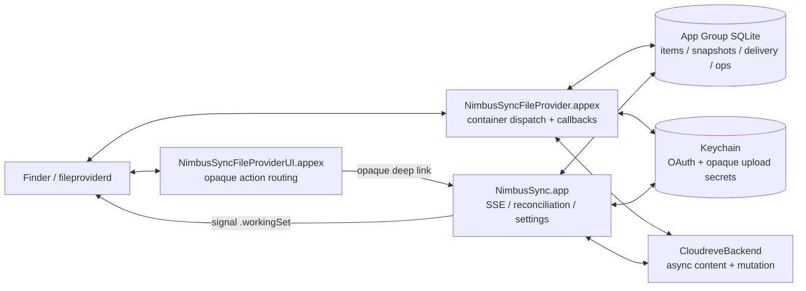

# NimbusSync File Provider 对齐 Nextcloud Desktop 的设计与实施方案

> 文档状态：Implementation Proposal
> 日期：2026-08-30
> 适用版本：NimbusSync Technical Preview / Beta，macOS 13+
> 参考实现：Nextcloud Desktop `3769349affcab99aee8ba6dd15b80bd632829beb`
> 前置文档：[产品需求](./01-macos-product-requirements.md)、[技术架构](./02-macos-technical-architecture.md)、[阶段 0](./03-phase-0-protocol-file-provider-spike.md)、[阶段 1](./04-phase-1-persistence-read-path.md)、[阶段 2](./05-phase-2-write-path-upload-recovery.md)、[阶段 3](./06-phase-3-events-consistency.md)、[阶段 4](./07-phase-4-product-release.md)

本方案定义 NimbusSync File Provider 的 12 项生产化目标、持久化与接口合同、实施顺序和验收基线。Nextcloud Desktop 只作为公开、可审计的行为与测试参考；不直接复制其 GPL/LGPL 源码、Realm/WebDAV/路径身份或主应用 XPC 假设。

## 1. 需求目标

### 1.1 总体目标

在保留 NimbusSync 现有 Cloudreve 和安全架构的前提下，把 File Provider 从“可编译的 Replicated Extension 原型”收敛为可恢复、可验证、可长期维护的 Finder 云盘实现：

1. 正确区分 working set、普通目录、trash、materialized set 和 pending set。
2. 在 Enumerator 被销毁、Extension 被终止或系统重放 callback 后，以 at-least-once、可幂等重放的方式交付变化：不得遗漏，允许系统重放相同 batch，但重复交付不能产生错误副作用。
3. 把系统 materialization、eviction、pending 和 upload/download error 反映到持久状态与 Finder item。
4. 让大文件传输可取消、可报告进度、可跨进程恢复，并避免按文件大小线性占用内存。
5. 在 Cloudreve 条件写契约验证后阻止静默覆盖，并适配 macOS 26 的原生冲突协议。
6. 处理父目录缺失、目录移动、trash、排除规则和特殊文件，不把不确定状态误判为删除。
7. 让 Finder actions、item decoration、content policy 和 Extension 版本升级后的缓存刷新保持一致。
8. 形成以本地单元测试、故障注入、签名 Finder E2E 和长稳证据分层的验收闭环。

### 1.2 当前基线

NimbusSync 当前的 File Provider 入口位于 [Extensions/NimbusSyncFileProvider/FileProviderExtension.swift](/Users/jorben/Documents/Codespace/tiylabs/nimbussync/Extensions/NimbusSyncFileProvider/FileProviderExtension.swift:1)，实际逻辑集中在 [NimbusSyncFileProviderKit.swift](/Users/jorben/Documents/Codespace/tiylabs/nimbussync/Packages/NimbusSyncFileProviderKit/Sources/NimbusSyncFileProviderKit.swift:12)。已有基础包括：

- opaque `cri-UUID` item identity 与独立 Cloudreve remote ID；
- `RemoteScope`、稳定 root identity 和重叠范围检查；
- App Group SQLite、WAL、schema fence、item/snapshot/journal/outbox/operation/conflict/upload 表；
- Cloudreve REST、SSE、事件 enrichment、reconciliation 和 signal outbox；
- `fetchContents` 的 signed URL、大小校验、内容版本校验；
- create/modify/trash/restore/delete 的 operation replay、lease、取消和 unknown outcome 基础；
- exclusion rule 编译/预览、exclusion intent 和本地产品设置基础；
- `DomainStateProjection`、File Provider UI Extension 和非 UI check-for-updates action。

当前仍需以源码和实机验证为准的主要边界：

- 通用 Enumerator 尚未像 Nextcloud 一样对 working set/trash 做独立 item enumeration；
- change enumeration 没有保存一次派生结果的独立 durable delivery session；
- schema fence 当前主要映射为 `cannotSynchronize`，而非明确的 `syncAnchorExpired`；
- `materializedItemsDidChange`/`pendingItemsDidChange` 目前主要设置 refresh flag，尚未完整消费系统集合；
- `NimbusSyncFileProviderItem` 的 upload/download 状态、child count、file-system flags、keep-downloaded 和 eviction 语义较少；
- backend 接口以同步方法和 `Data` 为主，URLSession task、Progress 与 callback cancellation 尚未贯通；
- Cloudreve trash、条件写、Provider upload matrix 和签名 Finder E2E 尚未完成真实契约验证。

### 1.3 参考实现边界

本方案参考 Nextcloud 当前公开 File Provider 模块中的以下行为：

- [FileProviderExtension.swift](https://github.com/nextcloud/desktop/blob/3769349affcab99aee8ba6dd15b80bd632829beb/shell_integration/MacOSX/NextcloudFileProviderKit/Sources/NextcloudFileProviderKit/Extension/FileProviderExtension.swift)
- [Enumerator.swift](https://github.com/nextcloud/desktop/blob/3769349affcab99aee8ba6dd15b80bd632829beb/shell_integration/MacOSX/NextcloudFileProviderKit/Sources/NextcloudFileProviderKit/Enumeration/Enumerator.swift)
- [ChangeEnumeration.md](https://github.com/nextcloud/desktop/blob/3769349affcab99aee8ba6dd15b80bd632829beb/shell_integration/MacOSX/NextcloudFileProviderKit/Sources/NextcloudFileProviderKit/Documentation.docc/ChangeEnumeration.md)
- [Item.swift](https://github.com/nextcloud/desktop/blob/3769349affcab99aee8ba6dd15b80bd632829beb/shell_integration/MacOSX/NextcloudFileProviderKit/Sources/NextcloudFileProviderKit/Item/Item.swift)
- [Upload.swift](https://github.com/nextcloud/desktop/blob/3769349affcab99aee8ba6dd15b80bd632829beb/shell_integration/MacOSX/NextcloudFileProviderKit/Sources/NextcloudFileProviderKit/Utilities/Upload.swift)
- [ExcludedFromSyncDeletion.md](https://github.com/nextcloud/desktop/blob/3769349affcab99aee8ba6dd15b80bd632829beb/shell_integration/MacOSX/NextcloudFileProviderKit/Sources/NextcloudFileProviderKit/Documentation.docc/ExcludedFromSyncDeletion.md)
- [FileProviderExt/Info.plist](https://github.com/nextcloud/desktop/blob/3769349affcab99aee8ba6dd15b80bd632829beb/shell_integration/MacOSX/NextcloudIntegration/FileProviderExt/Info.plist)

参考只取行为和测试意图。Nextcloud 目录存在混合 `LGPL-3.0-or-later`/`GPL-2.0-or-later` 文件，NimbusSync 的 Apache-2.0 代码不得直接复制或无条件 vendoring。

### 1.4 非目标

- 不把 NimbusSync 改造成 Nextcloud WebDAV 客户端；Cloudreve REST/SSE 和 Provider capability 仍是协议边界。
- 不把 `cri-UUID` 改为远端 ID、路径或账号可推导的标识。
- 不让主应用成为 File Provider callback 的强 RPC 代理。
- 不在 File Provider Domain 根目录运行普通 FSEvents watcher。
- 不在 Cloudreve 条件写、trash、Provider 上传或签名环境未验证前开放对应写能力。
- 不因修复 Finder 展示问题而删除 dirty user data、远端对象或 pending operation。
- 不在本方案中实现任意本地目录 Classic Sync；该能力应是独立的 `LocalMirrorAdapter` 后续方案。

## 2. 不可破坏的架构原则

1. **身份与路径分离。** `itemIdentifier`、`remoteID`、当前 URI、父目录和名称分别持久化；路径和名称可变，不能作为唯一身份。
2. **SQLite 是跨进程事实源。** App、File Provider Extension 和 UI projection 不共享进程内对象；Darwin notification 或 system signal 只负责唤醒。
3. **Extension 独立运行。** Extension 可以直接打开 App Group SQLite、Keychain 和 Cloudreve backend；主应用退出不能使 callback 依赖的关键状态消失。
4. **回调前先持久化。** 对系统可见的 mutation outcome、provider-side journal、upload checkpoint、exclusion intent 和 signal outbox 必须先提交，再返回成功。
5. **事件是提示，不是完成证明。** SSE 事件、`resumed`、working-set signal 和通知都必须经过 metadata enrichment 或 reconciliation 才能确认最终状态。
6. **完整性优先。** 扫描不完整、远端结果未知、父目录缺失或 capability 未验证时不批量生成 tombstone、不盲目重试写入。
7. **排除不等于远端删除。** 远端 view filter、本地 `.excludedFromSync`、系统清理 callback 和用户永久删除必须由不同 intent/operation 类型区分。
8. **只 signal working set。** 远端变化通过 `.workingSet` 进入系统；old/new parent 等信息写入 journal，由 change enumeration 传播。
9. **敏感信息不进入系统标识和日志。** Domain/item/page/anchor 不能包含 origin、账号、远端路径或文件名；token、signed URL、文件内容不进入普通日志。
10. **Nextcloud 的缺陷也要保留为反例。** 例如 Nextcloud 当前首次 create 的 chunk resume 仍有已知边界；参考其测试和防护，不把现有缺口误当成完成状态。
11. **系统回调只消费已持久化事实。** Change enumeration 不在 callback 内执行无界远端扫描；事件 enrichment、reconciliation 和集合重计算先形成持久结果，再 signal 并交付。
12. **系统状态按完整扫描原子发布。** materialized、pending 和目录快照只有在一代扫描完整成功后才能替换上一代；部分结果、错误结果和 capped 集合不得把未知状态推导为 evicted、clean 或 deleted。

## 3. 目标运行时拓扑



### 3.1 组件职责

| 组件 | 目标职责 | 明确不负责 |
|---|---|---|
| `NimbusSyncFileProviderExtension` | Domain 初始化、容器分派、callback deadline、状态投影 | 不维护永久 SSE，不依赖 App RPC |
| `WorkingSetEnumerator` | materialized/visited working set 的 item/change enumeration | 不把整个远端树默认当作 working set |
| `DirectoryEnumerator` | 远端目录分页、快照 generation、父子顺序 | 不在不完整结果上生成批量删除 |
| `TrashEnumerator` | 能力验证后的 trash 列表、恢复和永久删除显示 | 未验证时不伪造 trash |
| `ChangeDeliveryStore` | immutable change session、确定性 continuation cursor、可重放 batch payload | 不存 token 或文件内容，不在读取 batch 时破坏旧 cursor |
| `SystemSetCoordinator` | materialized/pending 集合的分代扫描、原子发布、状态合并 | 不把部分/capped 集合当作完整事实，不替代 operation 事实源 |
| `CloudreveAsyncBackend` | 异步下载、上传、条件写、trash、任务注册和错误映射 | 不持有 SwiftUI 或 Finder 对象 |
| `EventCoordinator` | SSE、enrichment、reconciliation、journal/outbox | 不直接修改 Finder 文件系统 |
| `FileProviderUI` | Share/Lock/Conflict/Open 等必要交互和 opaque deep link | 不持 token、DB 或执行远端 mutation |

## 4. 持久化和接口设计

### 4.1 现有表的保留

保留现有 `domains`、`items`、`materialized_containers`、`pending_items`、`change_journal`、`signal_outbox`、`pending_creations`、`operations`、`exclusion_intents`、`upload_sessions`、`upload_parts`、`conflicts` 和 `reconcile_runs` 的事实与职责；现有单代 `directory_snapshots` 按 4.3 迁移为分代 snapshot 表。整体继续使用 SQLite，不以 Realm 替换。

现有 schema 已能表达许多 Nextcloud 概念：

| Nextcloud 概念 | NimbusSync 现有/目标映射 |
|---|---|
| `RealmItemMetadata` | `items` + materialized/pending 状态 |
| `RealmChangeDeliverySession` | 新增 `fp_change_delivery_sessions` |
| `RealmChangeDeliveryItem` | 新增 `fp_change_delivery_items` |
| `ocId` | opaque `item_uuid`，另存 `remote_entity_id` |
| ETag | Cloudreve `remote_version` + content/metadata version |
| `chunkUploadId`/`RemoteFileChunk` | `upload_sessions` + `upload_parts` |
| `IgnoredFilesMatcher` | `ExclusionRuleSet` + rule revision + exclusion intents |
| notify-push | Cloudreve SSE hint + metadata enrichment + reconciliation |

### 4.2 新增 immutable change delivery 表

新增 schema generation（建议作为 Store schema v7 或后续版本），至少包含：

```sql
CREATE TABLE fp_change_delivery_sessions (
    session_id TEXT PRIMARY KEY,
    domain_id TEXT NOT NULL,
    container_id TEXT NOT NULL,
    incoming_anchor_digest BLOB NOT NULL,
    incoming_epoch TEXT NOT NULL,
    incoming_sequence INTEGER NOT NULL,
    final_epoch TEXT NOT NULL,
    final_sequence INTEGER NOT NULL,
    derivation_state TEXT NOT NULL, -- preparing / ready / abandoned
    payload_version INTEGER NOT NULL,
    created_at INTEGER NOT NULL DEFAULT (unixepoch()),
    updated_at INTEGER NOT NULL DEFAULT (unixepoch()),
    expires_at INTEGER NOT NULL,
    UNIQUE (domain_id, container_id, incoming_anchor_digest)
);

CREATE TABLE fp_change_delivery_items (
    session_id TEXT NOT NULL,
    delivery_offset INTEGER NOT NULL,
    item_uuid TEXT NOT NULL,
    deleted INTEGER NOT NULL DEFAULT 0,
    old_parent_uuid TEXT,
    new_parent_uuid TEXT,
    item_payload BLOB NOT NULL,
    item_version BLOB,
    PRIMARY KEY (session_id, delivery_offset),
    FOREIGN KEY (session_id) REFERENCES fp_change_delivery_sessions(session_id) ON DELETE CASCADE
);

CREATE INDEX fp_change_delivery_expiry
    ON fp_change_delivery_sessions(expires_at, derivation_state);
```

`item_payload` 保存形成 session 时的不可变、紧凑、版本化 item projection，不保存文件内容、token 或 signed URL。交付时不得仅凭 `item_uuid` 读取可能已经变化的 live row，否则同一 continuation anchor 无法确定性重放。删除项必须保存完成重放所需的 tombstone projection。

continuation anchor 编码 `formatVersion + sessionID + deliveryOffset + integrityTag`。读取 batch 是纯查询，不更新或删除 session/item；相同 anchor 必须得到相同结果。只有观察到系统从该 session 的 final anchor 或更晚普通 anchor 继续请求后，session 才进入可回收状态，并继续保留有界 TTL 以覆盖重放窗口。

普通 anchor 的处理顺序同样必须支持重放：先计算 incoming anchor digest 并查找已有 ready session；命中时从 offset 0 返回该 session 的首 batch，未命中时才校验 journal minimum sequence 并派生新 session。`preparing` session 不可交付；若进程在分批写入期间终止，下次启动清理或从同一 incoming anchor 重新派生，最后一次事务把 payload 标记为 ready。Journal compaction 必须同时考虑 active/TTL session，不能让仍可重放的 incoming anchor 失去对应 payload。

### 4.3 Directory Snapshot 分代发布

现有 `directory_snapshots(parent_uuid PRIMARY KEY, ...)` 不能同时表达 current generation 与 staging generation，迁移为三张职责单一的表：

```sql
CREATE TABLE directory_snapshot_generations (
    snapshot_id TEXT PRIMARY KEY,
    domain_id TEXT NOT NULL,
    parent_uuid TEXT NOT NULL,
    generation INTEGER NOT NULL,
    server_snapshot_token BLOB,
    next_cursor BLOB,
    state TEXT NOT NULL, -- collecting / complete / failed
    item_count INTEGER,
    created_at INTEGER NOT NULL DEFAULT (unixepoch()),
    updated_at INTEGER NOT NULL DEFAULT (unixepoch()),
    expires_at INTEGER NOT NULL,
    UNIQUE (domain_id, parent_uuid, generation)
);

CREATE TABLE directory_snapshot_items (
    snapshot_id TEXT NOT NULL,
    order_index INTEGER NOT NULL,
    item_uuid TEXT NOT NULL,
    item_payload BLOB NOT NULL,
    PRIMARY KEY (snapshot_id, order_index),
    UNIQUE (snapshot_id, item_uuid),
    FOREIGN KEY (snapshot_id) REFERENCES directory_snapshot_generations(snapshot_id) ON DELETE CASCADE
);

CREATE TABLE directory_snapshot_heads (
    domain_id TEXT NOT NULL,
    parent_uuid TEXT NOT NULL,
    current_snapshot_id TEXT NOT NULL,
    current_generation INTEGER NOT NULL,
    PRIMARY KEY (domain_id, parent_uuid)
);
```

服务端提供稳定 snapshot token 时允许直接使用受 token 约束的远端 cursor，不必复制全部 membership。服务端缺少该能力时，由可恢复 producer 写 staging generation；完整结束后在一个事务中更新 head。Enumerator 只读取 current head 的不可变 membership/payload。已有 complete snapshot 可先服务 Finder，再在后台刷新；首次没有 complete snapshot 时启动有 deadline 的 hydration，超时则返回可重试错误，由 producer 继续完成，不能退化为会漂移的 live offset 分页。

### 4.4 系统集合分代扫描

materialized/pending 集合和缺少服务端 snapshot token 的目录枚举共用分代扫描原则：

```sql
CREATE TABLE system_set_scans (
    scan_id TEXT PRIMARY KEY,
    domain_id TEXT NOT NULL,
    kind TEXT NOT NULL, -- materialized / pending
    generation INTEGER NOT NULL,
    state TEXT NOT NULL, -- collecting / complete / failed
    maximum_size_reached INTEGER NOT NULL DEFAULT 0,
    domain_version BLOB,
    next_page BLOB,
    created_at INTEGER NOT NULL DEFAULT (unixepoch()),
    updated_at INTEGER NOT NULL DEFAULT (unixepoch()),
    expires_at INTEGER NOT NULL,
    UNIQUE (domain_id, kind, generation)
);

CREATE TABLE system_set_scan_items (
    scan_id TEXT NOT NULL,
    item_uuid TEXT NOT NULL,
    item_payload BLOB,
    PRIMARY KEY (scan_id, item_uuid),
    FOREIGN KEY (scan_id) REFERENCES system_set_scans(scan_id) ON DELETE CASCADE
);

CREATE TABLE system_set_heads (
    domain_id TEXT NOT NULL,
    kind TEXT NOT NULL,
    current_scan_id TEXT NOT NULL,
    current_generation INTEGER NOT NULL,
    maximum_size_reached INTEGER NOT NULL DEFAULT 0,
    domain_version BLOB,
    PRIMARY KEY (domain_id, kind)
);
```

每页只写 staging generation；只有收到成功结束后，才在一个事务中更新 head 并计算可证明的新增/移除差集。失败或中断保留 retry marker，不改变上一代事实。pending set 达到 maximum size 时可以发布本轮可见子集和 capped 标志，但只更新“系统存在未完全展示的 pending activity”，不得依据缺席项清除 operation/error 状态。scan/head 同样受 TTL、配额和分代 compaction 约束。

### 4.5 Item 本地状态分层

不要把系统本地状态写回远端 metadata DTO。建议将 `RemoteItem` 的持久化映射拆为：

- **远端事实：** remote ID、当前 URI、名称、类型、大小、远端版本、权限、trash 状态；
- **系统状态：** materialized、visited、keep-downloaded、upload/download status、error、last-used；
- **操作状态：** operation ID、replay key、lease、cancel、unknown outcome、upload parts；
- **视图状态：** conflict decoration、rule revision、remote view filter、action flags。

远端 upsert 必须保留系统状态，不能像简单 `INSERT OR REPLACE` 一样把 pinned/materialized/error 重置为默认值。

### 4.6 异步 backend 和 task registration 协议

保留测试用的同步 `FileProviderBackend` 适配器，但生产路径新增异步协议。task registrar 必须等待系统注册完成，不能用不返回错误的 closure：

```swift
public protocol URLSessionTaskRegistrar: Sendable {
    func registerSuspended(
        _ task: URLSessionTask,
        for itemIdentifier: NSFileProviderItemIdentifier
    ) async throws
}

public struct FileProviderOperationContext: Sendable {
    public let itemIdentifier: NSFileProviderItemIdentifier
    public let progress: Progress
    public let registrar: any URLSessionTaskRegistrar
    public let cancellation: CancellationToken
}

public protocol CloudreveAsyncBackend: Sendable {
    func item(identifier: String) async throws -> RemoteItem?
    func childrenPage(parentIdentifier: String, cursor: PageCursor?) async throws -> RemotePage
    func fetchContent(
        identifier: String,
        expectedVersion: Data?,
        destination: URL,
        context: FileProviderOperationContext
    ) async throws -> RemoteItem
    func create(_ request: CreateRequest, context: FileProviderOperationContext) async throws -> RemoteItem
    func modify(_ request: ModifyRequest, context: FileProviderOperationContext) async throws -> RemoteItem
    func trash(_ request: TrashRequest, context: FileProviderOperationContext) async throws -> RemoteItem
    func restore(_ request: RestoreRequest, context: FileProviderOperationContext) async throws -> RemoteItem
    func delete(_ request: DeleteRequest, context: FileProviderOperationContext) async throws
}
```

task 必须以 suspended 状态创建，等待 `registerSuspended` 成功后才能 resume；同一 item 同时只允许一个 registered task。分片上传逐个替换当前活动 part 的 task，注册失败不得继续静默传输。接口不得暴露 Tokio runtime、数据库连接、裸线程句柄或系统临时 URL 的持久路径。生产 Cloudreve transport 可以继续由 Swift 实现，也可以在 FFI ownership 完成后切到 Rust；File Provider 层只依赖该协议。

## 5. 十二项目标设计

下面每一项均包含需求目标、方案详情、实施步骤和验收标准。ID 在后续 issue、commit 和测试名称中保持稳定。

### 5.1 FP-001：Working Set、普通目录和 Trash 专用 Enumerator

#### 需求目标

- `enumerator(for:)` 能识别 `.workingSet`、`.rootContainer`、普通 directory、`.trashContainer`。
- working set 初始枚举返回系统跟踪的 materialized 文件和 visited directory，而不是把 `workingSet` 当作普通 parent UUID。
- trash 只有在 Cloudreve trash/restore 契约验证后才对系统可见。
- 目录分页有稳定 snapshot generation；旧 page 不会跨快照错误复用。

#### 方案详情

将当前通用 `NimbusSyncFileProviderEnumerator` 改为容器分派器，内部选择：

```text
workingSet       -> WorkingSetEnumerator
root/directory   -> DirectoryEnumerator
trash            -> TrashEnumerator
```

`WorkingSetEnumerator`：

1. 从 Store 读取未 tombstone 的 materialized file、visited directory，以及明确标记为 recent/shared/favorite/tagged/trashed 的 provider item。
2. 以稳定 `(item_uuid)` 排序并按系统 suggested page size 分页。
3. working-set change 的成员谓词为：item 本身属于 working set，或 create/modify/delete 的 old/new parent 任一属于 materialized/visited container；移动场景同时检查 old/new parent。
4. trash 顶层 item 保留在 working set，trashed directory 的 children 不进入 working set。
5. 变化枚举只消费已经持久化的 provider-side journal；bounded reconciliation 先作为可恢复 producer job 完成并提交 journal，再 signal working set。

`DirectoryEnumerator`：

1. 服务端存在稳定 snapshot/version token 时，page token 必须绑定该 token；token 变化后旧 page 明确失效。
2. 服务端没有稳定 token 时，每个远端 page 写入持久 `directory_snapshot_items(snapshot_id, item_uuid, sort_key)` staging 表；完整扫描后原子发布 generation，再从该不可变 snapshot 向系统分页。
3. snapshot 未 complete 时不得参与 child count、批量 tombstone 或旧 generation 清理。
4. snapshot 设置 TTL、单目录/单 Domain 磁盘上限和中断清理；达到上限时返回可诊断错误，不退化为 live offset 漂移分页。
5. 系统请求某目录 Enumerator 时持久化 `visited` subscription；成功交付 item page 时以有界批次记录 conservative `system_visible` hint，供 working set 和 projection refresh 使用。

`TrashEnumerator`：

1. 由 `CapabilitySnapshot.trashRestore == .verified` 门禁。
2. 使用 backend 的 trash list/restore/purge 原语，不在 Enumerator 中拼 Cloudreve URI。
3. 服务端不支持或结果不确定时返回明确的 unsupported/cannot synchronize，不返回空 trash。

#### 实施步骤

1. 定义 `FileProviderContainerKind` 和 page token v2，加入 container kind、domain、parent、snapshot generation、cursor、integrity tag。
2. 新增 Store 的 `workingSetItems`、`trashItems`、`visitedContainers` 查询；必要时增加 `visited` 状态表或字段。
3. 增加 directory snapshot staging/membership 表、发布事务、TTL 和容量门禁。
4. 拆分目录、working set、trash 的 item enumeration 和 change enumeration。
5. 将 `signalEnumerator(.workingSet)` 只路由到 working-set change path。
6. 给每类容器增加 Mock backend 和 observer 测试。
7. 在 signed Finder 环境验证 Finder 初次打开、返回、重新进入和空目录行为。

#### 验收标准

- `AC-FP-001-1`：working-set 初始枚举返回 Store 中符合规则的 item，分页无重复/遗漏。
- `AC-FP-001-2`：普通目录的 page token 绑定 domain、parent 和 snapshot generation；旧 generation 返回 `syncAnchorExpired` 或触发重新枚举。
- `AC-FP-001-3`：trash 未验证时不暴露 provider-synchronized TrashEnumerator/Restore/Purge，不把系统自行决定的本地 trash 行为解释为 Cloudreve trash；验证后可列出、恢复和永久删除。
- `AC-FP-001-4`：working set 发生远端 create/modify/move/delete 时，App 退出后下一次系统请求仍能从持久状态得到正确结果。
- `AC-FP-001-5`：远端目录在多页枚举期间并发 insert/delete/rename，不导致当前 snapshot 重复、遗漏或跨 generation 混用。
- `AC-FP-001-6`：remote move 的 old/new parent 任一被 materialized/visited 时，working set 能交付所需变化；移出未跟踪区域不被伪造成错误远端删除。

### 5.2 FP-002：不可变 Change Delivery Session 与幂等 Continuation

#### 需求目标

- 一个已提交 journal range 只派生一次，后续 batch 不访问远端且能确定性重放。
- Enumerator 被系统销毁、Extension 重启或 App 退出时，continuation 仍可恢复。
- update/delete 共用同一个 batch budget，并按父目录先于子项交付。
- 变化交付采用 at-least-once：不得遗漏，重复 batch 必须幂等，不能要求系统提供 exactly-once acknowledgement。

#### 方案详情

Event/reconciliation producer 先完成 metadata enrichment，再在事务中写入 item、journal 和 signal outbox。完整目录扫描只有在 complete 后才提交 tombstone；尚未解析的远端 hint 不占用 provider journal sequence。

首次收到正常 anchor 时：

1. 校验 anchor。
2. 从 `(incomingSequence, currentCommittedSequence]` 的本地 journal 生成完整、有序 change list，不执行远端访问。
3. 在一个 SQLite 事务中写入不可变 `fp_change_delivery_sessions` 和 `fp_change_delivery_items`。
4. 取出一个 batch，返回 opaque continuation anchor。

continuation anchor 只包含格式版本、随机 session ID、delivery offset 和 integrity tag，不携带敏感路径。收到 continuation 时：

1. 按 session ID 和 offset 查询 immutable payload；
2. 相同 continuation 必须返回字节语义一致的 update/delete batch 和 next/final anchor；
3. session 不存在、TTL 已过或 integrity 校验失败时返回 `syncAnchorExpired`，禁止默默从 live row 重建；
4. 读取 batch 不推进可变 cursor、不删除已经返回的 item；系统从 final 或更晚普通 anchor 请求后，旧 session 才进入 TTL compaction。

排序规则：

```text
创建/更新：按远端相对路径深度升序，同深度按稳定 item UUID
删除：在更新之后，按深度降序或服务端提供的安全顺序
```

删除 item 的 live row 不应在形成可恢复 delivery payload 前移除。系统若在 `didUpdate/didDelete` 后、`finishEnumeratingChanges` 前重启，允许重放相同 batch；item version、stable identity 和删除幂等保证重放无副作用。

#### 实施步骤

1. 扩展 SQLite schema 和 StoreBridge API，增加 immutable session/item create、read batch、resume、observe-final、TTL compact。
2. 把 `enumerateChanges` 改为纯本地 `ChangeDeliveryCoordinator`，不再读取远端或把当前 live item row 作为唯一交付 payload。
3. 为 working set、普通目录和 trash 分别定义 change derivation，但共用 delivery store。
4. incomplete reconciliation 保留 producer job/cursor，不提交不可靠 tombstone；完成后再分配 journal sequence 并 signal。
5. 对每次 batch 记录 correlation ID、session ID、offset 和 moreComing，不记录远端敏感路径。

#### 验收标准

- `AC-FP-002-1`：在 batch 1 返回后强杀 Extension，使用 continuation anchor 创建新 Enumerator，剩余变化全部交付；重复请求同一 anchor 返回相同 batch。
- `AC-FP-002-2`：update/delete 共用 `max(1, min(validSuggestedBatchSize ?? 200, 4000))` budget；系统提供较小正数时不人为扩大。
- `AC-FP-002-3`：父目录重命名和子文件变化按父先子后交付，Finder 不出现临时双路径。
- `AC-FP-002-4`：一个 reconciliation 分支失败时，不提交该分支的推测性删除；其他已完整提交的 journal change 可正常交付。
- `AC-FP-002-5`：session 重复 resume、旧 cursor 重放、未知 session、过期 session 都有明确、可测试的结果。
- `AC-FP-002-6`：在 `didUpdate/didDelete` 与 `finishEnumeratingChanges` 之间强杀 Extension，系统从旧 anchor 重试时不遗漏变化，重复交付不产生远端或本地副作用。

### 5.3 FP-003：Sync Anchor 版本、Epoch 和过期映射

#### 需求目标

- 旧 anchor format、旧 projection schema 或已失效 journal epoch 产生的 anchor 不会被当作空变化成功完成。
- 系统收到过期 anchor 后能丢弃缓存并重新枚举。
- anchor 不包含 origin、账号、URI、文件名或 token。

#### 方案详情

将当前 `SyncAnchor` 升级为带格式版本的结构，逻辑字段包括：

```text
anchorFormatVersion
domainIdentifier
containerScope
epoch
sequence
projectionSchemaRevision
integrityTag
```

实际编码必须小于 500 字节，并使用定长字段。`integrityTag` 使用每个 Domain 随机生成、保存在 App Group Store 的 integrity key 计算，用于发现损坏和非预期篡改，不作为跨本机安全边界。`epoch` 只在现有 journal 无法继续解释时递增：

- Store schema/generation 发生不兼容迁移，旧 journal/anchor 无法继续解释；
- root remote ID 或 scope 变化；
- change journal 被安全 compaction；
- 排除规则或 capability 变化导致既有 provider view 无法通过普通 journal change 增量表达。

普通规则、权限、capability 或 action 投影变化优先生成 metadata/view journal change；只有 item projection 的编码合同变化才递增 `projectionSchemaRevision`。应用补丁版本和 `CFBundleShortVersionString` 不直接进入 anchor。

错误映射必须区分：

| 情况 | File Provider 结果 |
|---|---|
| anchor format/domain/scope/epoch 不匹配 | `.syncAnchorExpired` |
| projection schema/integrity tag 不匹配 | `.syncAnchorExpired` |
| sequence 小于 journal 最小有效序号 | `.syncAnchorExpired` |
| page token generation 不匹配 | 终止该次 item enumeration 并要求从 initial page 重试 |
| DB migration/process generation fence | 暂时 `.cannotSynchronize`，等待新 Extension 实例或迁移完成 |
| SQLite 损坏、锁超时、真实网络错误 | `.cannotSynchronize` / 对应可重试错误 |

新增独立 `AnchorValidationError.expired`。不得把 DB migration/process generation 的 `StoreBridgeError.schemaFenced` 直接映射为 `syncAnchorExpired`，否则会触发无法修复问题的昂贵全量重枚举。

#### 实施步骤

1. 增加 anchor v2 codec、解析、域/容器/epoch/schema 校验。
2. 修改 `FileProviderErrorMapper`，为 anchor/projection/epoch 过期提供专用映射，同时保留 DB fence 的暂时不可同步语义。
3. 增加 projection schema revision、严格 range 校验和 integrity tag；规则/capability 优先用 journal 增量表达。
4. 为 journal compaction 和 migration 增加 epoch bump 事务。
5. 在 `Enumerator` 和 `ChangeDeliveryCoordinator` 中统一先处理 continuation，再处理正常 anchor。

#### 验收标准

- `AC-FP-003-1`：旧版本 anchor 不会返回空 update/delete，而是触发 fresh enumeration。
- `AC-FP-003-2`：改变 anchor/projection schema、epoch 或 compact boundary 后，旧 anchor 返回 `.syncAnchorExpired`；普通 capability/规则变化可用 journal 表达时不触发全量过期。
- `AC-FP-003-3`：随机篡改 anchor、跨 Domain anchor、跨 container anchor 均 fail closed。
- `AC-FP-003-4`：编码后的 anchor/page token 小于系统上限，且不含敏感字符串。

### 5.4 FP-004：Materialized、Evicted 和 Pending 系统集合

#### 需求目标

- File Provider 系统实际 materialization/eviction 状态能回写 Store。
- pending upload/download/error 能被系统和产品 UI 读取。
- App 自己触发的 fetch 与系统触发的 materialized enumeration 幂等，不相互覆盖。

#### 方案详情

macOS 13+ 可使用 File Provider materialized/pending set API。实现两个独立协调器：

```text
materializedItemsDidChange
  -> manager.enumeratorForMaterializedItems()
  -> MaterializedSetObserver
  -> persist materialized=true/false + last system anchor

pendingItemsDidChange
  -> manager.enumeratorForPendingItems()
  -> PendingSetObserver
  -> persist pending state/error/maximum-size flag
```

系统回调只设置持久 refresh intent 并尽快 completion；`SystemSetCoordinator` 以有界 worker 消费 intent。materialized observer 必须：

1. 使用系统指定的空 starting page；
2. 主动遍历所有返回 page，把结果写入新的 staging generation，并保存 next page/cursor；
3. 只有完整成功结束后才原子发布 generation，并与上一完整 generation 做差；
4. 错误、中断、空的部分 page 或数据库繁忙不改变上一代 materialized 事实；
5. 文件的 materialized 状态与 directory 的 visited subscription 分开；directory 变为 dataless 时不自动清除 visited；
6. 通过 provider journal/requested projection refresh 更新受影响祖先的 action 状态，避免无界 `requestModification` 扫描。

pending set 是有延迟、可能 capped 的 UI/状态投影，不是实时变化通知。实时 operation 状态仍由 `operations`、`upload_sessions` 和 `pending_items` 提供。`maximumSizeReached=true` 时，缺席 item 不得被推导为 clean；只有完整、未 capped 的新 generation 才能清除上一代 system-pending membership。

#### 实施步骤

1. 将当前 `materialized_containers` 更名或扩展为可表达文件/目录、visited subscription、generation 和状态来源的 Store API；保留兼容迁移。
2. 实现 `MaterializedSetObserver` 和 `PendingSetObserver`，保存 staging generation、cursor、domainVersion、capped/maximum-size 信息。
3. 改造 `materializedItemsDidChange`、`pendingItemsDidChange`、`importDidFinish`。
4. fetch success 只作为一个 materialization hint，最终状态以系统集合回调校正。
5. 对系统回调被中断、重复、返回空集合和数据库繁忙增加恢复测试。

#### 验收标准

- `AC-FP-004-1`：首次 fetch 后 item 显示 downloaded；系统 eviction 后变为 online-only，远端对象不受影响。
- `AC-FP-004-2`：系统 out-of-band materialization 能被发现，不依赖主应用事件。
- `AC-FP-004-3`：pending upload/download/error 能在 item 和产品 projection 中一致呈现。
- `AC-FP-004-4`：materialized callback 中途终止后，下次回调可重放，不把未知状态标为 clean。
- `AC-FP-004-5`：根目录或文件夹的“移除下载”可根据实际可 eviction descendant 刷新，而不依赖固定缓存。
- `AC-FP-004-6`：pending set capped 或部分枚举失败时，缺席 item 不会被错误清除 pending/error；完整未 capped generation 才允许收敛 membership。

### 5.5 FP-005：Item 状态、Capability、Content Policy 与特殊文件保真

#### 需求目标

- Finder 中的上传、下载、错误、权限、目录数量和共享/锁定状态准确可解释。
- item 的远端事实、系统状态和 view action 不互相覆盖。
- 未验证的 Cloudreve capability 继续保持只读或 unsupported。

#### 方案详情

扩展 [NimbusSyncFileProviderItem](/Users/jorben/Documents/Codespace/tiylabs/nimbussync/Packages/NimbusSyncFileProviderKit/Sources/NimbusSyncFileProviderKit.swift:12) 的状态派生：

| 属性 | 目标来源 |
|---|---|
| `isUploaded` | remote ID + committed create/modify outcome，不再只判断 `!tombstone` |
| `isUploading`/`uploadingError` | `operations`/`upload_sessions`/`pending_items` |
| `isDownloading`/`downloadingError` | pending/download status |
| `isDownloaded` | materialized set observer 的结果 |
| `childItemCount` | complete directory snapshot 的 direct child count；未知或 snapshot incomplete 时返回 nil |
| `fileSystemFlags` | POSIX user read/write/execute、hidden 和 path-extension-hidden；lock/unsupported 不伪装成 filesystem flag |
| `capabilities` | Cloudreve permission + verified capability + lock/trash 状态 |
| `userInfo` | 非敏感 action predicate、conflict、upload/download 状态 |
| `decorations` | conflict/error/keep-downloaded 等持久状态 |

Content policy：

- 默认使用经实机验证的 lazy/inherited 策略；
- `keepDownloaded=true` 时使用 `.downloadEagerlyAndKeepDownloaded`；
- 只有真实系统 materialized 状态允许显示 Remove Download；
- `contentVersion` 只在内容变化时改变；metadata/action 变化使用 metadata version。

远端 upsert 时必须保留 materialized、pending、keep-downloaded、visited、lock token、exclusion 和 conflict 状态。

特殊文件采用显式保真矩阵，任何后端无法表达的语义都不能静默丢弃：

| 本地类型/metadata | 目标策略 |
|---|---|
| 普通文件、普通目录 | 正常同步 |
| symlink | 仅在 Cloudreve/Provider 往返保真验证后开放；否则 `.excludedFromSync` 并保留本地内容 |
| resource fork、syncable xattr | 后端支持且 round-trip 通过后同步；否则在 create/modify 前拒绝或排除 |
| executable/hidden/extension-hidden | 使用 `fileSystemFlags` 投影；远端不支持时明确为 local-only 或 unsupported |
| hardlink | 明确转换为独立副本或排除，不宣称保留 inode/link 语义 |
| socket、device、FIFO 等 | `.excludedFromSync`，不得读取为普通文件上传 |
| package/bundle directory | 按产品合同选择目录语义或原子文档语义，并加入并发修改测试 |

`metadataVersion` 使用定长 hash，输入为 remote metadata version、`projectionSchemaRevision` 和会改变系统可见 metadata 的本地 projection boundary；不得直接拼接无界版本字符串。

#### 实施步骤

1. 为 `RemoteItem` 增加或关联 `LocalItemState`，避免继续扩张单一远端 DTO。
2. 在 StoreBridge 增加统一 `itemProjection(identifier:)`，由所有 callback 和 action 使用。
3. 实现 permission/capability/lock/trash 到 `NSFileProviderItemCapabilities` 的矩阵测试。
4. 增加 `fileSystemFlags`、child count、error object 和最小 `userInfo`。
5. 实现特殊文件/metadata capability matrix、拒绝/排除策略和往返保真测试。
6. 将 item metadata version 与 projection schema、materialization/action boundary 结合。

#### 验收标准

- `AC-FP-005-1`：pending upload 不会显示为已上传；上传失败能显示可重试或需用户处理的错误。
- `AC-FP-005-2`：只读、不可移动、不可 trash、不可永久删除的权限组合在 Finder 中不出现虚假操作。
- `AC-FP-005-3`：目录 child count 在已知时准确，未知时不返回错误的 0。
- `AC-FP-005-4`：远端 metadata refresh 不会清除本地 pin/materialized/conflict 状态。
- `AC-FP-005-5`：新增 item 属性时旧 Extension 缓存可通过 FP-012 刷新，不强制重新下载内容。
- `AC-FP-005-6`：symlink、resource fork、xattr、hardlink、package 和 unsupported node 均按能力矩阵处理；未验证类型不会被静默上传为丢失语义的普通文件。

### 5.6 FP-006：异步传输、Progress、Task Registration 和取消

#### 需求目标

- File Provider callback 不使用阻塞 semaphore 等待网络。
- 大文件下载/上传不因 `Data(contentsOf:)` 按文件大小增长内存。
- `Progress.cancel()` 能停止真实 URLSession task 或 upload attempt。
- File Provider 能看到与 item 关联的网络 task 和进度。

#### 方案详情

以 destination URL 或文件句柄为传输边界：

```text
File Provider callback
  -> Progress + cancellation token
  -> async backend
  -> URLSession task
  -> manager.register(task, forItemWithIdentifier:)
  -> bounded stream -> temp URL
  -> size/hash/version verification
  -> completion callback
```

要求：

1. `fetchContent` 先校验 item/version，再流式写入 File Provider temporary directory。
2. signed URL 不携带 Bearer；redirect policy 仍只允许同 origin credential forwarding。
3. URLSession task 以 suspended 状态创建；等待 `registerSuspended` 成功后 resume。注册失败直接终止本 attempt。
4. 同一 item 同时只有一个 registered task；chunk upload 只注册当前活动 part，切换 part 前完成或取消上一个 task。
5. `Progress` 的 cancellationHandler 同时取消 Swift Task、URLSession task、标记 operation cancel requested，并保证 completion 只调用一次。
6. upload 使用 chunk/part checkpoint；每个 part 完成后持久化 hash、etag、offset 和 state。
7. callback 结束后不保留依赖临时 URL 的 detached task；source URL 必须在 callback 生命周期内打开为受控 handle，不持久化系统临时路径。

#### 实施步骤

1. 新增 async backend protocol，生产 `NimbusSyncRemoteBackend` 适配 Cloudreve URLSession。
2. 将 `Data(contentsOf:)` 的 create/modify 内容读取改为受控文件流或临时文件读取。
3. 实现 async `URLSessionTaskRegistrar`，覆盖 suspended/register/resume、注册失败和单 item 单 task 约束。
4. 增加 cancellation checkpoints：before request、after response、per chunk、before commit。
5. 迁移同步 facade 仅用于 unit-test double；禁止生产 callback 调用同步等待路径。
6. 将进度投影到 `pending_items`/`tasks`，错误通过 item projection 读取。

#### 验收标准

- `AC-FP-006-1`：取消下载/上传会取消底层 task，completion 只调用一次，Store 不产生假成功。
- `AC-FP-006-2`：对大于内存数倍的文件进行下载，内存增长与文件大小无关，临时文件在成功/失败路径都清理。
- `AC-FP-006-3`：File Provider manager 能看到 item 关联 task；Extension 终止后 operation/checkpoint 可恢复。
- `AC-FP-006-4`：网络超时、认证过期、signed URL 404、大小不匹配分别映射为可诊断的错误，不进入无限重试。
- `AC-FP-006-5`：注册失败时 task 未 resume；并发 part 不会为同一 item 注册多个活动 task。

### 5.7 FP-007：Cloudreve 条件写与 macOS 原生冲突

#### 需求目标

- 远端版本变化时，modify 不静默覆盖。
- Cloudreve `previous`/条件写语义经过受控实例验证后才进入 `verified`。
- macOS 26+ 使用原生 `failOnConflict`/`localVersionConflictingWithServer`，旧系统进入 NimbusSync Conflict Center。

#### 方案详情

写入前保存：

```text
item UUID
base contentVersion
remoteVersion/previous
source fingerprint
operation/replay key
```

backend 根据 Cloudreve 合同发送 `previous` 或等价条件参数。不能用前置 `file/info` 查询冒充原子条件写。

冲突分层：

| 系统/能力 | 行为 |
|---|---|
| macOS 26+ 且 `failOnConflict` | 条件写失败时返回 `.localVersionConflictingWithServer`，让系统保留 conflict copy |
| macOS 13–25 | 持久化 conflict projection，重新 signal working set，返回可重试/需处理错误 |
| Cloudreve conditional modify 未验证 | 只禁止可能覆盖既有内容的 modify/upload；其他 mutation 由各自独立 capability 决定 |
| 结果未知 | 不自动重放可能造成重复写的请求，进入 unknown outcome/reconciliation |

当实现支持原生冲突时，Extension Info.plist 增加 `NSExtensionFileProviderSupportsFailingUploadOnConflict=true`；代码使用 `#available(macOS 26.0, *)`，不能因最低部署 macOS 13 而静态调用新 API。

macOS 13–25 的 Conflict Center 不能只保存摘要或系统 source URL。检测到冲突后，在返回 callback 前把 local candidate 以流式方式复制到 App Group 的受控 recovery storage，记录 conflict ID、item UUID、base/remote version、内容 hash、大小、恢复文件引用和 retention state；文件内容不写入 SQLite。recovery storage 使用配额、文件权限、启动期 orphan cleanup 和“resolution commit 后再删除”规则。若 recovery copy 失败或空间不足，返回明确错误并保留系统 dirty data，不能创建一个无法执行 keep local/keep both 的空 conflict record。macOS 26 原生 conflict copy 经实机证明由系统可靠保留后，可以只保存引用状态而不重复复制内容。

#### 实施步骤

1. 在 Cloudreve contract 环境分别验证 `previous` 对 create collision、modify、zero-byte、分片完成的原子语义。
2. 扩展 per-operation capability matrix，区分 collision-safe create、conditional modify、metadata move、trash、purge、zero-byte、resumable、native conflict copy 和 fallback conflict。
3. 在 modify operation 中保存 baseVersion、条件参数和后置验证结果。
4. 实现旧系统 conflict recovery storage、配额、orphan cleanup 和 resolution 生命周期。
5. 增加 macOS 26 分支和旧系统 fallback；更新 Info.plist/action 状态。
6. 对 412/版本冲突、recovery disk full、响应丢失、重复 callback 和 conflict resolution 做故障注入。

#### 验收标准

- `AC-FP-007-1`：两个客户端基于同一版本编辑同一文件，后提交者不会静默覆盖先提交者。
- `AC-FP-007-2`：macOS 26+ 的 `failOnConflict` 返回专用冲突错误并保留两份内容。
- `AC-FP-007-3`：旧系统冲突可在 Conflict Center 中看到 base/remote/local 摘要并执行 keep remote/overwrite/keep both。
- `AC-FP-007-4`：未验证 conditional modify 时只阻止可能覆盖既有内容的路径，不降级为无条件 PUT，也不无差别关闭已经独立验证的安全操作。
- `AC-FP-007-5`：macOS 13–25 冲突在 Extension 重启、App 退出和 source callback URL 失效后仍可执行 keep local/keep both；resolution 前不会清理 recovery content。

### 5.8 FP-008：父目录恢复、目录移动和父子顺序

#### 需求目标

- item 的 parent metadata 暂时缺失时能有限恢复，不因数据库瞬时不完整直接丢失 item。
- 远端目录移动/重命名后，子孙 item 的 URI、parent 和 Finder path 最终一致。
- 父目录删除、移动和子项变化不会产生错误 cascade tombstone。

#### 方案详情

新增 `ParentResolver`：

1. 先按 stable parent UUID 查 Store；
2. 未命中时按已知 canonical URI 查 Store；
3. 再调用 Cloudreve `file/info` 或 bounded directory read 补齐父链；
4. 只允许在当前 root scope 内 hydration；
5. 失败时返回可重试的 missing-parent 错误，不能返回伪造 root。

目录移动时：

- 在一个 move generation 中写入父目录的新 parent/name/URI、old/new parent journal 和 descendant refresh job；
- 对已知 descendants 以稳定 remote ID 更新当前 URI；数量过大时使用可恢复 cursor 分批更新，并在完成前保留 generation/旧 URI alias 供事件解析；
- change delivery 按父深度先交付；
- 新 parent 未 materialized 时，不必把 item 伪装成删除，等待系统处理未知 parent；
- parent 404 时只标记删除候选，完整 reconciliation 后才允许提交 tombstone。

跨 root scope 的移动必须显式投影：移出当前 scope 在完整确认后对本 Domain 形成 view deletion，移入当前 scope 形成 create/update；不得尝试跨 account/Domain hydration，也不得把 view deletion 转换为远端 delete。

#### 实施步骤

1. 将 `CloudreveEventEnricher.parentIdentifier` 改为 bounded resolver，增加 ancestor hydration。
2. 为 directory rename/move 增加 generation、旧 URI alias、Store descendant update 和可恢复 refresh run。
3. 在 change derivation 中计算 parent depth 并排序。
4. 为 invalid parent、parent 404、远端移动到未访问目录、旧路径重建增加测试。
5. 将 parent recovery 与 root/scope guard 绑定，防止跨 Domain hydration。

#### 验收标准

- `AC-FP-008-1`：父 metadata 暂时不在 Store 时，单次 bounded recovery 可以补齐或返回可重试错误，不生成错误 tombstone。
- `AC-FP-008-2`：父目录重命名后已知子项最终使用新 URI/parent，Finder 不同时保留旧、新两份对象。
- `AC-FP-008-3`：父目录 404 不会未经完整扫描删除全部子项。
- `AC-FP-008-4`：跨 root、跨 account、祖先/子孙 scope hydration 均被拒绝。
- `AC-FP-008-5`：目录移动到 scope 外只移除本 Domain view，移动到 scope 内可重新出现；两者都不产生非用户发起的远端删除。

### 5.9 FP-009：Trash 能力门禁、恢复和永久删除

#### 需求目标

- Domain 的 `supportsSyncingTrash` 与 Cloudreve 已验证能力一致。
- trash、restore、purge 的 Finder 表示和 Cloudreve API 结果一致。
- 远端已被清理、路径冲突、网络超时等场景可幂等收敛。

#### 方案详情

Domain provisioning 在首次 `NSFileProviderManager.add` 前完成 trash capability 判定，并始终显式设置 `supportsSyncingTrash`：

```text
CapabilitySnapshot.trashRestore == verified
  -> makeSystemDomain(trashEnabled: true)
else
  -> supportsSyncingTrash=false；不提供 provider-synchronized trash
```

`TrashEnumerator` 从 backend 获取服务端 trash item，并保持 stable identity、原始 parent 和 trash metadata。永久删除：

- 只接受当前 item 处于 trash 且 `canDelete` 已验证；
- 远端 404 表示目标状态已达成时可视为成功；
- 远端路径不确定时先用 remote ID/最新 trash listing 解析，不盲删旧 URI；
- dirty upload/pending operation 存在时先阻断或 preserve data。

`supportsSyncingTrash` 视为 Domain 注册合同，而不是普通运行时开关。同一 identifier 再次 `addDomain` 不能被假定会更新该属性。能力在 Domain 已注册后发生变化时：

1. 默认保持注册时能力，产品显示“重新连接后生效”；
2. 只有 `waitForChanges`、pending/dirty 检查和 `.preserveDirtyUserData` 路径通过后，才允许用户确认受控 reprovision；
3. reprovision 失败时恢复原 Domain record、Keychain reference 和 preserved dirty location，不自动清理数据。

#### 实施步骤

1. 定义 Cloudreve trash list/restore/purge contract test；未通过前 capability 保持 unsupported。
2. 修改 provisioning 顺序：先完成 capability snapshot，再调用 `makeSystemDomain` 和首次 `addDomain`。
3. 实现 `TrashEnumerator`、trash item projection 和 restore/purge operation。
4. 实现已注册 Domain 的 trash capability 变更提示与受控 reprovision，不使用重复 `addDomain` 冒充配置更新。
5. 将 trash 404、路径重命名、重复 purge、网络重试加入 operation replay 测试。
6. 在 signed Finder 验证 Trash、Restore、Empty Trash、reprovision 和 Domain removal 交互。

#### 验收标准

- `AC-FP-009-1`：未验证 trash 时 NimbusSync 不提供 provider-synchronized TrashEnumerator/Restore/Purge；macOS 自行决定的本地 trash 行为不会触发或伪装 Cloudreve trash API。
- `AC-FP-009-2`：已验证环境中 Finder trash 与 Cloudreve trash 列表一致，restore 保留 stable item identity。
- `AC-FP-009-3`：重复 purge 或远端已不存在返回幂等成功，不产生无限重试。
- `AC-FP-009-4`：Domain 移除、trash purge 和 dirty upload 竞争时不丢本地未确认内容。
- `AC-FP-009-5`：已有 Domain 的 trash capability 变化不会通过重复 `addDomain` 静默假成功；受控 reprovision 可恢复或保留 dirty data。

### 5.10 FP-010：排除规则与 `.excludedFromSync` 安全接线

#### 需求目标

- 每个 Domain 可配置、校验和持久化排除规则。
- 远端 view filter 只改变本机 Finder 视图，不删除 Cloudreve 对象。
- 本地 create/modify 命中规则时，系统排除 cleanup 不会误入远端 delete。
- 规则更新有 dirty/materialized 预览、保护和可恢复重新枚举。

#### 方案详情

规则分为两种语义：

1. **`remote_view_filter`：** 远端 item 不进入或退出本机 provider view，保留 remote ID/metadata，不产生 Cloudreve tombstone。
2. **`local_create` / `unsupported_local_type`：** 本地 item 不上传，返回 `.excludedFromSync`；系统随后可能回调 `deleteItem`，必须用精确 intent 消费本地清理。

规则以 Domain 相对路径匹配，不能从 bounced/user-visible path 反推 identity。语法合同限定为已明确测试的 `/`、目录规则、`*`、`**`、`?`、否定规则和 case policy；沿用并收敛现有 ProductKit matcher，不为追求完整 gitignore 兼容额外引入 Rust FFI 或第二套 parser。未来若产品明确要求完整 gitignore，应以版本化规则语法单独迁移，当前版本不得宣称兼容。

`exclusion_intent` 是一次性本地清理授权，至少绑定：item/template identifier、intent kind、expected base metadata/content version、目标相对路径 hash、rule revision、source generation、created/expiry time 和 consumed time。过期、版本不匹配或已经消费的 intent 均 fail closed，不能被普通用户删除误消费。

应用流程：

```text
compile rule revision
  -> preview remote/materialized/dirty impact
  -> block or preserve dirty data
  -> persist rule revision
  -> compute view additions/removals
  -> commit provider-visible journal
  -> signal .workingSet
```

remote view removal 使用独立 `view_removed` journal kind，保留 item live row、remote ID 和远端事实；不得写 remote tombstone。`exclusion_intent` 只在 create/modify 即将返回 `.excludedFromSync` 时事务创建，不在普通规则编译时批量预生成。

不声明 Finder 原生 `.allowsExcludingFromSync`，因为其系统 cleanup 语义不能自动保证“仅本机隐藏、远端保留”。

#### 实施步骤

1. 将 `ExclusionRuleSet` parser 和 matcher 抽象为独立 `ExclusionMatcher`，补齐路径、目录、否定规则和 case policy 的明确合同。
2. 在 Directory/WorkingSet enumeration 和 reconciliation 中加载当前 revision，过滤或生成 view-removal change。
3. 在 create/modify 前计算相对路径，事务写入 `exclusion_intents` 后返回 `.excludedFromSync`。
4. 修改 `deleteItem`：精确匹配 intent 时执行 local-only cleanup；同 item/template 存在过期、已消费或版本不匹配 candidate 时返回保护性错误并 reconciliation；只有不存在任何 exclusion candidate、且 item 是具有稳定 remote ID 的正常 synced item 时，才进入用户远端删除路径。
5. 规则修改前列出 materialized/dirty/pending 影响；dirty 未同步或未迁出时阻断。
6. 规则移除后调用 `signalErrorResolved(.excludedFromSync)`，优先通过 journal 让符合条件的 item 重新评估；只有 view 无法增量表达时才递增 epoch。
7. 增加规则更新、移除、intent 过期/重放、重启、系统 cleanup 与用户删除并发测试。

#### 验收标准

- `AC-FP-010-1`：新规则过滤从未枚举的远端 item；已展示 item 从本机 view 移除但 Cloudreve 对象保持存在。
- `AC-FP-010-2`：本地 create/modify 命中规则时不调用 Cloudreve create/upload；本地内容按系统排除流程保留或迁出。
- `AC-FP-010-3`：`.excludedFromSync -> deleteItem` 只消费匹配 intent，不调用远端 trash/delete。
- `AC-FP-010-4`：规则变更优先产生 view journal 并触发重新枚举；只有无法增量表达时才递增 epoch；移除规则后远端 item 可重新回到 Finder。
- `AC-FP-010-5`：根目录不能被规则排除；规则非法、路径越界或 revision 不匹配时 fail closed。
- `AC-FP-010-6`：intent 过期、baseVersion/path hash 不匹配、已消费或用户删除竞态均不会绕过远端删除保护。

### 5.11 FP-011：Keep Downloaded、Evict 和 Finder Actions

#### 需求目标

- Finder action 是否出现由 item 的持久状态和 capability 决定，而不是由 UI 临时猜测。
- 支持 Keep Downloaded、Allow Automatic Freeing、Remove Download；其他 Share/Lock/Open action 以 Cloudreve contract 为门禁。
- UI Extension 不读取 token/DB，不直接执行远端 mutation。

#### 方案详情

将 action 分为：

| 类别 | 入口 | 执行方式 |
|---|---|---|
| Check for Updates | non-UI action | Extension 内 bounded reconciliation + signal working set |
| Keep Downloaded / Allow Automatic Freeing | non-UI action | 更新 tri-state keep policy，提交 metadata projection change 并 signal |
| Remove Download | non-UI 或 UI action | 直接调用 `NSFileProviderManager.evictItem`；目录递归和 non-evictable error 由系统处理 |
| Open in Browser / Copy Link | UI action | opaque item ID 交给 App，App 重新查询受信 URL |
| Share / Lock / Unlock | UI action | 仅在 Cloudreve server capability 验证后开放 |
| Resolve Conflict | UI action | opaque conflict/item ID 交给 Conflict Center |

Info.plist 使用 `SUBQUERY(fileproviderItems, ...)` 读取最小 `userInfo` predicate。每个 action 都必须有：

- item type/permission predicate；
- account/auth state predicate；
- pending/conflict/error gating；
- 可重入、可取消的 Progress；
- unsupported capability 的明确错误。

Keep-downloaded 设计：

- 每个 item 的本地策略为 `inherit / keepDownloaded / automatic`；root 默认为 `automatic`；
- 文件显式 pin 直接使用 `.downloadEagerlyAndKeepDownloaded`；
- 文件夹/root pin 只修改该容器的 content policy，普通 descendants 使用 `.inherited`，由系统为当前和新增 child 继承，不递归写入每个 descendant；
- child 的显式策略覆盖父级继承，解除父级 pin 不清除 child 的显式 pin；
- eviction 不得删除 Cloudreve 对象；
- 对文件夹直接调用系统递归 eviction；遇到 strict-pinned/unsynced/open/hardlink child 时保留系统 `nonEvictableChildren`/`unsyncedEdits` 等错误，不伪造全成功；
- action visibility 与 contentPolicy 来自同一次 item projection，避免缓存竞态。

#### 实施步骤

1. 为 Store 增加 tri-state keep policy、effective inherited policy、eviction eligibility 和 action state API。
2. 扩展 `NimbusSyncFileProviderItem.userInfo`、contentPolicy、decorations 和 Info.plist predicates。
3. 实现 non-UI keep/evict actions；目录 eviction 直接使用系统递归 API，本地 descendant 枚举只用于可选 UX preflight，不作为正确性依据。
4. 扩展 UI Extension action router；只传 opaque IDs，App 侧重新从 Store/Cloudreve 获取事实。
5. 对 action 被取消、item 变为 non-evictable、Extension 重启和多选执行增加测试。

#### 验收标准

- `AC-FP-011-1`：Keep Downloaded 后断网仍可打开已 pin 文件；Allow Automatic Freeing 后可被系统回收。
- `AC-FP-011-2`：Remove Download 只移除本地内容，item/remote object/identity 保留。
- `AC-FP-011-3`：文件夹 Remove Download 遇到 individually pinned/unsynced child 时不把该 child 标记为 evicted，并准确呈现系统返回的部分完成或 non-evictable error。
- `AC-FP-011-4`：未验证 Share/Lock/Link capability 时 action 不出现或返回明确 unsupported。
- `AC-FP-011-5`：UI Extension 日志和 deep link 不包含 token、signed URL、远端路径或本地敏感路径。

### 5.12 FP-012：Projection Schema 与 Finder Item Cache 刷新

#### 需求目标

- Item projection schema 更新后，新增/修改的 `userInfo`、capabilities、fileSystemFlags、contentPolicy 和 decorations 能到达 Finder。
- 不因 metadata cache 刷新强制重新下载全部 materialized 文件。
- 升级中途终止可在下一次启动继续。

#### 方案详情

将 `metadataVersion` 的输入收敛为定长 hash：

```text
remote metadata version
projection schema revision
materialization/action boundary
```

升级刷新按 projection schema 驱动，而不是按每个 Extension short version 驱动：

1. 从 Domain Store 读取 `lastAppliedProjectionSchemaRevision`；revision 未变化时不执行刷新。
2. revision 变化时创建持久 `projection_refresh_job`，优先向 working-set、materialized item、visited container 及已记录为 system-visible 的 item 提交 metadata journal change，并 signal working set。
3. 普通目录在下次 item/change enumeration 时自然返回新 projection；必要时只使受影响 container 的 anchor 过期。
4. `requestModification(of: [.lastUsedDate])` 只作为 signed Finder 验证后的 feature-gated fallback，限于无法通过枚举刷新的 system-visible item，并使用并发/速率上限。
5. fallback 触发的 `.lastUsedDate` modify 对 Cloudreve 必须是 no-op；若系统传入的 last-used 值确有变化，只更新本地 working-set 状态，不执行远端 mutation。
6. 所有目标完成或有明确可重试状态后才推进 `lastAppliedProjectionSchemaRevision`；部分失败保留 cursor/retry marker。

`contentVersion` 不因代码升级而改变，以免触发内容重新下载。规则/epoch 变化仍需通过 change enumeration 让系统重新评估 view。

`projectionSchemaRevision` 是代码中的显式、单调递增整数，只在系统可见 item projection 的编码或派生语义变化时更新。多个应用版本可以共享同一 revision；降级或 revision 不匹配同样进入有界刷新/anchor validation，不能用版本字符串比较替代 schema 合同。

#### 实施步骤

1. 在 item version builder 中加入 projection schema 和实际影响 metadata 的 projection boundary，输出定长 hash。
2. 新增 `FrameworkCacheRefreshCoordinator`，保存 job scope、cursor、attempt、last error 和 feature-gated fallback 状态。
3. 在 Extension 初始化和 account setup 完成后启动 bounded refresh；不在 callback 中无限遍历。
4. 对 journal refresh、container anchor expiry、item userInfo/action predicate 变化增加测试。
5. 在 macOS 13、当前稳定版本和 macOS 26 上验证 requestModification fallback、缓存刷新、回调 no-op 和失败重试。

#### 验收标准

- `AC-FP-012-1`：projection schema 更新而远端 ETag 不变时，Finder 最终仍显示新 item action/decoration；普通补丁版本升级不触发全量刷新。
- `AC-FP-012-2`：升级过程中终止 Extension，下一次启动从持久 cursor 继续或安全重做。
- `AC-FP-012-3`：metadata refresh 不触发所有内容重新下载。
- `AC-FP-012-4`：刷新失败不会写入“已完成”标记，也不会把 Domain 标记为 healthy。
- `AC-FP-012-5`：100,000 item Domain 的 projection 升级不会默认产生 100,000 个 `requestModification` callback；fallback 有明确 scope、速率和副作用为零的证据。

## 6. 实施步骤与依赖

### 6.1 Phase A：Store、版本和接口基础

目标：先建立所有后续步骤依赖的持久事实和协议边界。

1. 扩展 schema generation，加入 immutable delivery、directory snapshot staging、system-set generation、projection refresh job 和必要索引。
2. 实现 StoreBridge 的 transaction、epoch、anchor/page v2、integrity tag、immutable delivery 和 local item state API。
3. 增加 `CloudreveAsyncBackend`、async `URLSessionTaskRegistrar`、`Progress`/Swift Task cancellation contract。
4. 扩展 per-operation capability snapshot，明确 collision-safe create、conditional modify、metadata move、trash/purge、zero-byte、resumable、special metadata 和 action capability。
5. 建立错误分类：`syncAnchorExpired`、retryable network、auth expired、version conflict、unknown outcome、unsupported。

输出：schema migration、协议类型、错误映射、Store unit tests。

进入条件：SQLite migration/rollback、anchor/page encode/decode/integrity、immutable delivery replay 和 staging-generation transaction tests 通过。

### 6.2 Phase B：Enumerator 和 Change Delivery

目标：先修复系统枚举和变化交付，再接入更多 Finder action。

1. 拆分 WorkingSet/Directory/Trash enumerator。
2. 为目录 snapshot 增加 server snapshot token 或本地 staging membership、generation、TTL 和容量门禁。
3. 将 event/reconciliation producer 与纯本地 change delivery consumer 分离；producer 完成后原子提交 journal/outbox。
4. 处理父先子后、删除顺序、immutable continuation、旧 cursor 重放和 session TTL compaction。
5. 将 anchor validation failure 映射为 anchor expired；DB migration/process fence 保持暂时 cannot synchronize，并加入 process kill fault injection。

输出：三类 Enumerator、change delivery buffer、anchor v2、observer mocks。

进入条件：`AC-FP-001` 至 `AC-FP-003` 的 unit/故障测试通过。

### 6.3 Phase C：Materialized、Pending 和 Item Projection

目标：让系统实际状态成为 Finder item 的可靠输入。

1. 实现 materialized/pending enumerator observer 和 system-set staging generation。
2. materialized 仅在完整成功时原子发布差集；pending 成功但 capped 时只发布可见子集/capped 标志且不按缺席清理，失败时保持上一代。
3. 完整化 item capability、status、error、child count、fileSystemFlags、contentPolicy、userInfo、decorations 和特殊文件保真矩阵。
4. 实现 action state projection 和祖先 refresh。
5. 加入 system collection interruption/replay 测试。

输出：`SystemSetCoordinator`、materialized/pending observers、Item projection、property tests。

进入条件：`AC-FP-004`、`AC-FP-005` 通过，且不存在把 unknown 状态默认映射为 downloaded/healthy 的路径。

### 6.4 Phase D：异步传输与条件写

目标：使读写 callback 具备生产级 deadline、取消和冲突安全。

1. 将 fetch/create/modify/delete 生产路径切到 async backend。
2. 实现 suspended/register/resume、单 item 单 task、streaming、progress 和 cancellation checkpoints。
3. 运行 Cloudreve contract matrix，分别验证 collision-safe create、conditional modify、metadata move、zero-byte、chunk resume 和 provider callback。
4. 按 operation 开启已验证 capability，不以单一总开关关闭或开放全部写入。
5. 加入 macOS 26 原生 conflict 分支，以及旧系统 recovery storage、配额和 resolution lifecycle。

输出：async backend adapter、task registrar、upload recovery、conflict mapping 和旧系统 conflict recovery storage。

进入条件：受控 Cloudreve 环境中的相应操作矩阵通过；未通过的 operation 保持 unsupported，其他已独立验证的安全 operation 不受影响。

### 6.5 Phase E：父链、Trash、排除和 Finder Actions

目标：补齐高风险边界与产品可用性。

1. 实现 bounded parent recovery 和 directory move descendant refresh。
2. 按首次 provisioning capability 实现 trash/restore/purge，并提供已有 Domain 的受控 reprovision。
3. 将 exclusion rule 接到 enumeration、reconciliation、create/modify/delete。
4. 增加 tri-state keep policy、系统递归 evict 和 dynamic Finder actions。
5. 确保 UI Extension 只使用 opaque action context。

输出：ParentResolver、TrashEnumerator、ExclusionCoordinator、action predicates/UI routes。

进入条件：`AC-FP-008` 至 `AC-FP-011` 通过；dirty-data、exclusion cleanup 和远端删除隔离有故障证据。

### 6.6 Phase F：版本刷新、实机和发布门禁

目标：把系统缓存、升级和发布证据闭环。

1. 实现 projection-schema-driven metadata refresh、持久 cursor 和 feature-gated `requestModification` fallback。
2. 执行 macOS 13 至当前稳定版本的 signed Finder matrix。
3. 执行 Extension kill、App quit、sleep/wake、network loss、Keychain lock、DB busy、response lost、anchor expired 和 upgrade tests。
4. 执行 100,000 item metadata、深层目录、大文件、批量 action 和多 Domain fairness 测试。
5. 运行 Swift/Rust/Xcode/release entitlement/security gate；生成独立 evidence manifest。

输出：`AC-FP-012` 证据、signed Finder report、long-run report、release readiness 更新。

进入条件：无未解释的 callback loss、非幂等重复或错误删除；所有未验证能力在产品/UI 中保持降级状态。

## 7. 验收标准总表

### 7.1 功能正确性

| 类别 | 必须证明 |
|---|---|
| 枚举 | working set、root、普通目录、trash 的初始和增量枚举正确；并发目录变化不造成 snapshot 漂移；page/cursor generation 有界 |
| 变化交付 | 多 batch、continuation、旧 cursor 重放、Enumerator 重建和 Extension 重启不遗漏；重复 batch 确定且幂等 |
| 内容 | 按需下载、完整校验、系统 eviction、tri-state Keep Downloaded、目录递归下载/释放状态一致 |
| 写入 | create/modify/move/rename/trash/restore/delete 使用稳定 identity、条件版本、幂等 replay |
| 冲突 | 条件写失败不覆盖；macOS 26 原生 conflict 或旧系统 Conflict Center fallback 可用 |
| 父链 | missing parent bounded recovery、目录移动、父 404、深层 child 顺序安全 |
| 排除 | remote view filter、不上传 local create、exclusion cleanup 与远端 delete 完全隔离 |
| Action | non-UI/UI action predicate 与权限、状态、capability 一致，UI 不接触秘密 |
| 特殊文件 | symlink、resource fork、xattr、hardlink、package 和 unsupported node 按保真矩阵处理，不静默损坏 |
| 升级 | projection schema 变化可有界刷新，普通补丁升级不触发全量 callback，不重新下载未变化内容 |

### 7.2 故障与恢复

每个下列注入点都必须记录“最后持久化状态、系统回调、重放结果、是否产生远端副作用”：

- fetch/upload/mutation 每个网络阶段后强杀 Extension；
- completion 前、completion 后、journal commit 前后、delivery `didUpdate/didDelete` 与 finish 之间、signal outbox drain 前后终止；
- URLSession timeout、断网、401/403/404/412/507、signed URL 失效；
- SSE 断流、`resumed`、`reconnect-required`、事件重复、事件缺口；
- page token/anchor 过期、journal compaction、schema generation 变化；
- SQLite busy、损坏、迁移中断、App Group 不可用；
- Keychain locked、credential refresh 竞争、Domain 重复注册；
- materialized/pending observer 中断或返回 capped set；
- exclusion rule 更新与用户删除、本地编辑、Domain removal 并发；
- trash capability 变化与 Domain reprovision 中断；
- projection refresh fallback 中断、重复 callback 和 `.lastUsedDate` no-op 验证；
- sleep/wake、用户禁用 File Provider、App 退出和重新启动。

验收结果只允许以下终态：

```text
committed / safely retried / explicit user action required / preserved dirty data
```

不得出现“请求结果未知但本地标记成功”“远端已删除但本地仍显示 clean”“本地 dirty data 无处可恢复”等隐式终态。

### 7.3 性能与资源

- 单个 directory page 和 change batch 始终遵守系统 suggested size 与实现上限。
- 分页不把整棵远端树一次性加载到内存；working set 只查询明确成员，directory hydration 和 snapshot membership 以有界 page 写入 SQLite。
- 内容传输以临时文件/stream 为边界，内存增长不随文件大小线性增长。
- callback 不阻塞主线程；网络和数据库等待均有硬 deadline 或可取消路径。
- directory snapshot、system-set staging 和 delivery session 均有 TTL、单 Domain 配额和可观测 compaction；磁盘不足时 fail closed。
- 100,000 item metadata 场景下 page/cursor、journal compact、delivery resume 和 projection refresh 不发生无界内存、磁盘或 callback 增长。
- 多 Domain scheduler 遵守公平并发上限；单个慢 Domain 不阻塞其他 Domain。
- 长稳测试至少覆盖 72 小时或等价故障次数，并独立记录 CPU、内存、磁盘 cache、network retry 和 journal growth。

### 7.4 安全与隐私

- Token、refresh credential、signed URL、upload callback secret 只进 Keychain/受控内存。
- conflict recovery content 只进入受控 App Group 文件存储，使用最小权限、配额、hash 校验和 resolution 后清理；SQLite/日志不保存文件内容。
- URL redirect 跨 origin 时清除 Authorization；signed storage URL 永不携带 Bearer。
- Domain/item/page/anchor/深链不含 origin、账号、远端路径、文件名或 token。
- anchor/page continuation 使用严格格式、范围校验和 integrity tag；随机篡改、跨 Domain/container 使用均 fail closed。
- 普通日志不写响应 body、SSE payload、文件内容、完整本地敏感路径。
- UI Extension 不读取 SQLite/Keychain，不执行远端写入。
- Release entitlements 不含 File Provider testing mode 或任意 HTTP 例外。
- exclusion、Domain removal 和 unknown outcome 不以“清理缓存”为由删除远端对象。

### 7.5 证据分层

| 证据层 | 命令/环境 | 可证明内容 |
|---|---|---|
| Rust | `(cd Rust && cargo test --workspace)` | protocol/store/core/transfer 不变量 |
| Swift | `swift test --disable-sandbox` | Store/Auth/Event/File Provider adapter 单元和故障测试 |
| Xcode unsigned | `xcodebuild -project NimbusSync.xcodeproj -scheme NimbusSync -configuration Debug CODE_SIGNING_ALLOWED=NO build` | 编译、Target、Info.plist 和静态链接 |
| Static/release | `Scripts/build.sh`、`git diff --check`、entitlement/secret scan | 可重复构建和发布静态门禁 |
| Signed Provider | Apple Development signing + real Finder/fileproviderd | Domain 注册、callback replay、materialized/pending、actions、升级 |
| Cloudreve contract | 受控 Cloudreve 实例和各 Provider | identity、条件写、trash、zero-byte、chunk resume、SSE |
| Long run | signed macOS test machine | sleep/wake、网络、进程重启、72 小时稳定性 |

Unsigned Debug 或本地 unit test 不能替代 signed Finder、真实 Cloudreve 和发布公证证据。

## 8. 风险、回滚和发布策略

### 8.1 风险控制

| 风险 | 控制措施 |
|---|---|
| delivery session schema 错误 | 新 schema generation；迁移前 SQLite online backup/quick_check；无法迁移时 read-only；保留 journal/item 后再受控 fresh enumeration |
| callback 内远端扫描过慢 | change callback 只消费本地 journal；reconciliation 是可恢复 producer job，完成后再 signal |
| snapshot/staging 磁盘增长 | TTL、单目录/Domain 配额、索引和分代 compaction；磁盘不足不发布部分 generation |
| Cloudreve 条件写不可靠 | capability gate 保持 unsupported；不以 preflight 查询冒充原子性 |
| 旧系统冲突内容丢失 | callback 返回前流式写入 recovery storage；配额不足保留 dirty data；resolution commit 后才清理 |
| trash 路径/语义不稳定 | 先 contract test；未通过不启用 `supportsSyncingTrash` |
| 系统 eviction/pending 状态丢失 | staging generation 原子发布；错误/capped 结果不清除上一代事实；重复回调幂等 |
| 排除 cleanup 误删远端 | exclusion intent 必须先提交并精确消费；无 intent 走保护性错误 |
| projection cache refresh 过载 | 只在 projection schema 变化时刷新；优先 journal；`requestModification` fallback 有 scope、速率和 no-op 门禁 |
| macOS 版本差异 | `#available` 分支；按 macOS 13/14/15/26 建 capability matrix |
| Nextcloud 参考代码许可证 | 只采用行为/测试意图；禁止复制 GPL/LGPL 文件到 Apache-2.0 模块 |

### 8.2 回滚原则

1. 新功能先由 capability/feature gate 控制，不能通过删除 Store 状态回滚。
2. delivery/anchor 协议出现问题时递增 epoch，让系统重新枚举；保留 remote/local metadata，不批量删除。
3. async backend 出现问题时可回退到仅测试用同步 adapter；生产 callback 不回退到无限阻塞路径。
4. conflict、trash、exclusion、evict 任一实机门禁失败时，回退为只读/unsupported，并保留 pending/dirty 数据。
5. Domain removal 失败或状态不确定时保留 Domain record、Keychain reference 和 dirty-data recovery path，进入 repair required。

### 8.3 发布阻断项

以下任一项未通过，不能把 1.0 标记为 Go：

- working set/trash 初始与增量枚举未通过 signed Finder；
- batch continuation 在 Extension 重启后遗漏，或重复 batch 产生非幂等副作用；
- anchor 过期被错误当作空变化；
- materialized/eviction/pending 状态无法与系统集合对齐；
- 部分/capped 系统集合被当作完整结果并清除状态；
- conditional modify 未验证却开放覆盖既有内容的上传；
- 特殊文件或 metadata 在未验证时被静默降级并造成数据损坏；
- exclusion cleanup 可能进入 Cloudreve delete；
- Domain removal 可能丢 dirty data；
- Release 仍包含 testing entitlement/HTTP exception；
- Provider upload/zero-byte/chunk resume 矩阵未完成；
- 未完成公证、Gatekeeper、干净机器升级和长稳证据。

## 9. 交付物清单

### 9.1 代码交付物

- `FileProviderContainerKind`、三类 Enumerator 和 page/anchor v2；
- directory snapshot staging、immutable `fp_change_delivery_sessions/items` migration 与 StoreBridge；
- `SystemSetCoordinator`、materialized/pending generation、item projection 和特殊文件策略；
- `CloudreveAsyncBackend`、task registrar、streaming transfer、cancellation；
- 条件写/conflict adapter、ParentResolver、TrashEnumerator；
- conflict recovery storage、quota/orphan cleanup 和 resolution lifecycle；
- `ExclusionCoordinator`、rule parser adapter、action predicates/UI routing；
- `FrameworkCacheRefreshCoordinator`。

### 9.2 测试交付物

- Swift File Provider 专项测试 target，而不是继续把所有测试集中在一个文件；
- Enumerator/concurrent-page/anchor/integrity/immutable-delivery replay tests；
- materialized/pending partial/capped/eviction/property tests；
- create/modify/delete/trash/conflict/upload recovery tests；
- exclusion intent cleanup、parent recovery、directory move、Unicode/path 和特殊文件往返保真 tests；
- signed Finder callback replay、sleep/wake、upgrade/uninstall E2E；
- Cloudreve capability/provider contract matrix 和 72 小时报告。

### 9.3 文档交付物

- 更新 [技术架构](./02-macos-technical-architecture.md) 的 Enumerator、materialized、anchor、action 和 exclusion 章节；
- 更新 [阶段 2](./05-phase-2-write-path-upload-recovery.md) 的 async transfer/conditional conflict evidence；
- 更新 [阶段 3](./06-phase-3-events-consistency.md) 的 working-set scan/durable delivery evidence；
- 更新 [阶段 4](./07-phase-4-product-release.md) 的 action、upgrade cache 和 signed Finder acceptance；
- 更新 `docs/archive/reports/phase-4-release-readiness.md`，区分本地、Cloudreve contract、signed Finder 和长稳结果。

## 10. 完成定义

本方案完成的判定不是“12 个模块有代码”，而是同时满足：

1. 12 个需求 ID 均有实现状态、测试名称、证据链接和 capability gate；
2. 所有 callback 的关键状态都能在 SQLite 中恢复；相同 continuation 可确定性重放，重复交付无副作用；
3. 所有系统可见 item 状态都能从远端事实 + 本地系统状态重建；
4. 远端变化、系统 materialization、用户 mutation 和 Finder action 不互相伪造来源；
5. 任何不确定结果都进入可恢复的 retry、reconciliation、conflict、preserve dirty data 或 user action required；
6. signed Finder 和真实 Cloudreve 结果没有被本地 unit test 或 unsigned build 替代；
7. 特殊文件和 metadata 在已验证矩阵内往返保真，矩阵外明确排除或拒绝；
8. 许可证、密钥、日志、发布 entitlement 和删除安全检查全部通过。

最终产品承诺为：在已验证的 Cloudreve/Provider/macOS 矩阵内，NimbusSync 提供稳定、可恢复的 Finder 云盘；未验证的能力明确显示为只读、不可用或需要用户处理，而不是静默降级为有数据风险的行为。
